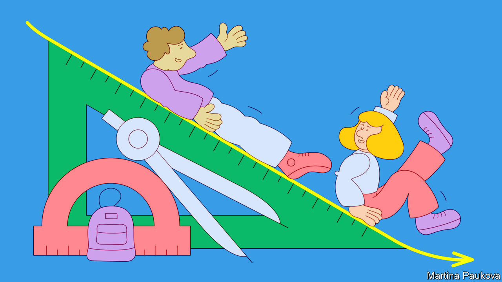
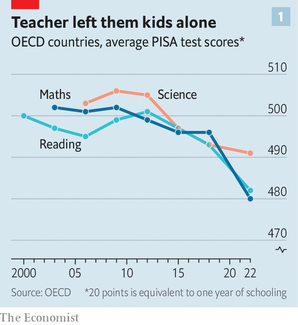
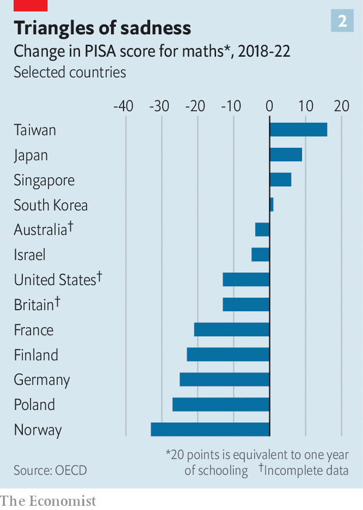

###### PISA tests

# The pandemic’s toll on schooling emerges in awful new exam results 

##### Grades in rich countries were sliding even before covid-19 spread 

 

> Dec 5th 2023 

IT IS ALMOST four years since the world’s classrooms started shutting down to 1.6bn pupils as covid-19 spread. At their height,  affected some 80% of all those enrolled globally. Youngsters then learned remotely, or not at all. It was the greatest disruption to education since the second world war. In many countries closures lasted long after it became clear that covid-19 posed a low risk to children’s health, and after vaccines became widely available to adults. Even when schools reopened, social-distancing quarantine rules still disrupted lessons for many.

The full effects of these policies are only just starting to be understood. Data from tests in maths, reading and science released on December 5th by the OECD, a club of mostly rich countries, offer the best snapshot yet of how children were affected. Fifteen-year-olds sat the exams between March and November last year. Pupils from Japan, Singapore and South Korea are among those who did well despite everything. British and American pupils mostly scored above the average for rich countries. The critical point is that results in many places were much worse than expected, even as some youngsters managed to weather the disaster with their academic progress surprisingly unscathed. 

 


The OECD has run these tests mostly every three years for two decades under its Programme for International Student Assessment, better known as PISA. Even before the pandemic, PISA data showed that school marks in the rich world had been stagnant for years. In the latest round of exams performance has tumbled sharply (see chart 1 ). On average, pupils in the rich world scored ten points lower in reading tests and almost 15 points lower in maths than was the case in 2018, when the exercise was last carried out. This implies that, compared with earlier cohorts, those tested have missed out on learning that is judged equivalent to between half and three-quarters of a school year.

A decline on this scale is a calamity. As a rule of thumb, every extra year of schooling a child receives pushes up their annual salary by close to 10%. Lost learning could still be holding wages down years from now. A dip in grades can have especially dramatic effects for youngsters who, as a result, fail to graduate from high school or do not hone the skills they need to succeed at university. Degree-holders in rich countries earn roughly 50% more than people who got jobs straight out of school. 

 


In the places recording the steepest drops, PISA finds 15-year-olds to be performing at levels that in 2018 were typical of youngsters a full year younger. In maths, the worst affected of the three subjects that PISA tests, declines of that magnitude were found in countries including France, Germany and Poland (see chart 2). This list also includes , whose schools have been held up for more than two decades as models for how to teach effectively. 

Swot teams

The findings for America and Britain are a bit less solid than for most other countries. Difficulties getting quite enough children to sit the tests mean that their data should be handled with care. Nonetheless, test scores seem to have dropped in both places, if not quite as sharply as they have for some of their neighbours. 

Reading scores in  have fallen back to levels last measured in 2006.  reading scores have remained surprisingly sprightly. Its big challenge is maths: its youngsters have long ranked in the bottom third of rich countries in the OECD’s tests of numeracy. Plummeting scores during the pandemic will do nothing to help them climb out of that hole.

PISA tests were taken by pupils in 81 countries and territories in 2022, most of them not in the rich world. Many of the developing countries that choose to take part appear to have done better than was forecast—though for reasons that may be grim. Their pupils tend to progress at slow rates even when schools are open as normal, says Andreas Schleicher of the OECD. So getting kicked out of classrooms may have come at a lower cost to their grades. The story on achievement gaps is similarly double-edged. PISA’s findings suggest that the pandemic has not, on the whole, ripped much wider the void separating poor pupils’ test scores from those of richer peers. But that is only because, in most countries, wealthy children have seen their progress stall just as much as disadvantaged children have.

Education ministries the world over will envy the handful of rich places that have a cheery story to tell amid the gloom. In Japan, Singapore, South Korea and Taiwan, test scores not only held steady over the pandemic period, they actually ticked up in at least one of the three subjects in which pupils sat exams. Israel and Switzerland are among other countries that appear, at least as judged from these data, to have done reasonably well.

Cramming it in

Some of these outliers protected learning by keeping school closures short. Across the OECD’s dataset there is a modest association between the length of time schools stayed closed and children’s subsequent performance in tests. Teachers in Switzerland ran fully remote or hybrid timetables for only six weeks (the average among countries in Europe was around 29). Closures in Japan were also comparatively zippy: in 2020 schools in that country shortened their summer breaks in order to claw back some of the class hours that children had lost up to then. Singapore, likewise, decided to alter school holidays to maximise learning time. 

 


For other top performers it was the quality of remote schooling that appears to have made the difference. In South Korea social distancing was strict and long-lasting. Children were permitted to attend school only part-time for more than a year after classrooms first reopened. Yet they also got lots of help. In the first year of the pandemic the government hired 30,000 additional teaching staff; some were pensioners called back into service. 

What is to be done to revitalise schooling elsewhere? The terrible results ought to renew enthusiasm for programmes aimed at helping pupils catch up on learning lost during the pandemic. In Britain the government has coughed up about £3.5bn ($4.4bn) to support such schemes since 2020, a sum roughly equivalent to 6% of one year’s spending on schools. Much of that money has gone on tutoring: the available information suggests that children are making back time. But cash for the scheme is likely to dry up next year.

In America a whopping $190bn in federal relief money has been found for schools since the start of the pandemic, equal to about a quarter of what the country spends on public schooling in a normal year. But schools have been given enormous freedom to spend the money as they wish; only a feeble 20% of it is required to go on schemes designed to get children’s learning back on track. A big crunch will arrive in September next year, when all the extra money will run out.

Data released in July by NWEA, a test-provider with access to over 6m children’s scores, suggest that American pupils in many grades made no more progress than usual during the most recent academic year. Indeed, rather than catching up, they seem to have progressed at a slightly slower rate than was standard before the pandemic. A tight labour market has made it difficult for American schools to hire the army of tutors that might help speed up educational recovery. The other problem, reckons Tom Kane of Harvard University, is that schools have shied away from adding extra hours to the school day, or extra days to the school year. He thinks it was always unlikely that schools, emerging from catastrophe, would suddenly find ways to make an average school day dramatically more productive. Providing more learning time, by contrast, is something that even the least innovative establishment ought to be capable of.

In the best of all worlds, policymakers would be seizing this moment not only to patch up lost learning but to drive through reforms that might alter the less-than-impressive trajectories many school systems were tracing even before the pandemic hit. The OECD’s previous data dump, in 2018, found that 15-year-olds in most rich countries were doing no better in maths, reading or science than pupils 20 years before them. Indeed, in a number of big countries—not just Finland, but also France, the Netherlands and New Zealand, among others—school marks were already heading down. In these kinds of places it is difficult to disentangle exactly how far the pandemic itself contributed to score declines. There is a high risk that underlying problems will go unsolved if bad results are written off as a pandemic blip.

Learning the lessons

The challenge goes beyond finding more cash. In the decade to 2018 spending per pupil rose by around 15% in rich countries without producing dramatic results. The OECD’s data suggest that pushing up school funding brings reliable improvements only until it reaches a threshold of about $75,000 per pupil, spread over each child’s first ten years in school. Beyond that point, the gains quickly peter out. America is a striking example. It spends more than $140,000 per pupil. Yet across the board its maths, science and reading scores still lag behind those of Japan, which shells out about 40% less.

In that context, Mr Schleicher of the OECD worries when he hears education ministers promising that they will respond to the pandemic’s effects by “building back better”. He fears that could involve pouring more money into the same old strategies. “Building forward differently” would be smarter. International evidence, for example, reveals that improving teachers’ training and motivation is a far surer way of improving marks than splashing cash on smaller classes—the lever politicians find easier to pull. And too many school systems do a poor job of making sure adequate resources flow to the schools and pupils that have the most need. A big opportunity may be wasted if mediocre school systems are recreated much as they were before. ■

