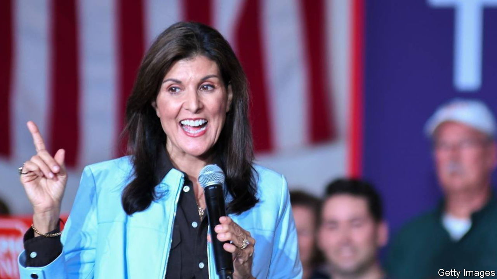
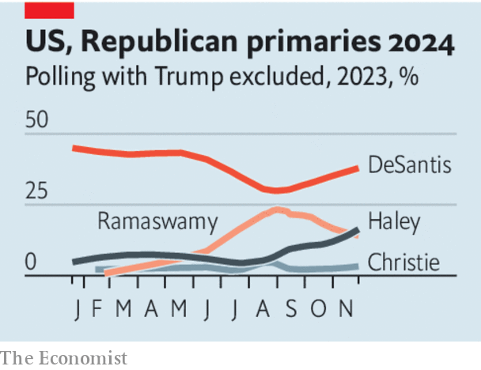

###### The race for second place

# A messy contest is coming to a head behind Donald Trump 

##### Our poll tracker sheds light on that competition. It may yet matter 

 

> Dec 6th 2023 

AS A HORSE race, the contest to be the Republican Party’s nominee for president is as much of a walkover as they come. Donald Trump has been far ahead all year, and his lead has steadily lengthened. As our , the gap between the former president and his closest challenger, Ron DeSantis, Florida’s governor,  from 14 percentage points to a seemingly unassailable 51 points. With Iowa’s big night less than six weeks away, it looks all over bar the caucusing. And if he wins his party’s nomination, Mr Trump would have a good chance of returning to the White House. Analysts at home and abroad are rightly starting to get their minds round what  might mean.

However, just as in a horse race, the primaries’ front-runner can stumble, or be tripped up by the voters in Iowa and New Hampshire. In Mr Trump’s case, his legal troubles—including four criminal trials and 91 felony charges—could start to look like a threat in the general election. Concerns over candidates’ ability to last the course have understandably centred on the 81-year-old, gaffe-prone President Joe Biden. But the more vigorous-looking Mr Trump is only four years younger and you cannot rule out that a health scare will afflict such a short-fused burger enthusiast. Momentum in politics can change, and a dead-cert can suddenly start losing ground.

 


For all these reasons, although the nomination looks like Mr Trump’s to lose, it is worth keeping an eye on the race far behind him. Contenders have started to drop out, including Mike Pence, Mr Trump’s former vice-president. A fresher face, Vivek Ramaswamy, an entrepreneur, managed a mini-spurt over the summer but has since fallen back. As the field narrows, it is becoming more interesting. Heading towards election year, the struggle to be Mr Trump’s main challenger is between two credible candidates: Mr DeSantis and Nikki Haley, a former governor of South Carolina who served as Mr Trump’s ambassador to the UN.

Ms Haley has been on something of a roll. In the absence of Mr Trump, she has stood out in candidate debates (calling Mr Ramaswamy “scum” in Miami last month), and predictably came under attack from the diminished field of just three rivals at the latest one on December 6th. “I love all the attention, fellas,” she said. She has won the endorsement of the wealthy political network founded by the Koch brothers. According to our poll tracker, she has risen to within one percentage point of Mr DeSantis, at 11% to the Florida governor’s 12%. Betting markets suggest that she has already overtaken him, with on average a 13% chance of winning the nomination, compared with just 6% for the wooden, unconvincing Mr DeSantis. 

However, Florida’s governor still has some running in him. His dismal form for most of the year has meant that his support has slumped by more than 20 points. But he mustered a combative performance in another recent televised debate, this time with Gavin Newsom, the Democratic governor of California. And, intriguingly, our tracker shows him well ahead of Ms Haley in the polling of Republican voters’ second preferences—the candidate they would favour should Mr Trump drop out. Those polls suggest that, were that to happen, Mr DeSantis would pick up much of the former president’s support, giving him more than double the backing of Ms Haley.

The tussle far behind Mr Trump looks like a sideshow, given his commanding lead. But if he falters, the Republican primary is not the only one that would suddenly become compelling. Mr Biden let slip at a fundraising event this week that “If Trump wasn’t running, I’m not sure I’d be running.” Rarely are presidential races so certain and so uncertain at the same time. ■


