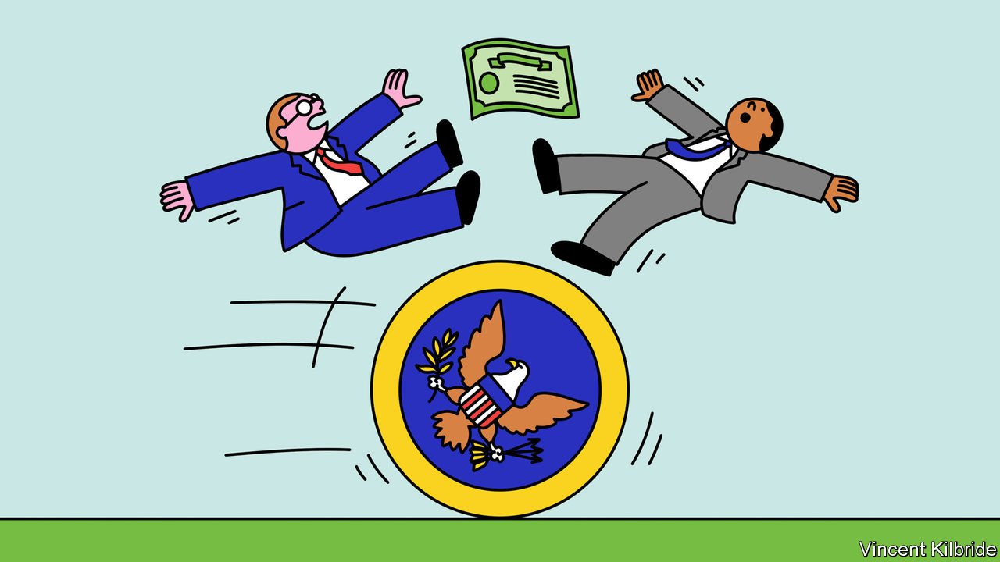
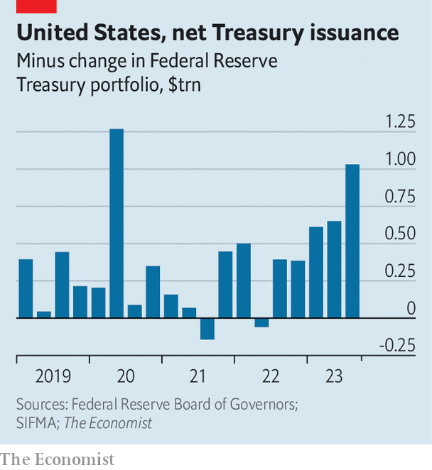

###### Gensler v Griffin

# Bashing hedge funds that trade Treasuries could cost taxpayers money 

##### Why fears about the “basis trade” are overblown 

 

> Dec 7th 2023 

There is no more important financial market than American , and it is growing fast. In the 12 months to October the Treasury, on net, issued $2.2trn in bills and bonds, worth 8% of GDP, to fund America’s gaping deficit. Adding to the supply, the Federal Reserve has shrunk its own portfolio of Treasuries by nearly $1trn since mid-2022. Foreign demand is flat, meaning the Treasury increasingly needs big asset managers and hedge funds to . That is worrying some regulators. Could capricious hedgies shake the foundation of the global financial system? 

One concern is the “basis trade”. This is when hedge funds exploit small gaps in price between futures contracts on Treasuries, which they sell to asset managers, and the bonds themselves, which they buy. Making money this way requires high leverage, so hedge funds borrow from banks, posting Treasuries as collateral. By one estimate, in December 2022 they owed $553bn this way and the trades were leveraged at a ratio of 56 to 1.

 


Gary Gensler, chairman of the Securities and Exchange Commission, has called generous lending to hedge funds the biggest source of risk in the financial system, and said that the public will pay the price if things go wrong. Regulators are studying how to overhaul the market. Some ideas on the table, such as a compulsory 2% haircut on Treasuries posted as collateral, have vexed the masters of the universe. Ken Griffin, head of Citadel, has said that fear of the basis trade is “utterly beyond me”. 

Who is right? Loans to hedge funds do not much threaten banks, which have the security of the bond if they are not paid back. Instead the chief worry is that a failure of a large hedge fund could set off a repeat of the “dash for cash” at the start of the covid-19 pandemic, in which investors dumped Treasuries; or the doom loop that struck Britain’s bond market in September 2022, in which falling bond prices forced pension funds to sell bonds, further pushing down prices. These fire sales were resolved only when central bankers bought bonds at scale. 

The interventions were dramatic, but they did not expose taxpayers to much danger. Unlike lending to banks or firms, public debt bought by central banks does not involve credit risk for taxpayers, who become both borrower and lender. Fire sales caused by financial rather than fundamental factors in effect result in the central bank buying back government bonds on the cheap. The Bank of England made a £3.8bn ($4.8bn) profit on its purchases, a return of 20% in a matter of months.

The trouble comes when central banks fail to contain the panic or stay in the market long after it has stabilised. After the dash for cash, central banks’ goals switched from financial stability to monetary stimulus. They amassed huge portfolios of long-term bonds which have fallen in value as interest rates have risen. At the end of September the Fed’s mark-to-market losses on its portfolio of Treasuries stood at nearly $800bn. Ultimately, these losses pass through to the Treasury. 

First, do no harm

Provided central banks get in and out of the market quickly, though, there is nothing untoward about stopping fire sales of sovereign debt. Indeed, knowing central bankers can act should create a more liquid market, which will help keep bond yields low and well-behaved. Unfortunately some of the rules proposed by Mr Gensler making borrowing for hedge funds more expensive by imposing haircuts on their collateral would do the opposite. If it becomes too costly for hedge funds to trade, the interest expenses on $26trn of outstanding debt will rise over time. The status quo is not perfect; some of the ideas for reform, such as replacing the market’s intermediaries with a centralised exchange, have merit. But when playing with vast sums it is not just hedge funds that can make errors. Regulators must tread with care, too. ■

