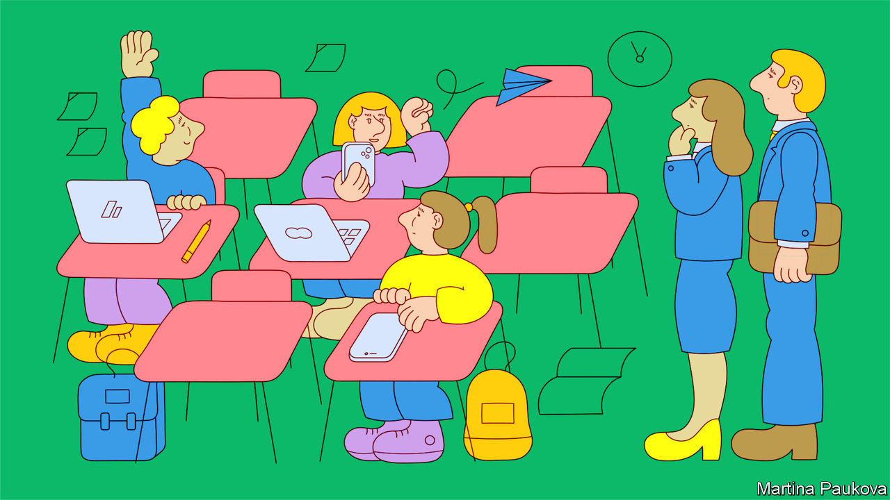
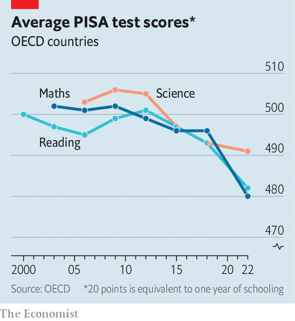

###### The learning power of PISA

# Covid-19 was a disaster for the world’s schoolchildren 

##### The costs of wasting brainpower are huge 

 

> Dec 5th 2023 

EVERY THREE years for the past two decades analysts at the OECD, a club of mostly rich countries, have asked pupils in dozens of places to take tests in reading, maths and science, the better to compare the quality of their schools. No one was expecting the latest round of exams, sat a year late in 2022 after years of , to bring good news. But the results, released on December 5th, . An average teenager in the rich world is found to have fallen about six months behind in reading and nine months behind in maths, compared with peers who sat similar tests in 2018. In several rich countries 15-year-olds are performing at levels that back then would have been expected of learners a full year younger.

 


These findings are all the gloomier because of the discouraging trends that preceded them. Years of international testing suggest that, when the pandemic struck, typical teenagers in the rich world were no more numerate than those schooled some 20 years earlier. In reading and science, average scores have been drifting down for a decade, according to the OECD’s yardstick, even though spending has been going up. So there are good reasons to think that grades in the latest exams (often known as the PISA tests) might have slipped even without the turmoil of covid-19.

The sombre school report should rally governments to accomplish two tasks. The first is to renew pandemic “catch-up” programmes, for which energy and funding is beginning to flag even though the job is far from complete. Data released in July by a big test-provider suggest that in the most recent academic year many pupils in America made no faster progress than was normal before the pandemic. This month’s PISA results suggest that America’s scores may have fallen back a bit less than in lots of other places—but that means nothing to the millions of youngsters who are nonetheless approaching the end of their school days with yawning gaps in their skills.

A priority of any revamped catch-up schemes should be to bring down absenteeism. In both America and Britain 20-30% of pupils miss at least one lesson in ten, and often many more. This is roughly double the rate before the pandemic. As for pupils who are regularly coming to class, schools could be offering them more lessons than usual. Providing more learning time—in holidays, at weekends and after school—is perhaps the simplest way of getting youngsters back up to speed. But in many places extra hours have been given only a minimal role in catch-up plans; they are expensive because teachers would have to be paid more, or more teachers hired. And the children are not keen.

Governments’ second task is to turn around the disheartening long-term trends. International tests offer clues about what works and what does not. Cutting class sizes is often a waste of money; having high-quality teachers matters more. Education budgets could be better focused. Across rich countries, disadvantaged pupils put up with less qualified staff and make do with fewer books. Changing much of this means taking on powerful lobbies, including teachers’ unions and wealthy parents. In theory the crisis offers a big opportunity to make such reforms.

All the more reason to regret that politicians are focusing their energies elsewhere. Britain’s government has painted its pupils’ performance in the PISA tests as a triumph (like America it has drifted up the league tables, but only because its scores collapsed a smidgeon less than the average). The Labour Party, which will probably come to power next year, plans to get tougher on private schools by making them pay tax; they cost the government nothing and get excellent results, but taxing them will probably force some parents to increase the burden on the public sector. In America, meanwhile, the past few years have seen much energy wasted on fiery but mostly fruitless battles about the teaching of history, gender and race. Neverending disruptions during the pandemic were bad for learning. Schoolchildren must not be let down once again.■


