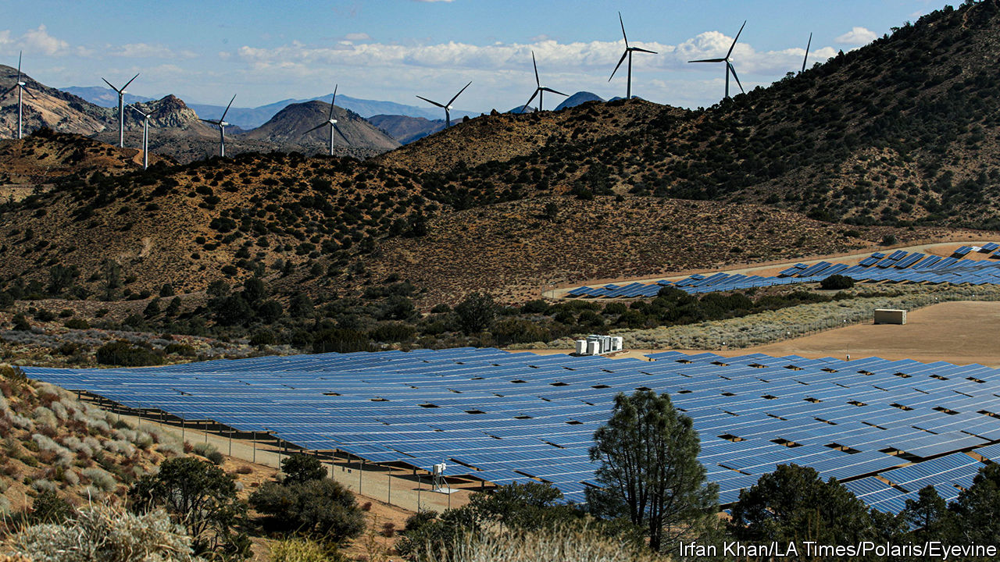
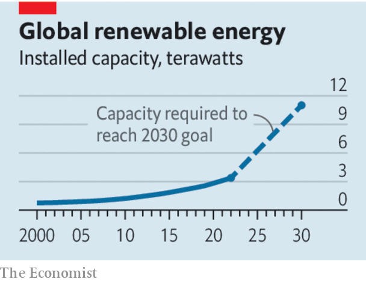

###### Power trip

# Green protectionism will slow the energy transition 

##### Expanding renewable-power capacity is becoming ever harder 

 

> Dec 7th 2023 

If the world is to decarbonise, then more clean energy is needed, fast. Nearly everyone at the un’s annual climate summit, which is being held in Dubai, seems to agree with the sentiment: delegates from 118 countries have pledged to raise global renewable-energy capacity to 11,000 gigawatts (GW) by 2030, up from 3,400GW last year. But the task of adding roughly 1,000GW every year—almost as much as the entire generating capacity of America—looks increasingly daunting.

Despite record investment in renewables in the first half of the year, the industry is . Wind-turbine supply chains have struggled as manufacturers rushed out bigger and more powerful models. Last month Siemens Energy was rescued by a loan guarantee from the German government. Rising costs, caused partly by higher interest rates, have led developers to abandon once-profitable projects. Five offshore-wind developments have been cancelled in America this year. 

 


There is a bigger problem, too. At a meagre 6%, the average return on capital for solar and wind developers will not entice the $8trn or so of investment needed over the rest of this decade to honour the 11,000GW pledge. One obstacle is slow approval, which delays projects for years and can needlessly tie up capital, lowering returns. In September, in a bid to speed up permits, the European Parliament designated the development of renewables to be of “overriding public interest”. Yet such diktats have not worked in the past; European Union rules already require permitting to take no longer than two years, a limit that member states often breach. Reforms to federal permitting have been proposed in America, but will do little to ease delays at the state or local level. Better to streamline approvals across all tiers of government.

Another obstacle is that, not counting China, too little development is happening in the global south, even though the demand for electricity there is surging. Investors want a premium when putting money to work in emerging markets. One fix is to blend in government funding that takes on some of the risk. That is the idea behind the Just Energy Transition Partnerships, which Western governments have set up over the past two years, and the $30bn climate fund announced by the United Arab Emirates on December 1st. Yet the sums involved remain too small, and earlier deals have been beset by backsliding and delays.

A last obstacle is protectionism, which raises costs and threatens shortages. Solar panels are already more than twice as expensive in America as elsewhere, mostly owing to anti-dumping duties on Chinese suppliers. From June 2024, those duties will also apply to some South-East Asian suppliers deemed to be redirecting Chinese products.  incentivises the use of pricier homemade components even though their makers will struggle to supply enough of them.

America is not alone. Last month the European Parliament passed the Net Zero Industry Act, which sets domestic-content thresholds for bidders in public auctions. The European Commission is considering investigating Chinese turbine-makers, which it sees as a threat to local industry because their wares are much cheaper. India, too, plans to tighten local-content rules for solar projects. 

Rather than micromanaging production, governments should unleash investment, by acting boldly to strip back permitting rules and ease the risk of projects in the global south. They also need to face up to the fact that protectionism frustrates their climate goals. It leads to lower returns, higher prices for power and more broken promises over decarbonisation. ■


