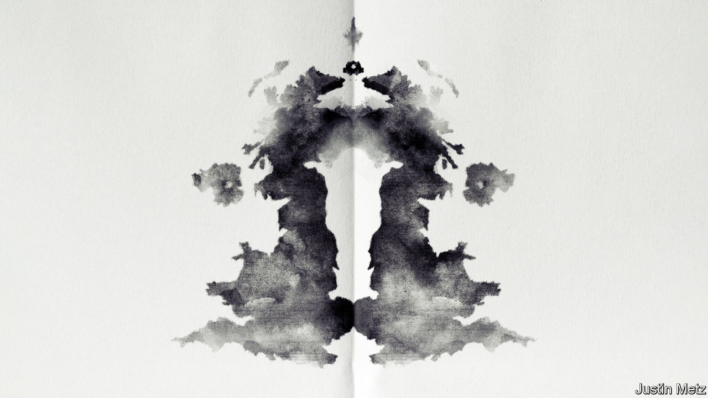

###### Compassion and its consequences

# How to stop over-medicalising mental health 

##### What the world could learn from Britain’s flawed approach 

 

> Dec 7th 2023 

FOR A PLACE with a reputation for buttoned-up stoicism, Britain is remarkably open about mental health. The British are more likely than people in any other rich country to think that mental illness is a disease like any other. Only the Swedes are more accepting of the idea that a history of mental-health problems should not disqualify someone from public office. The importance of good mental health is a cause vigorously championed by everyone from the Princess of Wales to the opposition leader, Sir Keir Starmer; employers preach the gospel of well-being. Britons were once encouraged to hide their feelings; now they are urged to seek support. 

Much of the rich world has struggled with rising rates of self-reported mental-health problems, particularly since the covid-19 pandemic. But the numbers in Britain are startling. Around 4.5m Britons were in contact with mental-health services in 2021-22, a rise of almost 1m in five years. In the past decade no other European country has seen a greater increase in the use of antidepressants. A National Health Service (NHS) survey in 2023 found that one in five 8- to 16-year-olds in England had a probable mental disorder, up from one in eight in 2017. In 17- to 19-year-olds the figure had increased from one in ten to one in four. The number of people who are out of work with mental-health conditions has risen by a third between 2019 and 2023. 

It is good that people do not feel they must bottle things up and the suffering from mental illnesses is real. Awareness of mental health has diminished the stigma of some conditions and revealed that many Britons’ needs are not met. But awareness has caused damage, too. 

For all their good intentions, campaigns intended to raise awareness are leading some people to conflate normal responses to life’s difficulties with mental-health disorders. Special treatment creates incentives for people to seek diagnoses and to medicalise problems unnecessarily. The need to treat people with milder conditions  with care for those who have the most severe ones. 

Start with the idea that mental health has become a catch-all term. The sheer proportions of people who say they have a disorder is a red flag. Some 57% of university students claim to suffer from a mental-health issue; over three-quarters of parents with school-age children sought help or advice over their child’s mental health in 2021-22. In surveys Britons increasingly describe grief and stress as mental illnesses, redefining how sickness is understood. Most conditions do not yet have objective biomarkers, so self-reported symptoms weigh heavily in official statistics and in diagnostic processes.

People have incentives to label mild forms of distress as a disorder. In 2022 more than a quarter of 16- and 18-year-olds in British schools were given extra time in official exams because of a health condition. Evidence of a mental-health problem can unlock welfare payments. Certification need not come from an NHS doctor: plenty of private clinics stand ready to provide it. Firms may prefer to label stress a disorder rather than deal with the consequences of acknowledging that working conditions are poor (the World Health Organisation implies that good management is the best way to protect mental health in the workplace). The highest rates of diagnosed depression occur among England’s poorest people, but the government probably prefers  to trying to solve poverty. 

Medicalising mild distress may not benefit patients. One study of mindfulness courses in 84 British schools found that normal teaching was just as good for mental health. But the great harm from overdiagnosis is to those who most need help. 

The NHS, in theory, is able to triage patients by need. In practice, a service that has long been understaffed and poorly organised is struggling with surging demand. The number of young people in contact with mental-health services has expanded at more than three and a half times the rate of the workforce in child and adolescent psychiatry. A 22% increase in the overall mental-health workforce in the five years to 2021-22 could never have matched a 44% increase in referrals for all patients. At least 1.8m people are waiting for mental-health treatment. 

Increased demand is driving staff into private practice. Clinicians burned out from dealing with the most severe NHS cases can earn as much as £1,000 ($1,265) a session conducting assessments of attention-deficit hyperactivity disorder. The NHS has only 6% more consultant psychiatrists than a decade ago, compared with 86% more consultants in emergency medicine. The police pick up some of the pieces—officers in England spend around 1m hours a year with mental-health patients in accident-and-emergency departments—but that is not treatment. Even as awareness of mental-health conditions rises, outcomes for people with severe mental illnesses, such as bipolar disorder and schizophrenia, are worsening; they die 15-20 years earlier than the rest of the population, a gap that was widening before covid-19 and was exacerbated by it. 

Rethinking Britain’s approach to mental health requires several changes. More money should go on research so that individuals are treated appropriately; mental disorders absorb 9% of England’s health budget but 6% of medical-research funding. The social causes of mental illness should also receive more attention. Earlier this year the government shelved an ambitious plan to look at the underlying context for mental disorders, from poverty to isolation; that plan should be revived. More time and effort should be devoted to those most in need of help; reforming the Mental Health Act, a punitive law that still criminalises the mentally ill, would be a start. 

Causes and affect

Above all, Britain needs to avoid the mass medicalisation of mild forms of distress. Funnelling people into an overstretched health-care system is having predictable effects. All suffering should be taken seriously, but a diagnosis is not always in someone’s best interests; one recent piece of research found that volunteers were happier when they learned to suppress negative thoughts. Britain has become more compassionate about mental health. It needs to become more thoughtful, too. ■


