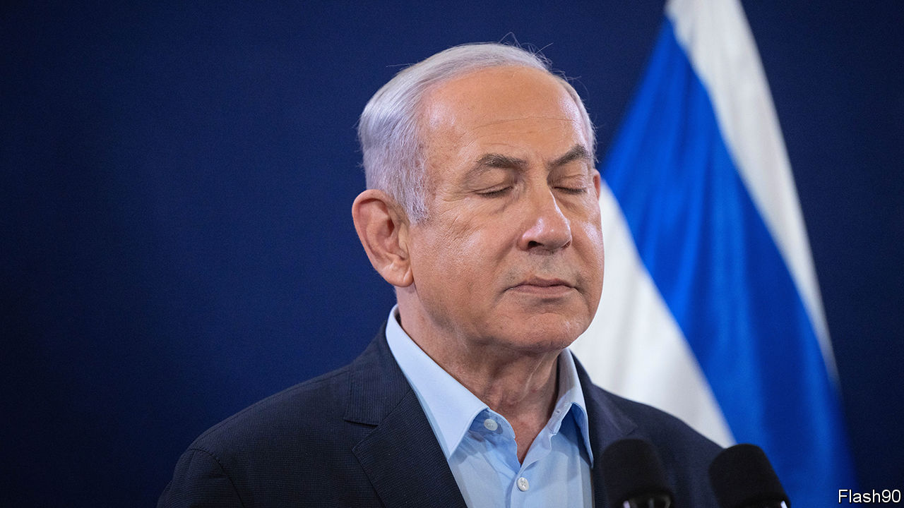

###### Israel’s irrelevant prime minister

# Binyamin Netanyahu is at the mercy of his hardline coalition partners 

##### And he has little say over the big decisions in the war 

 

> Dec 7th 2023 

ISRAEL’S COURTS returned to normal service on December 4th after a two-month pause because of the war in Gaza. Among the trials to resume was that of Binyamin Netanyahu, the prime minister, who is charged with one count of bribery and three of fraud; he denies them all. 

For the more than four years since charges were laid, they have consumed Israeli politics. Mr Netanyahu has refused to resign for the duration of the trial, arguing that it would not hinder his work as prime minister. Yet now his lawyers are asking for an adjournment, saying he does not have time to prepare—because of the war.

But is Mr Netanyahu really leading Israel in its war effort? Israeli officials claim that military decisions are being made mainly by Yoav Gallant, the defence minister, along with two other former generals, Benny Gantz and Gadi Eisenkot, the two leaders of the centrist National Unity party. Both joined the government soon after Hamas attacked Israel on October 7th to serve in a new war cabinet.

This group, which has five members in all, makes all the key decisions to do with the war, yet Mr Netanyahu is largely isolated within it. Mr Gallant, a member of the prime minister’s Likud party, has had little love for his leader since Mr Netanyahu tried in vain to sack him in March. Mr Netanyahu is wary of Mr Gantz, too, who is far ahead of him in the polls: three-quarters of Israelis recently said they wanted Mr Netanyahu to resign, either immediately or once the war is over. 

The three former generals in the war cabinet are much closer than Mr Netanyahu to the serving generals in the Israel Defence Forces (IDF), upon whom the prime minister has tried to pin all the blame for the debacle of October 7th. That was when Hamas caught Israel unprepared with a devastating surprise attack that claimed some 1,200 Israeli lives. 

Among the decisions over which Mr Netanyahu has exercised little influence was the timing of the recent ground offensive in Gaza. Another was to accept a weeklong truce with Hamas in return for the release of 110 mostly female and child hostages, according to senior Israeli officials. 

The prime minister, meanwhile, is trapped inside a hardline coalition. Before the war the main centrist parties had refused to join a government led by a prime minister on trial for corruption. So a year ago Mr Netanyahu returned to power after 18 months in opposition by putting himself at the mercy of far-right and ultra-Orthodox parties to form a majority. They now hold his political fate in their hands. 

As a result Mr Netanyahu has very little power over the budget, which is controlled by the religious parties in his coalition. They have allocated billions of shekels to West Bank settlements and religious schools. Nor can he block other right-wing policies, such as the wholesale issue of gun licences by the national security minister, Itamar Ben-Gvir, who leads the far-right Jewish Power party. 

Mr Netanyahu’s political paralysis means he cannot plan what to do with Gaza when the fighting stops. The extreme wing of his coalition wants to keep the Israeli armed forces permanently in the territory. But Israel’s key ally, America, wants Israel to withdraw completely to let a hopefully revitalised Palestinian Authority (PA) take control. Under pressure from his far-right ministers, however, Mr Netanyahu has had to veto co-operation with the PA, which his finance minister is depriving of funds. 

Mr Netanyahu exposes his political weakness with his inability to rein in junior ministers who are making inflammatory and damaging remarks. These include the grandly titled intelligence minister (albeit that she has no authority over Israel’s intelligence services), who called for Gaza’s people to be resettled in Egypt, and the heritage minister, who mused about dropping a nuclear bomb on Gaza. 

Within the ruling Likud party, stirrings of rebellion are afoot. Mr Gallant and Nir Barkat, the independent-minded business minister, are among those thought to be pondering challenges for the leadership. But Mr Netanyahu still controls his party and will be hard to dislodge.

There are two ways to replace the prime minister. One is through a “constructive no-confidence” measure whereby a majority of the Knesset, Israel’s parliament, votes for a new prime minister from among its members. There may soon be a parliamentary majority against Mr Netanyahu, but the fractious Knesset is much less likely to agree on a replacement. 

A more plausible outcome, once the war in Gaza has been scaled down, would be a speedy dissolution of the Knesset. In that case Israel’s sixth election in less than six years would be held by mid-2024. Once again the main issue at stake would be Mr Netanyahu’s political survival. ■

