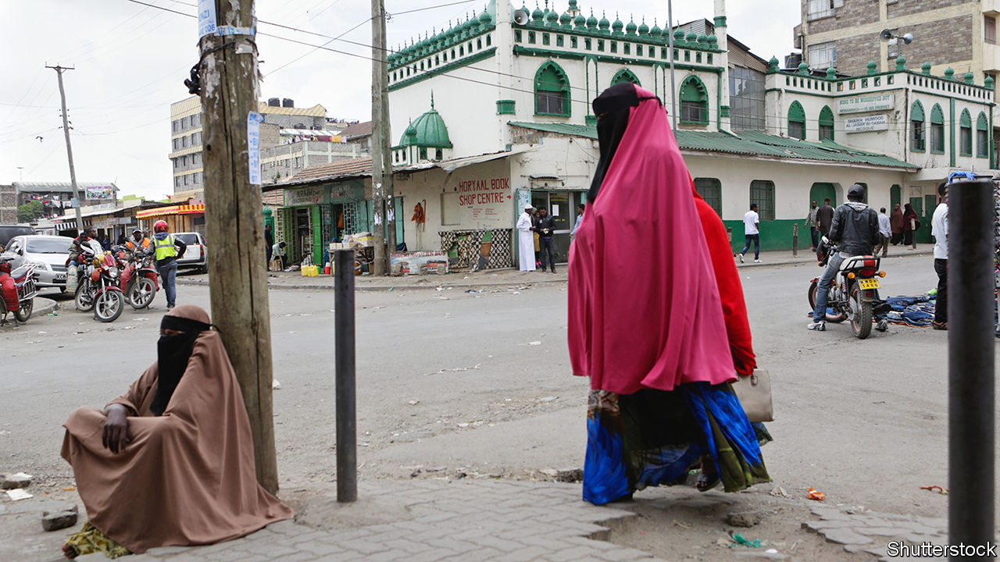

###### Let me be Kenyan

# Citizenship in Kenya is belatedly being extended to groups once deemed foreign 

##### But discrimination persists 

 

> Dec 7th 2023 

Identity cards are a big deal in Kenya. Without them you cannot marry, register to vote or get salaried jobs. Nor can you open a bank account, go to university or legally buy a SIM card. Walking around without papers can even get you arrested, a hangover from the colonial era when many African workers needed a special pass. Though that is legally dubious, few Kenyans, especially those without documentation, dare challenge the police. “If you don’t have an ID, you don’t exist,” says Mustafa Mahmoud of Namati, a group that campaigns for legal rights for the poor.

For most Kenyans, applying for an ID card is quite simple. A school leaving certificate and a copy of a parent’s ID will usually do. Yet some ethnic groups have still faced discrimination when applying. If your forebears migrated to Kenya during British colonial rule, you were still officially deemed foreign at independence in 1963. Generations later, long after losing touch with your ethnic homeland, for instance if it is Somalia, the government would not recognise you as a Kenyan citizen. Thousands were left in a bureaucratic limbo. The un High Commissioner for Refugees (unhcr) reckons that 16,800 people in Kenya are stateless. But the true number is probably far higher. 

In 2016 Kenya’s then president, Uhuru Kenyatta, declared that the Makonde, about 6,000 of whom came up from Mozambique and Tanzania in the 1940s, would “become Kenyans”; several thousand got ID cards. Mr Kenyatta later made a similar offer to the Shona people, originally from Zimbabwe, and to a small community of Rwandans. His successor, William Ruto, said the Pemba, originally from an island north of Zanzibar, constituted “one of the ethnic communities of Kenya”. He ceremoniously handed them some 7,000 ID cards.

These presidential interventions raise awkward issues for Kenya, says Samantha Balaton-Chrimes of Deakin University in Australia. They suggest that the Kenyan state is “fumbling its way towards a kind of inclusivity” yet entrench the idea that citizenship is linked to the notion of ethnicity. 

That is troubling because it can be used to legitimise discrimination against certain groups. For instance, ethnic Somalis and people of Nubian descent still face extra vetting when applying for IDs. The police and security officials sometimes grill them with harsh demands for proof of descent. Some vetting committees ask people to prove that all of their grandparents were born in Kenya—often an impossible task.

Things may, however, be improving. Most Nubians now eventually get an ID if they request one. But ethnic Somalis, a few of whom have been involved in jihadist terrorism on Kenyan territory and beyond, are sometimes still given a hard time proving their credentials when renewing their ID cards, if they are lucky enough to have one in the first place. 

Moreover, the procedure can be frighteningly random and can require bribes. “There’s an absolute lack of due process and oversight,” says Bronwen Manby, a lawyer at the London School of Economics. “Nothing is written down anywhere: it’s just internal departmental directives and you don’t know the rules.” 

Nubian activists say a batch of IDs issued since 2021 were faulty, preventing their holders from opening bank accounts or registering SIM cards. Government officials apologised, explaining that the “ethnic code” had been incorrectly entered. This appears to have been a clerical error and the issue was resolved. ID cards are not supposed to specify ethnicity at all. But suspicions were aroused that any ID code could be used by officials for malign purposes, such as tracing a voting record. ■

