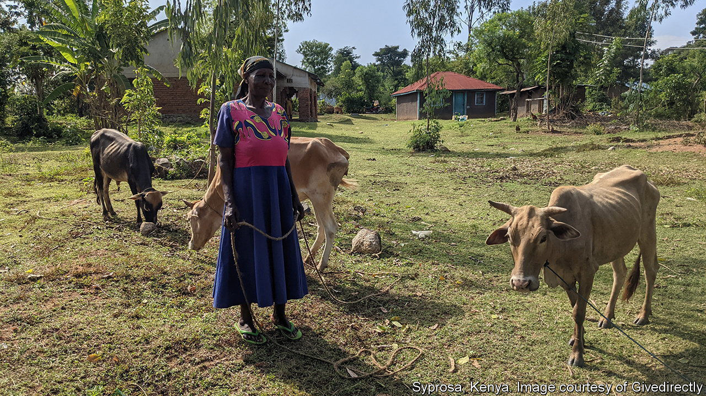

###### Free money on trial

# Giving the poor a wodge of cash is better than dripping it out 

##### The world’s biggest basic-income trial releases early findings 

 

> Dec 7th 2023 

What happens when you give people free money? The world’s largest basic-income experiment is trying to find out. Since 2018 the American charity GiveDirectly has been sending the equivalent of $22.50 a month to thousands of villagers in western Kenya. On December 1st researchers including Abhijit Banerjee, a Nobel prize-winning economist, presented results from the first two years of the trial.

The core idea of a universal basic income, which is intended to reduce poverty, is to send money to everyone, without strings attached, regardless of their earnings or if they are employed. But attempts to test it, from Finland to California, have generally made payments to a smattering of individuals for short periods of time. The experiment in Kenya is unusually “universal”: it covers every adult within selected villages and will run for 12 years. 

In all, more than 22,000 people in 195 villages got money. The outcomes were compared with a control group of about 11,000 people who got nothing. The most striking pattern was of recipients leaving waged work on farms to open shops. When payments were scheduled for the full 12 years, the number of non-farm enterprises rose by a quarter, and their profits nearly doubled. Recipients ate more protein and reported lower rates of depression. Land became more expensive, but it appears consumer goods did not.

That is evidence that giving people money helps them, but not how best to do it. So the researchers also compared a group of villages where payments were drip-fed in monthly instalments with other villages where the equivalent sum was given upfront. Business outcomes were better when people got all the money at once, enabling them to make chunky investments. Otherwise they had to patiently accumulate funds by stowing their stipend in local savings groups.

The findings are further proof, if any were needed, that poor people know what to do with their money. “Two big worries with any of these interventions is that they’ll make people lazy and they’ll make them consume badly, and you see neither,” says Mr Banerjee. People said they did not drink more booze, although liquor stores made higher profits, perhaps because patrons bought pricier drinks.

The study has attracted the interest of officials from California, who visited some of the villages in August. Lump-sum payments are already part of some pilot programmes in America, such as a scheme in Flint, a city in Michigan. Next year it will give $1,500 to expectant mothers, followed by a monthly allowance of $500 in their child’s first year. The research is also relevant to social-protection programmes in poor countries, where cash transfers are replacing in-kind handouts, such as food.

But some are disconcerted by the idea of NGOs running large-scale social experiments, however benign the intent. The documentary “Free Money”, released last year, explores GiveDirectly’s impact on one Kenyan village. The film follows jubilant recipients as they install clean-water taps and extend their homes. It also captures the unfairness felt by others who live just outside the catchment area of the scheme, or are excluded by some quirk of registration. They wonder why they were the unlucky ones, comparing the mysterious ways of foreign benefactors to unknowable acts of God.

Those are the kind of gnarly problems that bedevil targeted welfare programmes, and which the principle of universality is supposed to avoid. But unless the idea of providing a basic income is taken up by governments, schemes will always be limited in scope. Ones that rely on charity will never be truly universal. ■

