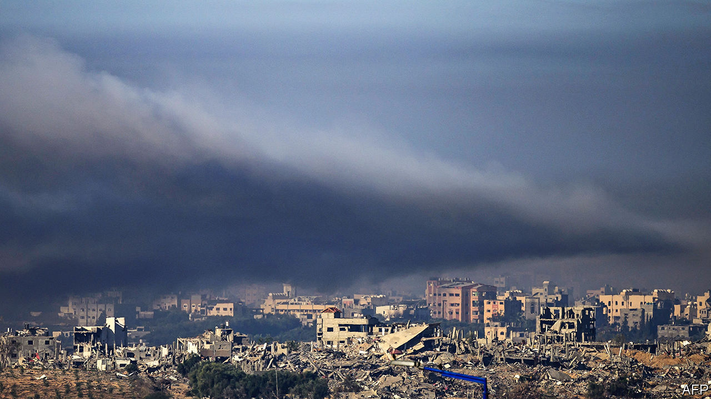

###### The final battle looms

# Israel is pushing into southern Gaza as the clock ticks down 

##### The fighting in Khan Younis is the most intense yet 

 

> Dec 6th 2023 

WITH THE war in Gaza about to enter its third month, Israeli forces are pushing hard into the  of the coastal strip. In the most intense fighting seen so far, they are hoping to inflict as much damage as they can to  before the political clock runs out on what may be Israel’s last large-scale ground offensive of the war.


On December 5th Lieutenant-General Herzi Halevi, the chief of staff of the Israel Defence Forces (IDF), said his troops had encircled Khan Younis, the largest city in southern Gaza and the birthplace of Hamas’s two main leaders in Gaza, Yahya Sinwar and Muhammad Deif. They have since entered the city itself which, along with two other Hamas strongholds in northern Gaza, Shujaiya and Jabalia in Gaza city, have been the main focus of the IDF since the collapse of a weeklong truce on December 1st. 

Israel’s aim is to destroy Hamas’s military capability and its ability to govern Gaza. So far it has succeeded only partially, at a terrible price to Gaza’s civilians: the Hamas-run authorities say more than 16,000 have been killed. Israel, which says the tally includes militants and several senior field commanders, has forced Hamas from its main hubs in Gaza city, large chunks of which have been destroyed. A similar fate now awaits Khan Younis. But the movement’s top leaders are hunkering down in an extensive tunnel network, along with thousands of fighters. 

The IDF says it has found more than 800 tunnel entrances in northern Gaza and has blown up most of them. But many of the deeper tunnels are believed to have remained intact, so Israel is considering more drastic measures, such as flooding them with seawater. 

Hamas, meanwhile, has retained the ability to launch rockets against Israeli cities as distant as Tel Aviv, more than 70km away. Though the salvoes are smaller than in the earlier stages of the war, the fact that they are continuing after months of intense Israeli attacks shows how difficult it will be for the idf to destroy Hamas as a military threat. In any case, Israel may be running out of time.

In public Israel’s leaders insist that there is no time limit on the operation. Yet in private, senior officials acknowledge that the push into Khan Younis may well be the last major manoeuvre of the war and a prelude to the next stage, when the IDF will carry out smaller, briefer raids. 

The clock is ticking

International support—and what Israel calls its “window of legitimacy” to conduct intensive warfare—is eroding in the face of the bloody toll in civilian lives in Gaza. Antony Blinken, America’s secretary of state, has made clear to Israel’s war cabinet that the idf will not have the “months” they say it needs to finish the job. 

Mr Blinken also said that the administration is watching closely to see whether Israel is making greater efforts to minimise civilian casualties than earlier in the war. America also wants Israel to let more aid reach the 2m or more Palestinians who are now crowded into southern Gaza. Whether Israel appears to be meeting these conditions will determine how long America will keep backing its offensive.

Israeli officers say they have tried to minimise hitting civilians when fighting an enemy that hides among them. They say that Hamas fighters account for about 5,000—or roughly one-third—of the total deaths reported, giving a rough ratio of two civilians killed for every combatant. But this arithmetic is not winning over its American ally. 

Lloyd Austin, America’s defence secretary, said on December 2nd that his lesson from commanding forces against Islamic State in Iraq was that “you can only win in urban warfare by protecting civilians” and that “if you drive them into the arms of the enemy, you replace a tactical victory with a strategic defeat.”

In an attempt to lower the rate of civilian casualties, the IDF is trying to micromanage the movements of Gaza’s inhabitants. In the first stage of the war it simply ordered them to vacate northern Gaza, forcing some 1.2m out of Gaza city and its surrounding towns. It has since issued a map that divides Gaza into a jigsaw puzzle of 623 sections. It sends out text messages and air-drops leaflets telling people which ones to leave and which are safe. 

Relief organisations say this is unrealistic and ineffective amid the chaos of Gaza. In order to move to safety, the shell-shocked population is inevitably finding it hard to escape Israel’s bombardment or Hamas’s attempts to fight back. Even if civilians do follow Israeli guidelines, they will have to crowd into a shrinking area alongside the thousands of Hamas fighters who will doubtless follow them. Moreover, Israel has yet to present a comprehensive humanitarian plan for these supposedly safe areas. During the truce, Israel agreed to allow in 200-300 aid lorries a day, though on average only 170 crossed the border from Egypt and the number has since fallen to around 100 a day.

Binyamin Netanyahu’s government faces other pressures, too. For the sake of Israel’s economy he must start scaling down the war and let many of the 360,000 reserve soldiers go back to work. Yet some parts of Mr Netanyahu’s far-right coalition have threatened to peel away from his government if he winds down the ground campaign too soon. 

Meanwhile the families of the 138 hostages still held in Gaza (some of whom Israel reckons are dead) are clamouring for another agreement with Hamas to get them back. During the truce Hamas freed 110 hostages (mainly women and children), including 24 foreign workers. But the deal brokered by Qatar collapsed when Hamas refused to release the remaining 17 women and children it still holds. Israel insists they must be returned before it will begin talks about the male hostages. 

Yoav Gallant, Israel’s defence minister, has tried to assure the families that “when the military operations advance, the pressure on Hamas rises and so do our chances of returning more hostages”. Meanwhile, the captives remain in grave jeopardy. Some were wounded on October 7th and need treatment. In a tense meeting with their families on December 5th, Mr Netanyahu was accused by one relative of “putting politics above returning the hostages”.

The IDF is acutely aware that it is operating under a mix of irreconcilable expectations. Israel’s politicians and most of its people want it to destroy Hamas; the hostages’ families above all want their loved ones home; and Israel’s international allies want fewer Palestinian casualties and an end to this war. If America calls more loudly for a quicker end to the fighting, the pressure will inevitably grow.

Meanwhile Hizbullah, a Shia Islamist militia in Lebanon, is again launching missiles and drones towards northern Israel as intensively as it did before the truce. And Houthi rebels in Yemen are busily  in the Red Sea (see next article). Israel’s embattled prime minister, whose popularity is plummeting and whose rivals in the war cabinet are eyeing his job, is seeking desperately to avoid making hard choices between those irreconcilable aims. As the tanks rumble into southern Gaza, crunch time looms. ■

