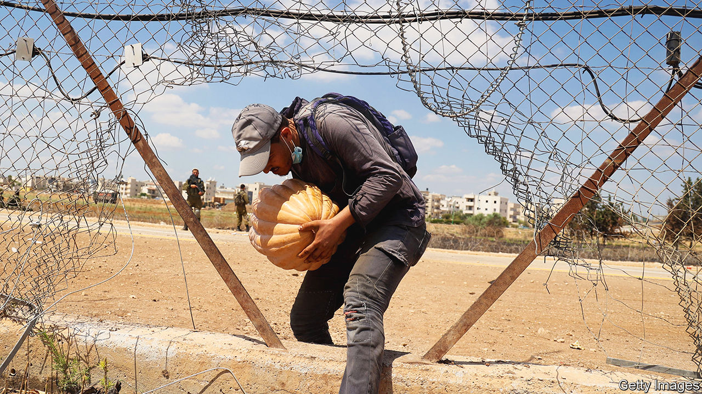

###### Money troubles

# Israel is strangling the West Bank’s economy 

##### Unless conditions ease, the Palestinian Authority could collapse 

 

> Dec 7th 2023 

The war in Gaza has ushered in a grim new economic reality in Ramallah, the de facto capital of the West Bank. Supermarkets have hired security guards to fight off shoplifters. Thousands of businesses have closed. One official reckons the current economic crisis is worse than that caused by the covid-19 lockdowns. 

About 160,000 Palestinians employed in Israel and in Jewish settlements in the West Bank have had their work permits revoked since October 7th. Tens of thousands more worked in Israel illegally. Before the war their salaries pumped some 1.4bn shekels ($370m) a month into the West Bank’s economy. 

Because it does not control its own borders, the Palestinian Authority (PA) has to rely on Israel to collect import taxes on its behalf, which account for 64% of its total revenue. When the Gaza war broke out, Bezalel Smotrich, Israel’s far-right finance minister, refused to transfer any of this money to the PA, though the Israeli cabinet later compromised, saying it would withhold the portion paid by the PA to Gaza. Though Hamas has controlled the strip since 2007, the PA still covers Gaza’s power bill to Israel and pays the salaries of thousands of public workers including those in the health ministry and the official Palestinian security forces, who are paid to stay at home. In response Shoukri Bishara, the PA’s finance minister, furiously rejected the whole amount. Accepting it would, he says, have been a “violation of our social contract” with Palestinians in Gaza. 

Those two factors have led to an 80% drop in the PA‘s revenues since October 7th, leaving Mr Bishara with a fiscal deficit of $1.5bn (roughly 10% of GDP in the Palestinian territories). In November it was unable to pay public servants their salaries at all, though it did manage to convince the Bank of Palestine to offer some employees loans worth half of their pay.

Whereas foreign aid once made up 30% of the PA’s operating budget, it paid for just 0.7% of it this year. But the Palestinian economy still relies heavily on aid. Donors have shifted much of their direct budgetary support to development financing, in part because of frustration at the PA’s rampant corruption.

That is one reason why the PA is in a poor position to deal with economic crises. Another is that it cannot get funds from the IMF, because it is not a member-state of the fund. With no central bank it has no lender of last resort to bail out its banks, some of which are starting to sweat after writing off at least $1bn in loans in Gaza. In normal times lending to PA employees is a tidy source of income. Yet unless they are paid their salaries soon, thousands will begin to default on their consumer debts. 

Adding to the banks’ woes are signs of capital flight, especially by Palestinians with a foot in Jordan or in the Gulf. Mr Bishara has reduced the PA’s borrowing from Palestinian banks and is loth to increase it again because of the risks this could pose to financial stability. 

To stave off the PA’s financial collapse Mr Bishara could try to persuade Mr Smotrich to hand over the customs revenues. But there are few signs Israel’s finance minister will have a change of heart, even though America has tried to alert him to the security risks if the PA goes bust.

America and the EU are particularly worried about the already meagre salaries of the more than 30,000 members of the Palestinian security forces in the West Bank. Without pay these men with guns will have little incentive to keep turning up for work. Some have already stopped. “We can tell him [Mr Smotrich] his policies are risking the financial collapse of the PA,” says a diplomat in Jerusalem. “But for him that’s a long-coveted dream.” 

The PA has asked Qatar for $900m to get through the next six months. But so far neither Qatar nor any of the other Gulf states seems prepared to pay Israel’s obligations, says Raja Khalidi, a Palestinian economist. If they did, it might further tempt Israel to deduct the money it is meant to hand over under a protocol of the Oslo accords, the peace agreement between Israel and the Palestinians. 

A handout might also allow the PA to set aside desperately needed reforms. “Temporary mechanisms often have a terrible way of becoming permanent and ineffective,” says Mr Khalidi. It could also offer a lifeline to a sclerotic and corrupt institution that few Palestinians believe can ever bring about a Palestinian state. 

America has been touting the idea of a “revitalised PA” as the only serious alternative to Hamas’s rule in Gaza. Yet if the pressure of the economic war being waged against the PA by Israel’s far-right government is not relieved soon, there may be little left of the PA to run the West Bank, let alone to govern Gaza. ■

