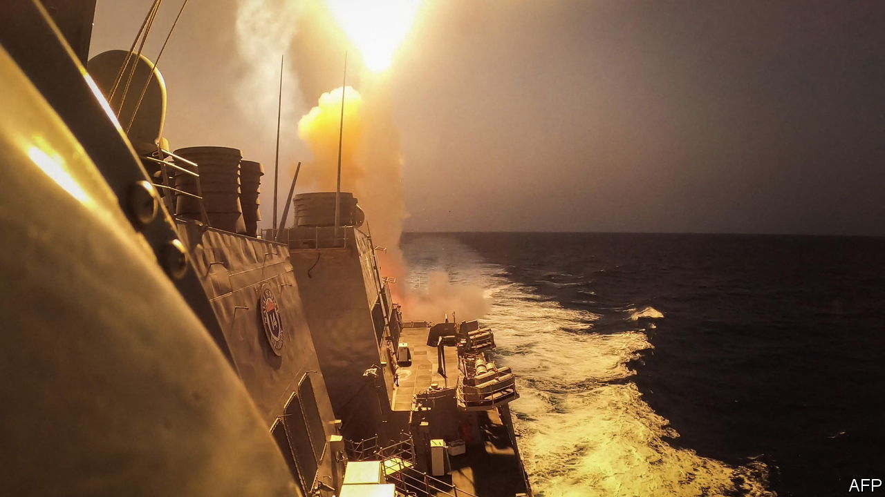
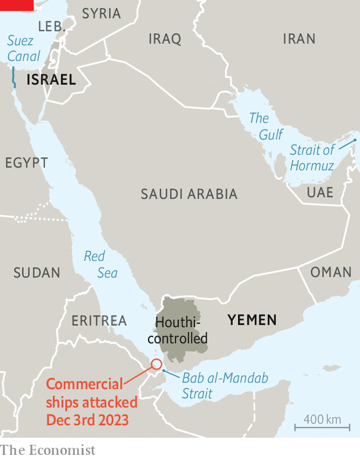

###### Red Sea peril

# Why Yemen’s Houthis are attacking ships in the Red Sea 

##### The risk to shipping from Iran-backed rebels has risen sharply 

 

> Dec 4th 2023 

ALTHOUGH NOT the first of their kind, the missile attacks on three bulk carriers in the Red Sea by  on December 3rd marked a sharp rise in the risk to commercial shipping . The , an American Arleigh Burke class guided-missile destroyer, shot down several  (UAVs) that appeared to be heading in its direction while it was sailing to assist the damaged carriers. Fortunately the attacks caused no injuries and fairly minor damage to the three ships. 

America’s Central Command said it was considering “appropriate responses” to the attacks, which had been “fully enabled by Iran”. This careful wording reflects the probability that, though the missiles were undoubtedly supplied by Iran and the attacks would have been welcomed by its government, the Houthis may well have been acting off their own bat. 

Israeli intelligence sources beg to differ. They are convinced that Iran ordered the attacks and that they are being co-ordinated by Brigadier-General Abdolreza Shahlaei, a veteran commander of Iran’s expeditionary Quds force. The hope in Tehran is that the attacks will drive up oil and shipping prices, putting pressure on Israel’s allies to rein it in. What seems certain is that more such attacks are likely. 

 


Emile Hokayem, an expert at the International Institute for Strategic Studies (IISS) in London who knows how Iran uses its proxies in the region, says the attacks also mark a strategic opportunity for the Houthis—in a number of ways. First, by linking them to Israel’s assault on Hamas in Gaza, the Houthis can improve their standing in the Arab world, where the Palestinian cause remains popular and emotions are running high. The attacks let the Houthis show, as they always claim, that they are on the side of the oppressed. Moreover, they can hit a range of targets, not just ones at home or in Saudi Arabia. 

Second, they send out a clear signal that the Red Sea is now a legitimate theatre for the struggle against Israel and that the Houthis are even willing to go after American warships as well as commercial shipping that may have some relationship with Israel, however tenuous. The sophistication of the attacks also shows that the Houthis are very far from being a raggle-taggle group of warriors, as they have sometimes been described. 

Fabian Hinz, a specialist in Middle Eastern missile and UAV forces, also of the IISS, says the Houthis have received a huge number of anti-ship missiles and drones from Iran. They have also seized and adapted some from Yemen’s regular army. The Houthis have at least ten different anti-ship missiles in their arsenal, including sea-skimming Exocet-type missiles based on Chinese designs, such as the al-Mandab 1 and 2. These have a range of about 120km. The Houthis have the Quds Z-0 and Sayad , too, which boast ranges of up to 800km and which have radar, infrared or electro-optical seekers to home in on their targets.

The Houthis have an arsenal of anti-ship ballistic missiles that runs from short-range locally produced systems to longer-range and much heavier missiles, such as the Asef and the solid-propellant Tankil (based respectively on the Iranian Fateh and Raad-500 missiles, which carry a 300kg warhead and are designed to hit a warship up to 500km away). Because of the limited damage reported as a result of the latest attacks, it seems likely that smaller missiles were used. 

Indeed, such are the Houthis’ capabilities that they may well have the potential to do in the Bab al-Mandab Strait, the Red Sea’s southern choke-point, what Iran has often threatened to do in the Strait of Hormuz. Though a long-range Houthi ballistic missile aimed at Eilat was shot down last month by an Israeli Arrow 3 interceptor, Yemen is not an easy spot from which to attack Israel. It is, however, perfect for striking ships in the Red Sea. 

A variety of Iranian attack-drones, including the Shahed 136 that Russia is using against Ukraine, is beefing up the Houthis’ arsenal. As far as those shot down by the  are concerned, Mr Hinz thinks these were probably intelligence and surveillance drones that the Iranians have cloned from America’s RQ-21. In addition to aerial drones, the Houthis also have naval ones and mine-laying devices. 

American warships in the region are not at great risk from Houthi missiles. Their defences are simply too good, though a lucky strike from a salvo of attacks can never be ruled out. But it is another matter as to whether on their own they can provide much protection for commercial shipping. Following the latest incidents America’s national security adviser, Jake Sullivan, suggested talks were under way with allies to establish a larger naval task-force in the Red Sea.

If the Houthis keep shooting, there could be increasing pressure on the Americans to go after missile sites in Yemen, assuming they could be found. Yet the last thing America will want is to be dragged into Yemen’s civil war, which Joe Biden’s administration has recently been trying hard to dampen down. ■

