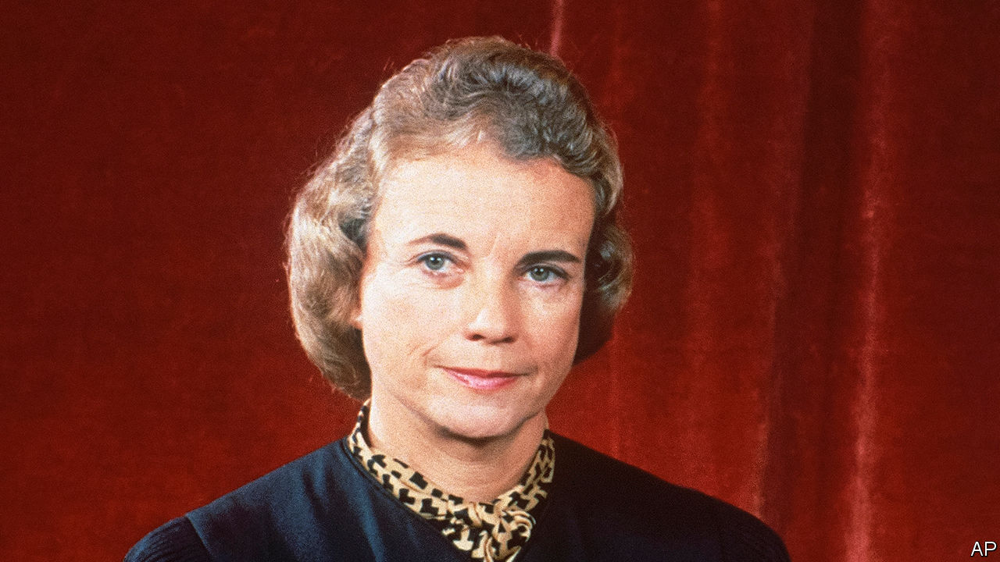

###### A cowgirl on the bench

# Sandra Day O’Connor specialised in breaking into male bastions 

##### The first woman justice on America’s Supreme Court died on December 1st, aged 93 

 

> Dec 6th 2023 

That Arizona sun was hot, and Sandra Day, then a teenager, was in the high desert alone. She had taken the disreputable old Chevy pickup on a two-and-a-half-hour drive to where her father, and the cowboys of his 200,000-acre Lazy B ranch, were branding cattle. The chuck-wagon box held the lunch she had packed for them herself, coleslaw and potatoes and applesauce cake. But now the left rear tyre was totally flat.

The desert was an empty and dangerous place, so silent that you could sometimes hear an ant running on a leaf. Anything there could scratch or sting you. If something went wrong, you had to fix it yourself. So she climbed out, jacked up the truck, and struggled to get the lug nuts off. It took a while; they were on tight. After an hour she got the tyre changed, reached the men, made a brushwood fire for the coffee and spread out lunch. No one thanked her. This was her allotted job, and she was late. 

It was probably for experiences like this, she thought later, that President Ronald Reagan had picked her in 1981 to be the . He too was a westerner who loved the ranching life. And for all the law she had learned by then, it was the lessons of the desert that inspired her in her 24 years on the bench. Tackle the job in front of you. Overcome your own difficulties. Don’t expect anyone else to assist. But in company, co-operate kindly. It was all good training for being a woman and a moderate on a court otherwise equally divided, most of the time, between four liberals and four conservatives.

All the same, her appointment was a shock. She had no aspiration that way. And it seemed just as well. She left Stanford Law in 1952, third in her class, to find no law firm would hire her. Only one would even interview a female; at the end, rejected again, she was asked how well she could type. But she was determined to practise law, no matter what. She took a first post without pay, became assistant to Arizona’s attorney-general, and rose to be an appeals court judge. Not the deepest legal preparation, but enough. 

Though the tag was annoying, the role of swing vote was ideal for her. She had no ideology to speak of. As a longtime Republican, she approved of small government, remembering how her father had been driven mad by far-off paper-pushers in Washington. She also tolerated guns well. But no grand vision, save reverence for the Framers, coloured her decisions. Instead, as on the Lazy B, she was clear-eyed and practical. For her the most striking part of the justices’ conference was the way, at the end, they all shook hands. 

The first day was nerve-racking, but she soon steadied. For most of her tenure the chief justice was William Rehnquist, a fellow Arizonan, with whom she had played cards and had fun at Stanford Law. The work itself was fascinating. Her method was to stay close to the record, ignoring any dramatics from the lawyers. Not all “crises”, she wrote, were real. Crises were when a ranch-hand was badly hurt, with no medical help for miles. Crises were when a windmill stopped pumping water. By contrast, her cases involved a potential injustice that needed long consideration. 

In doing so, she sometimes had to adjust her own beliefs. Several cases involved affirmative action, which she instinctively disliked. She ruled against it in a gerrymandering case, because the equal-protection clause protected persons, not groups; she ruled for it in university admissions, because it encouraged diversity in work and civic life. She admitted to falling under the spell of Thurgood Marshall, the court’s first black justice, and the stories of racial suffering he told, in his ringing voice, at the conference table. She had not heard that sort of talk in Arizona. 

Her opinions were written narrowly, because she always bore in mind the effect of her decisions on ordinary people. Unlike most other justices, she had been a politician, serving in the Arizona Senate. She therefore knew that, on the ground, legal rulings could prove intolerable. Abortion was the prime example. Eight years before she joined the court, had become the law of the land. Twice, as the casting vote, she could have overturned it. But she did not. Personally, she found it repugnant; but at her age, 60 or so, she was not about to face an unwanted pregnancy. How could she cause distress to a young woman who was? 

States had to be free, too, to run their own affairs. Her time in the Arizona Senate convinced her to trust their officers. But a notable exception came with the hair’s-breadth presidential election of 2000, when her opinion that Florida’s recount should stop put George Bush junior in the White House. As a Republican, she felt awkward; perhaps the court should have said “We’re not going to take it, goodbye!” to that case. But then again, the recount was a shambles that contravened the equal-protection clause. 

This was possibly the trickiest moment of her long legal career. She could think of others, though. Her failed attempt to run her own little law firm in the suburbs of Phoenix, while being a mother and a housewife. The time when the Arizona attorney-general, having no idea what to do with a woman, sent her to work in the state mental hospital. (Undeterred, she set up legal aid for the patients.) The time when, asking her first question from the Supreme Court bench, her light voice barely made itself heard. 

Eventually, however, her questions rang out loud and clear. Lawyers quailed. Her presence also made a social difference to the court. She encouraged friendship, not just among her clerks, whom she mothered, but among the justices, whom she urged to lunch together after oral arguments. And in the wider world she chalked up one truly fine men’s club conquered, though it was 12 years before Ruth Bader Ginsburg joined her there. 

That bastion was not the first to fall. Before that, she had become the first woman majority leader of a state Senate. And before that she had been the first woman, or rather girl, to ride with a cattle drive at the Lazy B ranch. In that rugged, wonderful place, which surged through her mind and heart long after it was sold, she learned to show the men what women could do. Even if it made her late with their lunch. ■

