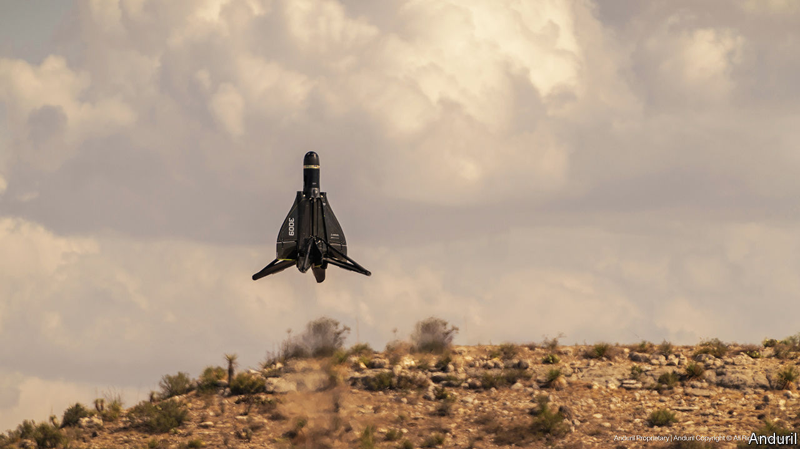

###### Meep-meep. Boom!

# A startup called Anduril has unveiled a reusable missile 

##### Palmer Luckey’s firm hopes “Roadrunner” will shake up America’s arms industry 

 

> Dec 7th 2023 

Palmer Luckey is no stranger to hype. In 2014 he sold Oculus, a virtual-reality startup, , kickstarting the current wave of interest in VR. In 2017 he co-founded Anduril, another startup, this time focused on weapons. On November 29th Mr Luckey said Anduril would release “a radical new category of weapon that is totally unlike anything that has come before it”. On December 1st he unveiled Roadrunner, a missile-cum-drone. It is not revolutionary. But it is interesting.

Roadrunner has two party tricks. Its payload can be changed depending on the mission. Sensors can be installed for surveillance, for instance. But the company’s emphasis is on Roadrunner-M, which is explosive-tipped and designed to destroy drones. It is also reusable. Most air-defence systems, including America’s Patriot and Israel’s , fire several missiles at a target to boost the odds of a kill. Unused ones are lost. Roadrunners can talk to each other in flight. If one takes out the target, the rest can return home and land. 

Both features have precedents. “Loitering munitions” such as Israel’s mini-Harop or the Polish Warblefly can land, too. The Coyote, an air-defence weapon built by RTX, an American firm previously known as Raytheon, also has modular payloads. But putting everything together is new. 

Anduril claims Roadrunner is “far superior” to competing missiles, with higher take-off speed, a bigger payload and ten times the range. Brian Schimpf, the firm’s boss, says it can also cope with faster, more evasive drones likely to appear over the coming years, which might be comparable to high-end cruise missiles.

Perhaps. Comparing air-defence systems is tricky, for they are designed for different things. Iron Dome deals with small rockets. Patriot handles large missiles and planes. Coyote is built for what the Pentagon calls Group One and Two drones, which weigh less than 25kg and fly below 3,500 feet (1,069 metres). Roadrunner is designed for Group Three threats, which can weigh almost 600kg and fly up to 18,000 feet, like the Iranian Shahed-136 drones that Russia has used to .

A Coyote costs about $100,000 per unit. Roadrunner is priced at “low six figures”. That makes it “not much cheaper than many existing air-defence missiles that can engage a far wider range of higher-end threats”, like cruise missiles, says Justin Bronk of the RUSI think-tank in London. He points to NASAMS, a Norwegian-American system which uses off-the-shelf missiles. The cheapest cost around $400,000 to $500,000 each.

Nonetheless, America’s special forces have already bought a few Roadrunners. Anduril will hope large-scale production can bring costs down. But anti-drone technology is a crowded field. In 2019 an American destroyer downed an Iranian drone using electronic warfare. High-powered microwave weapons and lasers have been fitted on warships and tested at air bases. 

Roadrunner’s theatrical launch reflects a divide in America’s arms industry. Critics see the country’s established firms as complacent and lazy, and welcome disruption from scrappy newcomers such as Anduril. Indeed, Roadrunner’s name is a deliberate dig. In the Looney Tunes cartoon of the same name, the nimble roadrunner outwits Wile E. Coyote’s attempts to catch it with needlessly complicated gadgets. The big players, for their part, roll their eyes at upstarts with little experience of mass production. But there is nothing like a little competition to spur everybody on. ■


