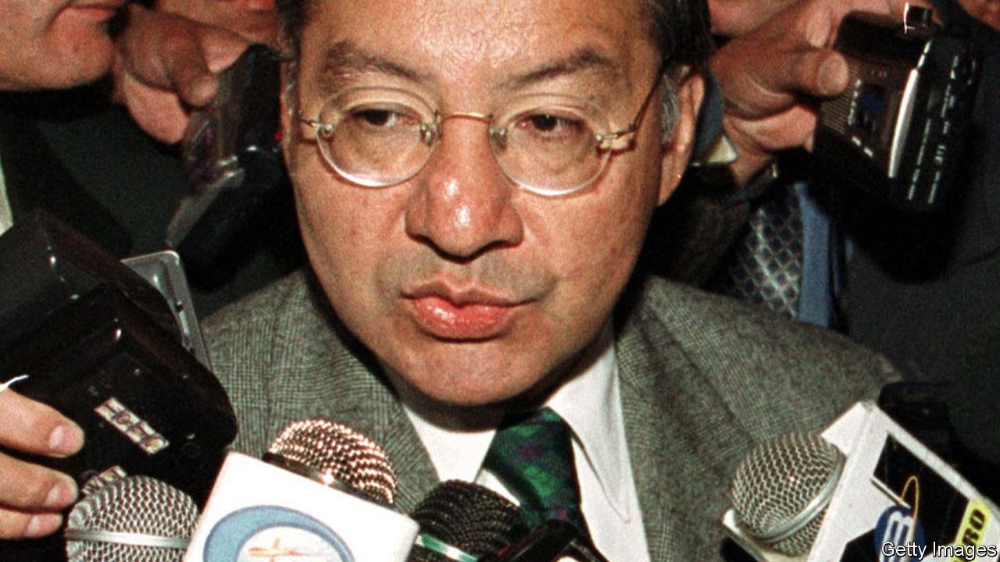

###### Their man in Havana

# America has had a Cuban agent in its midst for 42 years 

##### Cuba’s spooks punch well above their weight 

 

> Dec 7th 2023 

INSIDERS HAVE long known that Cuba’s foreign intelligence agency—the Intelligence Directorate, or DGI in its Spanish acronym—punches above its weight. Evidence of that came on December 4th when the US Justice Department charged Victor Manuel Rocha, a former American ambassador, with secretly serving as a Cuban agent for 42 years. 

Mr Rocha would be one of the highest-placed moles that America’s government has recently found. An indictment says that he started working for Cuba no later than in 1981 and joined the State Department that year. He went on to become the top official for the Americas in the National Security Council in the White House, a senior diplomat in Havana, deputy ambassador in Argentina and ambassador in Bolivia between 1999 and 2002.

Even after retirement, Mr Rocha had access to valuable intelligence. From 2006 to 2012 he was an adviser to the head of the Pentagon’s Southern Command, which has responsibility for Latin America. He was in contact with the DGI as recently as 2016 or 2017. He was caught in a sting when the FBI pretended to be his new handler. He is said to have praised Fidel Castro, Cuba’s revolutionary leader, as “the ”, referred to the United States as “the enemy” and described Cuban spooks as , or comrades. “What we have done”, he is said to have boasted, is “enormous …more than a grand slam.”

Mr Rocha is not the first such case. “I don’t find this particularly surprising,” says Duyane Norman, who ran the CIA’s Latin American operations. “Pound for pound Cuba is recognised as one of the better intelligence services in the world.” Cuban intelligence was modelled on the Soviet KGB and East German Stasi. It penetrated the United States in the 1970s and 1980s, focusing on the recruitment of women and Hispanic men. In 1987 Florentino Aspillaga Lombard, a top Cuban intelligence officer, defected and revealed that virtually every CIA agent on the island since the 1960s had been plants, or later turned and fed misinformation.

American spooks have long acknowledged that their Cuban counterparts were part of, as one government report noted, “a first-rate intelligence service” who could run “highly aggressive operations…throughout the world”. One reason for this was that, as in other communist countries, the brightest often gravitate to positions that bring power and privilege, such as the opportunity to live abroad, says Mr Norman. “They have been cultivating a class of genuine professional intelligence officers for a long time,” he adds.

Those officers have taken a long-term view. “One of the hallmarks of a lot of Cuban operations is patience,” says Mr Norman, allowing recruits to rise to positions of prominence over time. He points to the example of the “Cuban Five”, a group of intelligence officers arrested in Miami in 1998 and accused of infiltrating anti-Castro groups. Mr Rocha was recruited at around aged 30 and helped by the DGI to join the State Department.

Cuba’s biggest known success was Ana Montes, the top Cuba analyst in the Pentagon’s Defence Intelligence Agency (DIA). She had been recruited by Cuban intelligence in 1984, trained in Havana and served as an agent for 17 years until her arrest in 2001. In that time she revealed the names of four American undercover officers in Cuba and details of operations in El Salvador, Nicaragua and Panama. 

The case of Ms Montes, who was released from prison in January, illustrates another reason why the DGI has enjoyed such success. Cuba does not need to resort to what Russia calls , compromising material to blackmail would-be agents, says Mr Norman. Ideology is often enough. Just as Soviet spies traded on the appeal of anti-fascism and socialism in the 1930s, so too did the DGI exploit the (former) romance of the Cuban revolution. 

In the cold war the KGB had to pay, often handsomely, to recruit many of its best agents. Mr Rocha and Ms Montes apparently worked for free. Ms Montes was radicalised by the Reagan administration’s policy in Latin America, including its intervention in Grenada in 1983 and its support for the Contras, right-wing rebels, in Nicaragua. She was, she later told the FBI, a “comrade in the struggle” against America. Mr Rocha, though adopting right-wing garb—last year he contributed to the re-election effort of an anti-Castro congresswoman—was driven by the same ideology. He boasted that his “number-one priority” was to prevent any action “that would endanger…the revolution itself.” ■

