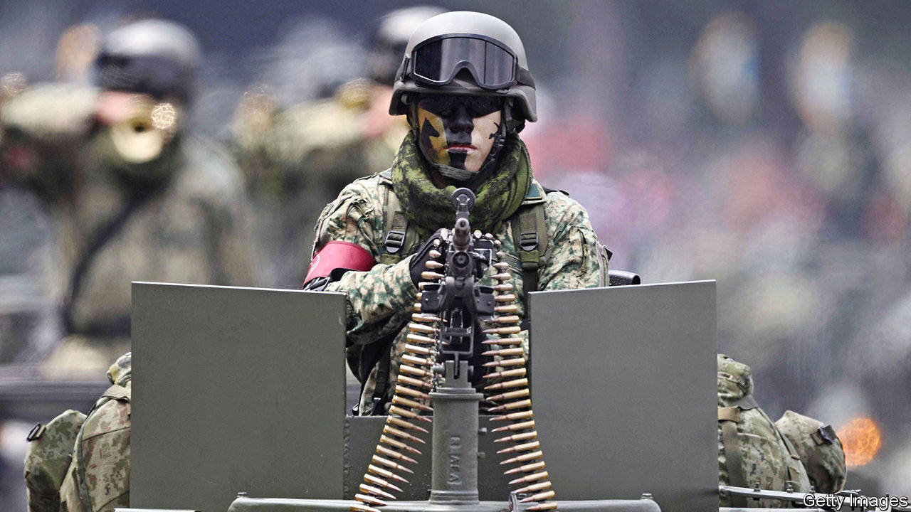

###### General purpose

# Latin America’s armed forces have increasing clout 

##### After 30 years of quiet, they are back in parts of the region 

 

> Dec 7th 2023 

The Essequibo, a swathe of jungle that makes up two-thirds of Guyana, seems an unlikely place for war to break out. But in recent weeks the area has seen an unusual flurry of military activity. Venezuelan troops built an airstrip and roads near the border ahead of a  on whether to annex the territory, which Venezuela has long claimed as its own. American military advisers flew down to Guyana—an oil-rich but poorly armed nation—to talk strategy. On December 4th Brazil’s defence minister sent 16 armoured vehicles to the border with Venezuela after Nicolás Maduro, its autocrat, claimed that 95% of voters had agreed to the annexation. 

Latin America has avoided a major international war for almost a century. Even its cold-war military dictators abstained from attacking each other. Instead, the generals collaborated in the mass murder of dissidents. By the turn of the millennium, newly democratic governments had sent their soldiers back to the barracks. Some got rid of them altogether. Costa Rica abolished its armed forces in 1948. Panama followed suit in 1990. The region spent just 1.1% of its GDP on defence in 2022, on a par with sub-Saharan Africa. Paraguay’s airmen today use second-hand choppers that last saw service in Vietnam.

Yet Latin America’s armed forces are no longer irrelevant. For a start, the region is becoming more embroiled in geopolitical tensions. Its commodities—such as copper, oil, lithium and foodstuffs—have huge strategic value. Chinese state-owned companies are building deepwater ports in Peru and Argentina. China is also said to be ramping up signals bases in Cuba: potential targets in the event of a war with the United States over Taiwan. It is training with the region’s armed forces, too.

And though wars are exceedingly rare between Latin American countries, the region is “the most violent...in the world” for its citizens, says Nicolás Terradas of the Pontifical Catholic University of Peru. As the global demand for illegal drugs has increased, criminal gangs have achieved a level of territorial control and firepower which few police forces can match. 

As a result, politicians that once looked askance at their armies are embracing them. The trend started in Mexico, which drafted troops into fighting criminal gangs in 2006. That has intensified under its current president, Andrés Manuel López Obrador, who came to power in 2018. He has replaced the police with a new National Guard, 80% of whose 130,000 members are active-duty soldiers. The president is also trying to put the guard under the command of the armed forces.

Mexico’s army is engaged in dozens more non-military missions, such as manning Mexico City’s new airport, building banks and guarding refineries. Mr López Obrador has relied on the army to circumvent a hostile civil service and complete his pharaonic infrastructure projects, such as a tourist train to run around the Yucatán peninsula. The only government institution “that responds with 100% loyalty to the president is the military”, says Raúl Benítez Manaut at the National Autonomous University of Mexico. 

Flush with inflated budgets and new powers, Mexico’s military commanders appear increasingly unaccountable. Earlier this year a data hack of the defence ministry suggested that they had spied on journalists and human-rights defenders investigating murders allegedly carried out by soldiers. (They deny wrongdoing.)

Brazil’s former president, Jair Bolsonaro, stuffed his cabinet with military men. Some generals appear to have supported rioters who stormed Congress in January to demand a coup after Mr Bolsonaro lost the election. To keep the army onside, Brazil’s new president, Luiz Inácio Lula da Silva, looks set to approve a plan to double the military budget to 2% of GDP.

Since coming to power in 2022 Gabriel Boric, Chile’s left-wing president, has renewed the state of emergency in the south of the country 35 times and sent the army to guard the northern border. (Before he was in office, he criticised such policies.) In El Salvador Nayib Bukele, who has just circumvented term-limits by stepping down as president in order to seek re-election, has used the army to lock up 70,000 alleged gang members over the past 18 months, or 2% of the adult population.

In Argentina, Javier Milei, who takes over as president on December 10th, appears to have downplayed the atrocities by the military junta, which ran the country from 1976 to 1983. He acknowledges that “excesses” were committed but denies a systematic extermination plan. He describes the dictatorship as part of a war where crimes were committed on both sides.

A warning shot

The region’s democracies are unlikely to attack their neighbours. But its dictatorships may. Venezuela’s sabre-rattling will probably increase ahead of a presidential election next year. The Falklands war of 1982 set a precedent when Argentina’s dictators briefly seized the windswept British archipelago in a bid to distract from brutal repression at home. Hugo Chávez, Venezuela’s former autocrat, repeatedly sent tanks trundling towards Colombia, a firm ally of NATO. A renewed outbreak of hostilities in Latin America “is still a distant prospect”, thinks Robert Evan Ellis of the US Army War College. But Russia’s invasion of Ukraine has made the region’s armies realise “that the unthinkable is still possible”. ■

