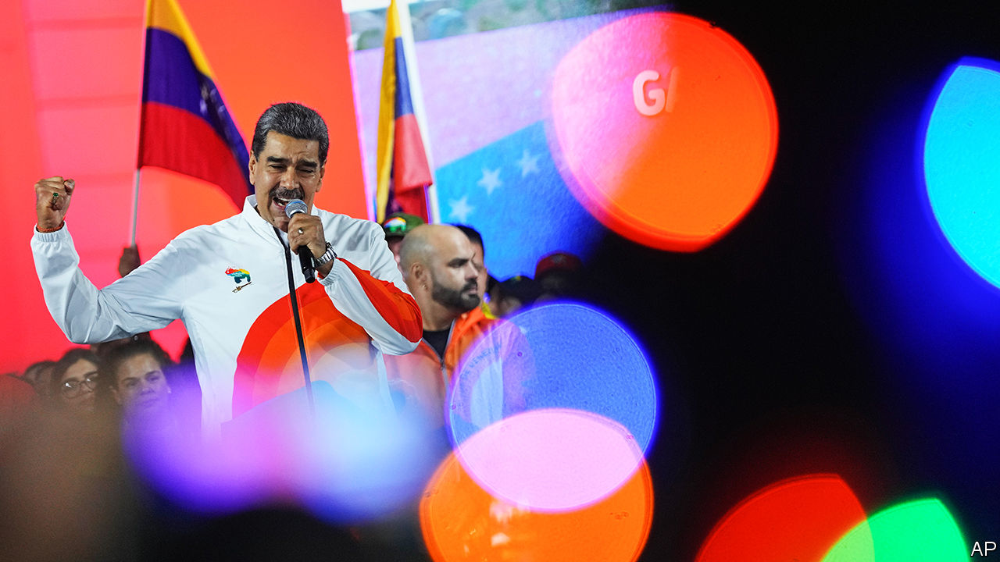
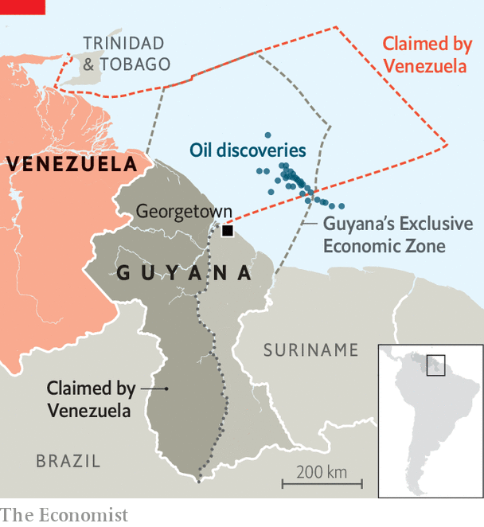

###### Making Venezuela great again?

# Venezuela’s autocrat, Nicolás Maduro, threatens to annex Guyana 

##### An unpopular president holds a referendum to distract voters from his failings 

 

> Dec 4th 2023 


IT IS THE one issue that almost all Venezuelans agree on. For generations, they have been taught that the correct map of their country should include a large chunk of next-door Guyana. The dispute has gained more prominence since 2015, when ExxonMobil, an American oil giant, started making a series of  off the Guyanese coast, some of which are in waters that Venezuela claims. 

So when the propagandists inside President Nicolás Maduro’s regime were pondering how they could demonstrate that their unpopular leader, who faces a presidential election next year, could still mobilise the masses, a referendum on the centuries-old border dispute seemed like a promising tactic. On December 3rd, with much patriotic fanfare and blanket coverage on state TV, the vote was held.

 


Voters were asked five questions, exploring in some detail how the existing border, agreed to in 1899, could be declared illegal and redrawn. The most provocative question came last, asking people if they agreed that two-thirds of the current land mass of Guyana, an area almost the size of Florida known as Essequibo, should be absorbed by Venezuela, forming a new state. 

The result of the referendum was predictable, especially since the regime holding it has a reputation for fiddling elections. Indeed, there was no organised “no” campaign. According to the government-controlled electoral authority, the CNE, 95% of answers to each of the questions was yes. “The ‘tick here to make my country bigger’ option was always bound to win,” quips a Western diplomat in Caracas. 

The question of turnout was more controversial. The CNE declared on December 5th that 10.4m Venezuelans had voted. That was an unbelievable figure. In the presidential election in 2018, which was widely seen as rigged and which Mr Maduro claimed he won, the official turnout was 9.4m. TV footage of that vote showed large crowds of people waiting to cast ballots. 

On the day of the referendum, by contrast, barely any queues were seen or reported outside thousands of polling stations. Even government broadcasters, practised at giving the impression that Venezuela is a thriving democracy, struggled to find voters to film. True turnout was probably fewer than the 2.4m who voted in October in opposition primaries, which were run without government resources. Those were won with 93% of the vote by , a fierce critic of Mr Maduro. She is banned from office. 

Did such apathy over the referendum worry Mr Maduro? Seemingly not. “The Venezuelan people spoke loud and clear,” the autocrat declared, wearing a bespoke white referendum tracksuit top as he addressed supporters at a rally after the vote near the presidential palace in Caracas. Jorge Rodríguez, the president of the regime’s rubber-stamp National Assembly, said the mandate was so large that the government had no choice but “to abide by it”.

And that is what it is doing, at least on paper. On December 5th Mr Maduro ordered a new Venezuelan state to be created, called “Guayana Esequiba”. He appointed Rodríguez Cabello, a general, as its chief. A new map of a now larger Venezuela has been published. Mr Maduro, whose rule has been marked by mass emigration and soaring poverty, said that Petróleos de Venezuela SA (PDVSA), the state’s oil company, should begin granting operating licences for the exploitation of crude oil, gas and mines in Essequibo, and that “social care“ should be organised for its inhabitants.

This has all the hallmarks of “the fairytale stage” of a dictatorship, says the Western diplomat. In reality, the exercise has backfired. If Venezuelans could not be persuaded to vote in large numbers for a profitable slice of Guyana, what hope might Mr Maduro have that they would re-elect him in a fair election, assuming the regime decided to hold one? 

The timing of the referendum also appears to be something of an own goal for the usually savvy Mr Maduro. In October representatives of his regime signed an agreement in Barbados with members of the opposition over how the presidential election might be held in 2024. In return for some modest pledges, the United States  for an initial six months, most significantly on PDVSA. This means that it can expand production and the regime can begin selling its oil at market prices. 

President Joe Biden’s administration recently reminded Mr Maduro that he needed to fulfil his part of the deal, by releasing American prisoners and beginning the process of rehabilitating banned politicians, including Ms Machado, by the end of November. Mr Maduro’s government appeared to be partially complying with that demand, hours before the deadline expired. It announced on November 30th that opposition politicians could appeal against their bans until December 15th.

But now Mr Maduro has chosen to be a pariah once more. Luiz Inácio Lula da Silva, Brazil’s president, has long  Mr Maduro for the economic disaster that Venezuela has been through under his decade-long rule. But Lula showed irritation on December 3rd at the cop28 summit. “If there’s one thing South America doesn’t need right now, it is conflict,” he said. 

Before the referendum Vladímir Padrino López, the defence minister, ominously claimed that the dispute “is not a war, for now”. Nevertheless, Venezuela is unlikely to invade its neighbour. It “has a massive military advantage over Guyana, but Venezuela would not be confronting only Guyana,” says Rocío San Miguel, a military analyst. The United States and Brazil would swiftly come to the small nation’s defence with military help, she thinks. 

Mr Maduro, who had no doubt convinced himself that the referendum was a brilliant idea, has in fact confirmed his unpopularity. Could this threat of a phoney war against Guyana be his Waterloo? Might those close to him decide he is a liability? Maybe. But he does have an uncanny ability to survive. ■

