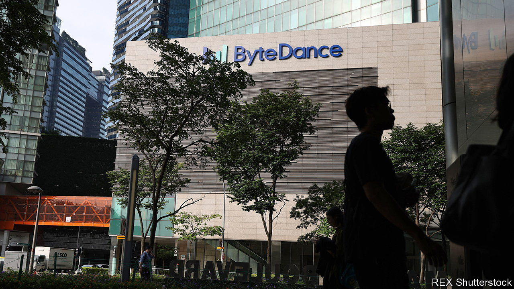
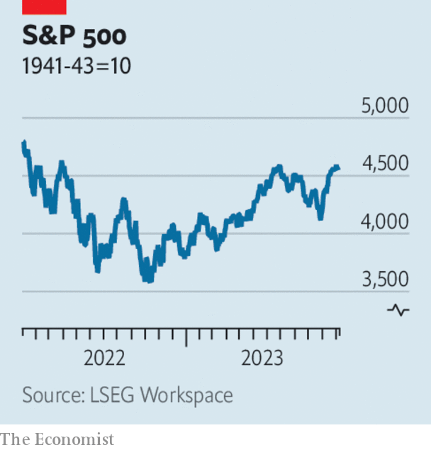

###### The world this week

# Business 

#####  

 

> Dec 7th 2023 

has offered to buy back stock from investors, according to reports, in a proposal that values the owner of the TikTok and Douyin platforms somewhere between $260bn and $268bn. That is about 10% less than what the firm was reportedly worth a year ago in a separate buy-back plan. ByteDance is still the world’s most valuable startup and one of the most valuable firms in China. It has toyed with listing on the Hong Kong stockmarket several times. 

Meanwhile, a federal judge imposed an injunction against  statewide ban on . The ban was supposed to come into force in January, but the judge found that Montana was focused on “targeting China’s ostensible role in TikTok”, and that foreign policy “is not an important Montana state interest”. The ban had been challenged by TikTok and free-speech advocates. Montana described the injunction as “a preliminary matter” in an ongoing process in which it would present “a complete legal argument” to the court. 

China has started operating the world’s first “fourth-generation” , according to state media. The coastal plant in China’s Shandong province generates power through a HTR-PM high-temperature, gas-cooled reactor, based on a modular design. Over the past ten years China has added 37 nuclear reactors to its energy mix (America has added two) and is aiming to install between another six and eight a year. 

said it would take an impairment charge of around £25bn ($31.5bn), as it writes down the carry value of its cigarette assets over the next 30 years. The company, which counts Dunhill, Kent and Lucky Strike among its brands, aims to get half its revenue from smokeless products by 2035. 

 also booked an impairment charge, on the value of , which it acquired almost two decades ago. The conglomerate is writing off $1.3bn from the male shaving-and-grooming business in the current quarter, which comes on top of the $8bn it wrote down in 2019. Gillette has struggled to compete against razor-sharp marketing from upstarts such as Dollar Shave Club and Harry’s.

Return to never-ever land

 was forced to defend its business strategy, after Nelson Peltz launched a fresh proxy fight to gain a seat on the company’s board. In February Mr Peltz’s hedge fund, Trian Partners, backed down from its battle to get a board seat, saying that Disney’s restructuring plan, which included 7,000 job losses, did “everything we wanted them to do”. But Mr Peltz now says that, since giving Disney the opportunity to “right the ship”, shareholders have lost $70bn in value. Disney responded by saying it is in the middle of a “significant transformation”.

The price of  surged past $44,000, its highest level in 20 months. It was boosted in part by investors betting that central banks will cut interest rates next year, which makes riskier assets more attractive. , another asset that does well when interest rates are lower, hit a record high of $2,135 a troy ounce.

 


The bullish mood on rate cuts spurred investors to push up . On December 1st the S&amp;P 500 and the Dow Jones industrial average closed at their highest points this year (though they fell back in subsequent trading). The NASDAQ composite has not been as buoyant these past few weeks, but it has still risen by more than 35% this year. 

 grew by 2.1% in the third quarter on an annual basis, but was just 0.2% bigger than over the previous three months. The quarter-on-quarter rate came in below forecasts and was the slowest pace in a year. Household spending was flat in the Lucky Country, as inflation, interest rates and the end of a tax-offset scheme took their toll on personal finances. 

 decided to cut 1,500 jobs, its third and largest round of lay-offs this year. The music-streaming giant admitted that it hired too many employees in 2020 and 2021 when it “took advantage of the opportunity presented by lower-cost capital”, but it thanked those who were being shown the door for “sharing your talents with us”.

Virtual reality

After being warned about “greenwashing”, companies are now being told not to engage in , or claiming a product or service has been created with artificial intelligence when it has not. Gary Gensler, the chairman of America’s Securities and Exchange Commission, reminded firms that by law they are required to make “truthful” disclosures regarding their use of AI. Examples abound, but include a business that falsely claimed it had used “AI machine learning” to maximise revenues (some investors lost their life savings) and a startup that said it deployed AI to develop mobile apps (the work was mostly done by staff in India). 

