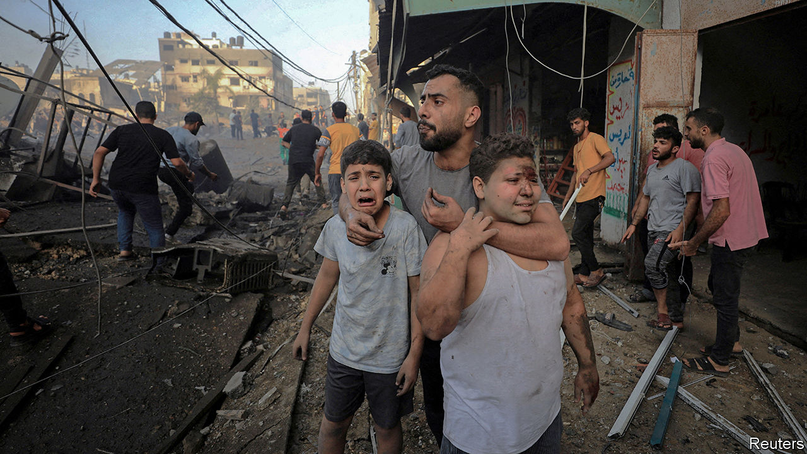
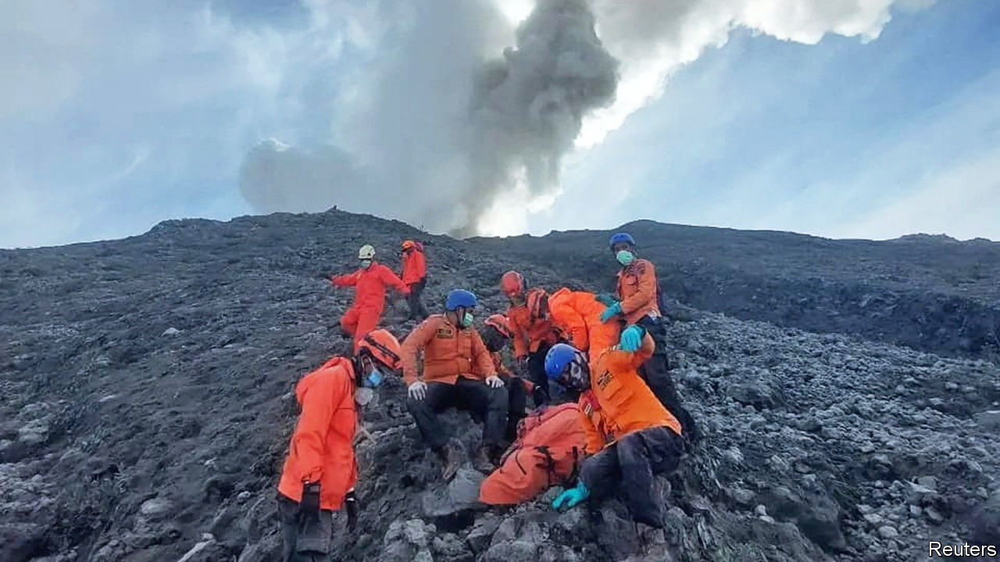

###### The world this week

# Politics 

#####  

 

> Dec 7th 2023 

 brought its  against  to southern Gaza, encircling Khan Younis, where Hamas has consolidated its position after losing control of northern Gaza. Israeli warplanes stepped up their bombardment of the Palestinian strip. The fighting resumed after the collapse of a week-long ceasefire, which America and Israel blamed on Hamas for breaking its promise to release more hostages, firing rockets while the truce was in place and killing civilians in an attack in Jerusalem. With battles raging in the area where Gazans had sought shelter, concerns grew about civilian casualties. Hospitals are said to be running low on fuel and medical supplies. 

America imposed visa sanctions on extremist  who are involved in attacks on Palestinians in the West Bank. Antony Blinken, America’s secretary of state, has pressed the Israeli government to do more to hold settlers who commit violence accountable for their actions. 

 visited Saudi Arabia and the United Arab Emirates, where he discussed oil (Russia is a big contributor to OPEC+) and business (the UAE is a hub for Russian business dealings). Mr Putin was also set to meet Iran’s president, Ebrahim Raisi, in Moscow. Iran supplies drones to Russia for its war on Ukraine. 

The military junta in  scrapped its military partnership with the European Union, which had been helping it fight against jihadists. Niger’s defence ministry said his country wants closer military co-operation with Russia. 

The death toll rose from flooding in Tanzania. Some 300 people in  have died recently, half of them in Kenya, in floods and landslides related to the El Niño climate pattern, which is causing unusually heavy rains in the region.

 air force killed at least 85 civilians when it mistakenly bombed a religious gathering in the northern state of Kaduna. The government has been battling jihadists and armed groups of bandits, who have terrorised large parts of the north. 

Nicolás Maduro,  autocratic president, held a referendum asking voters if they wanted to annex two-thirds of neighbouring , which has benefited from discoveries of huge oil reserves. The exercise was skewed in favour of a yes vote as there was no official “no” campaign. The electoral authority claimed that over 10m people voted, an unlikely figure, given that few were seen at polling-stations. Even so, Brazil sent troops and 16 armoured vehicles to the border with Venezuela. 

I’m away from my desk

Nayib Bukele stepped back from the presidency of  to campaign for elections in February. The country’s constitution bars a second consecutive term, but the Bukele-appointed Supreme Court ruled in 2021 that he could run again if he was out of the post for six months before the inauguration, which takes place on June 1st. Mr Bukele has left his secretary in charge.

Javier Milei, a libertarian economist who takes office as  president on December 10th, selected most of his cabinet. The appointments of Luis Caputo as economy minister and Santiago Bausili as central bank chief, two technocrats from a former centre-right administration, signalled that Mr Milei’s flagship plan of dollarisation would be put on hold. 

The  majority in America’s House of Representatives narrowed to just three, when  was expelled as a member, only the sixth congressman ever to meet that fate, amid charges of unlawful conduct. A special election will be held in his marginal Long Island district. Meanwhile Kevin McCarthy, who was ousted as speaker in October, said he would leave the House by the end of the year. He represents a safe Republican seat in California. 

Republicans in the American Senate blocked a bill to provide more military support to . The legislation became entangled in a row over migration, as the Republicans tied their support for the bill to stricter border measures, which Democrats rejected. Volodymyr Zelensky, Ukraine’s president, cancelled a speech to Congress via video link amid the row. Before the vote the White House’s budget director warned that cutting aid would “kneecap Ukraine on the battlefield”. 

The  home affairs commissioner warned of a “huge risk” of terrorists carrying out attacks in the region over the Christmas period. Ylva Johansson was speaking after a supporter of Islamic State stabbed a man to death and wounded two other people near the Eiffel Tower in Paris. He had previously served time in prison for plotting another attack. Ms Johansson said the conflict in Gaza was polarising society, and increasing the risk of terrorism.

America signed a defence co-operation agreement with , describing the country as a “strong, capable defence partner that champions NATO’s values”. The Hungarian and Turkish parliaments have still not ratified Sweden’s NATO membership.

The EU criticised the  Supreme Court’s decision to outlaw the “international LGBT public movement” for supposed extremism. The ruling imperils those few gay organisations that have dared to still operate in Russia. 

 coalition government scrambled to resolve a budget crisis caused by the Constitutional Court striking down its spending plans because they increased the federal debt. The government has been left with a spending shortfall of €60bn ($65bn) for this year, and time is running out to present a revised budget to parliament. 

Police in the  said that two supporters of Islamic State were suspected of being behind the bombing of a Catholic mass in the city of Marawi, killing four people. In 2017 a pro-IS group took command of Marawi for five months as it battled the country’s army, which eventually regained control.

 


At least 22 climbers were killed when  Mount Marapi volcano erupted. The volcano emitted a 3km-high cloud, covering nearby villages in ash.

Finding a place to stay

 ruling Conservatives were embroiled in fresh turmoil, after the immigration minister resigned in protest against an emergency bill that classifies Rwanda as a safe country in order to send illegal migrants there. The minister said the bill did not go far enough in deterring migration; the government insisted it tackled the recent objections to the policy raised by Britain’s Supreme Court. Rumours swirled that the bill might turn into a confidence vote on the government. 

