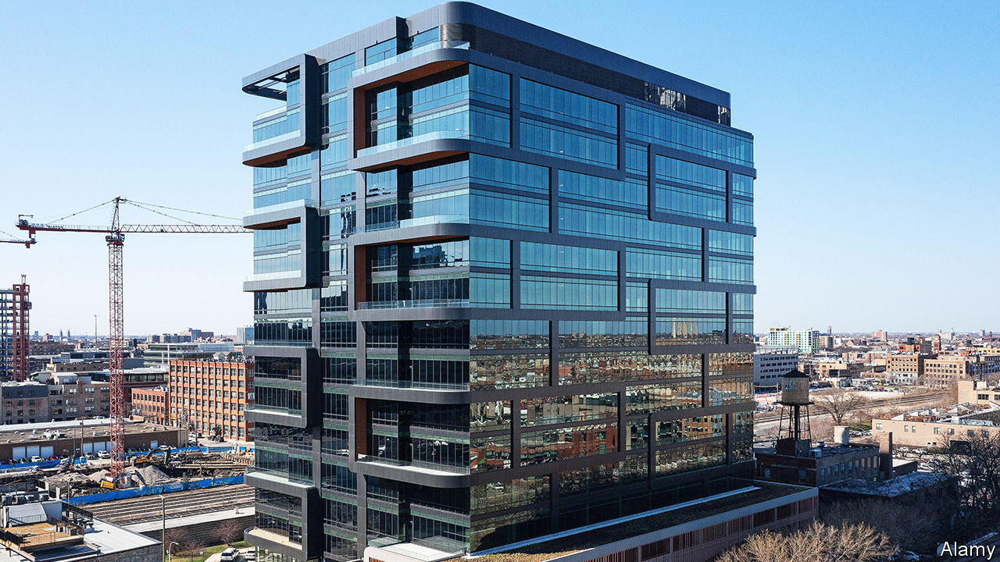

###### Science and the city

# American life-sciences firms are moving labs downtown 

##### They provide welcome demand even as offices shrink 

 

> Dec 7th 2023 

From initial impressions, the headquarters of Portal Innovations, a business in Chicago, resemble any other tech-firm office space. In the main lobby, workers in jeans and t-shirts sip on fancy coffees and lounge around on modernist furniture. Walk around the place, however, and differences become apparent. First, there are almost no cubicles or desktop computers. Instead, the rooms surrounding the central atrium are filled with lab equipment: microscopes, mass spectrometers and bioreactors. Second, the space is in use. Given your correspondent visited late on a Thursday afternoon, the workers are rather numerous. Evidently almost nobody is working from home—probably because they do not have access to those bioreactors in their living rooms.

Portal is a firm somewhere between a WeWork and a venture-capital incubator for life-sciences firms. Its tenants are startup firms typically trying to develop new drugs. The complex they are based in is Fulton Labs, in Chicago’s West Loop, which opened its second building last year. From the outside it resembles a fancy hotel, or any other new office building, with its gyms and balconies. But inside it is largely lab space. As well as Portal, space is taken up by the Chan Zuckerberg Biohub, a charitable research lab set up by the Facebook founder, which opened in October. Its construction represents a bet that scientists will flock to city centres, even if office workers remain slow to return.

Until recently, says John Flavin, of Portal, biosciences mostly happened in the suburbs. Big pharmaceutical firms operated huge labs on corporate business parks. But that, he insists, is changing—because bioscience is becoming more like tech. 

New drugs used to be invented by large vertically integrated firms. But now they are increasingly developed by startups that come out of universities and are funded by venture capitalists. These firms face a vicious fight for workers—especially fresh graduates from high-end universities, such as MIT or, in Chicago, Northwestern and the University of Chicago. Those young workers tend to want to live in city centres. “Power is with the individual talent,” says Mr Flavin. “And they all want to be in an urban environment.” That means proximity to restaurants, bars—and other similar businesses to poach staff from.

Could labs make up for diminishing demand for office space, and so help save struggling city centres? It will not be easy. Mr Flavin notes that the building his firm is based in had to be custom-built. JLL, a property consultancy, points out that scientists have different requirements: lab spaces need higher ceilings and more power, which can make converting older buildings to new uses tricky. 

Nonetheless, Boston, a centre for life sciences, last year approved the conversion of an office block to lab space. And new lab space is being built in Manhattan and across the Atlantic in Canary Wharf, in London. Unless office workers can be replaced, landlords in such places will soon face the prospect of hefty rent cuts. The equipment may be microscopic. But the potential rewards for accommodating it are on a macro level. ■


