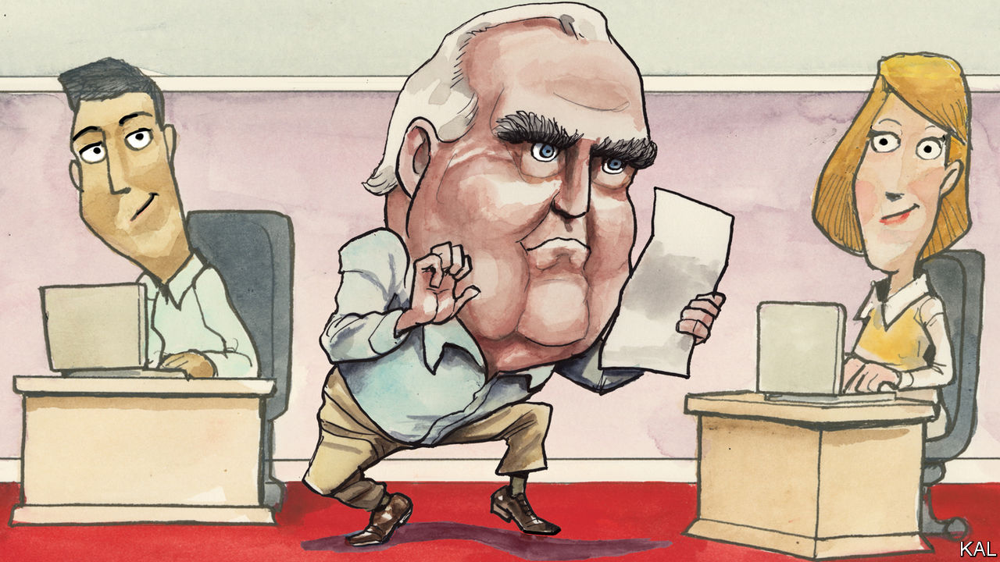

###### Lexington

# Charlie Peters, the man who tried to save Washington 

##### He believed that ruthlessly idealistic journalism would renew faith in government 

 

> Dec 2nd 2023 

For those who thrive in Washington, DC, the city is so pleasant they often lose sight of how smug and insular it can be—how abstracted from the country it is meant to serve. They arrive with dreams of changing the world, and some even do so, a bit. But the city changes them, too. Over the years their innate proportions of idealism and careerism, though both to some degree ever-present, tend to migrate towards the latter. 

It comes to seem only natural that a city created to benefit all Americans sucks in enough wealth to make it among the richest places in the country; that one of its key industries, lobbying, manufactures influence over lawmakers (with record sales of $4bn in 2022); that book parties, embassy receptions and television green rooms, along with the touchlines of soccer pitches at private schools where tuition exceeds Americans’ median personal income, are venues for journalists and public officials to chew over the latest occupant of the White House. Presidents come and go; the Washington establishment abides, and prospers.

Charles Peters, a magazine editor who died on Thanksgiving Day at the age of 96, was a fixture of Washington who nevertheless stood apart from it. Mr Peters—Charlie, as he was invariably called by those who knew federal Washington—arrived during what now seems a romantic and even innocent time, the presidency of John F. Kennedy. An Army veteran and lawyer, Charlie won a seat in the West Virginia house of delegates in 1960 while in the primary helping deliver a crucial county to Kennedy. His reward was a role in a signature Kennedy initiative, the Peace Corps.

Tasked, fatefully, with evaluating the programme’s effectiveness, he became fascinated with how a bureaucracy’s culture can undermine its objectives. In the Peace Corps pressure to show progress led field staff to propose flimsy programmes and then gild the results, while officials in Washington preferred not to challenge them, to duck accountability themselves. He also discovered his best evaluators were journalists he hired part-time, sharp observers who could write and had no long-term ambitions within government that might soften their judgments. 

Restless, and never lacking in confidence, Charlie combined these insights and set out to save government from itself by changing the way journalists covered it. He started his own magazine, the , in 1969. “I wanted to look at Washington the way that an anthropologist looks at a South Sea island,” he wrote in his autobiography, “Tilting at Windmills”. The title, which was also the name of his column in the from 1977 until 2014, captured with characteristic self-awareness the immodesty, idealism and impracticality—the glory—of his venture. 

His faith in government made him a ruthless sceptic of it. A Roosevelt Democrat, he believed in an activist federal role, and he despised the tax-cutting, anti-government drift of the Republican Party. But he feared, rightly, that Democrats’ indifference to bureaucratic bloat would erode support for programmes to help poor and working-class Americans. This orientation—idealism with a gimlet eye—was the essence of his approach. He summed up the prejudices of liberals as “Don’t say anything good about the bad guys”, including businesspeople, the police and the clergy. A corollary was “Don’t say anything bad about the good guys”, meaning Democratic constituencies such as civil servants, teachers and union officials. His writers had to be willing to do both.

Charlie thought Democrats could respect the armed forces while attacking Pentagon waste or foolish wars; be patriotic without indulging chauvinism; and embrace entrepreneurship without neglecting the poor. He believed in some form of national service to encourage class-mixing and civic responsibility. He saw cultural snobbery, and the chase for status and wealth it inspired, as among the most destructive forces in American life. It was Charlie who first applied the label “neoliberal” to his synthesis of liberal, conservative and even radical ideas, but he never liked the term, and now it is linked to an anti-regulatory fervour he reviled.

Though the  published many important articles over the years, Charlie changed Washington far less than he hoped. It grew more cynical, and Americans grew more cynical about it. But Washington changed him even less. The magazine was never a juggernaut. He ran it on the model of the Peace Corps, hiring aspiring editor/writers for two-year terms. Into the 1990s he paid himself less than $25,000 a year—his wife, Beth, helped keep them housed and fed through her work as a school administrator—and he paid his editors less than half that. He demanded articles with a strong point of view earned through shoe-leather reporting and meticulous reasoning that always acknowledged, as he would put it, when the other side was 20% right, or even 49% right. 

Making it rain

Straw men sent him into a fury. His editing technique became known as the “rain dance” because it would so often eject him from his seat and send him bouncing around the room. He was not tall, and in these moments the blazing dark eyes under billowing eyebrows and the small hands pawing at the air called to mind a particularly terrifying raccoon. If the rain dance took place during a meal, the writer’s disappointing draft, and even the writer, might emerge flecked with tuna fish or spotted with Negroni.

Those journalists are Charlie’s most influential legacy. One of them, Paul Glastris, has edited the  since Charlie stepped down in 2001, and dozens of others went on to roles as writers and editors throughout American media, sometimes training journalists themselves. Charlie continued to advise his former staff until near his death. Each of these journalists, including Lexington, has Charlie’s voice in their ear as they write, demanding that they do better than to indulge despair over the state of things, that they do not just criticise but try to solve, that they never forget how fortunate they are or why they got into this struggle to begin with. ■


