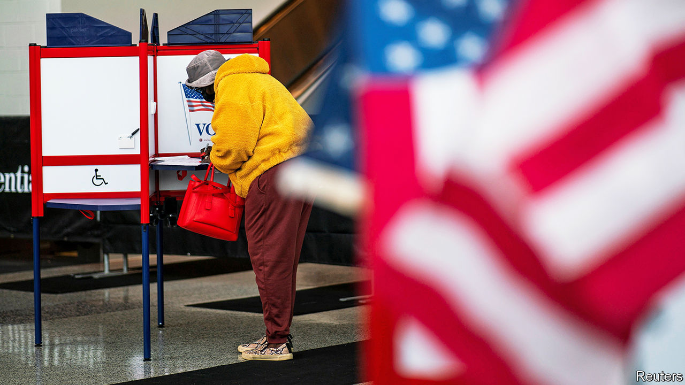

###### Fuhgeddaboudit!

# New Jersey introduced a smart voting reform—then let it lapse 

##### The automatic right to vote from home helped make the state’s turnout the highest in America 

 

> Dec 7th 2023 

The covid-19 pandemic changed a lot of things. For some states, this included voting. Four states (California, Nevada, New Jersey and Vermont) and the District of Columbia decided to automatically send every voter a mail-in ballot. Five other states (Colorado, Hawaii, Oregon, Utah and Washington) already did this before the pandemic. After implementing this temporary change for the 2020 presidential election New Jersey had the highest voter turnout in the country after Washington, DC. Then it did what any reasonable government would do when something goes well. It allowed the provision to expire.

Being citizens of one of the richest and most educated states, New Jerseyans should vote more than they do, says Jake Grumbach, a public-policy professor at the University of California, Berkeley. In the previous presidential election, in 2016, only 62% of eligible voters in the state cast a ballot (about the same as the national average). This changed in 2020. New Jersey topped the league with a 78% turnout (compared with 67% nationally).

The pandemic election also seemed to engage a notoriously nonchalant group: younger voters. According to a study by the National Vote At Home Institute (NVAHI), a non-profit outfit that advocates for expanded voting access, among all the states New Jersey also came top for participation among eligible voters aged 18-34, with a turnout of 64%. In the previous presidential election, less than half of young eligible New Jerseyans cast a ballot.

There could be many reasons for the rise in civic engagement in 2020. It was a presidential-election year during a global pandemic. George Floyd’s murder months earlier sparked a racial reckoning. Many people found themselves at home with little to do but much to worry about. Still, Phil Keisling of the NVAHI thinks that something else was in play for New Jersey: the automatic ability for every registered voter to vote from home.

During the 2020 election every registered voter in New Jersey received a mail-in ballot. Those voters then had options. They could post their ballot back. They could place it in a secure drop-box or at a polling place on election day. Still others left those ballots at home and voted the traditional way in a booth.

It appears that this surge of voter participation was too much of a good thing for the Garden State. After 2020 New Jersey ignored the success of its experiment and let its automatic mail-in-ballot policy end. This is a particularly surprising move for a state where 57% of voters chose President Joe Biden. (Donald Trump tweeted in 2020 that mail-in voting “doesn’t work out well for Republicans”.) 

“Universal mail ballots with automatic registration…is the best system,” says Professor Grumbach. “So it is weird when any state, especially a blue state that says it likes accessible voting, moves away from that.” After the 2020 election, California, Nevada, Vermont and Washington, DC, kept their automatic mail-in-ballot system. New Jersey chose to invest in in-person voting technology instead.

Voter turnout is already down for New Jersey, and it will probably stay down for the next presidential election. Mid-term elections tend to have lower voter participation than presidential ones, but compared with other states New Jersey had the biggest drop between 2020 and 2022 (31 percentage points, compared with the national fall of 20 points).

Micah Rasmussen, of the Rebovich Institute for New Jersey Politics at Rider University, says that low turnout, especially during presidential elections, is not a concern for New Jersey’s state politicians. New Jersey is one of only four states to have off-year elections, meaning that governors and state legislators are elected outside the federal-election cycle. And for the most part this process works well for the Democrats in charge. “Democrats are using vote-by-mail very strategically and effectively to build the electorate they want to get the turnout that they want,” says Mr Rasmussen. “They’ve got things the way they like them, and there’s not really a desire to change that.” ■


