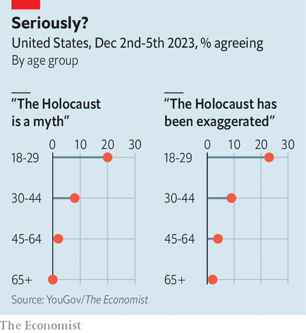

###### Young opinions

# One in five young Americans think the Holocaust is a myth 

##### Our new poll makes alarming reading 

 

> Dec 7th 2023 

On December 5th, for over five hours, lawmakers grilled the presidents of elite universities in a congressional hearing about antisemitism on college campuses. In one of the testiest exchanges a Republican congresswoman, Elise Stefanik, asked whether “calling for the genocide of Jews” violates university rules. It is “context-dependent”, replied Liz Magill, the president of the University of Pennsylvania. Clips of the exchange went viral on X, formerly Twitter. Yad Vashem, a Holocaust museum and research centre, issued a condemnation and stressed the importance of “raising awareness about the history of antisemitism and the Holocaust”.

 


A new poll from YouGov/ suggests that Yad Vashem has its work cut out. Young Americans—or at least the subset of them who take part in surveys—appear to be remarkably ignorant about one of modern history’s greatest crimes. Some 20% of respondents aged 18-29 think that the Holocaust is a myth, compared with 8% of those aged 30-44 (see chart). An additional 30% of young Americans said they do not know whether the Holocaust is a myth. Many respondents espouse the canard that Jews wield too much power in America: young people are nearly five times more likely to think this than are those aged 65 and older (28% versus 6%). 

Now for the harder part: why do some young Americans embrace such views? Perhaps surprisingly, education levels do not appear to be the culprit. In our poll, the proportion of respondents who believe that the Holocaust is a myth is similar across all levels of education. 

Social media might play a role. According to a 2022 survey from the Pew Research Centre, Americans under 30 are about as likely to trust information on social media as they are to trust national news organisations. More recently Pew found that 32% of those aged 18-29 get their news from TikTok. Social-media sites are rife with conspiracy theories, and research has found strong associations between rates of social-media use and beliefs in such theories. In one recent survey by Generation Lab, a data-intelligence company, young adults who used TikTok were more likely to hold antisemitic beliefs.

Though young Americans’ views are most stark, antisemitism is rearing its head in other demographic groups. The same YouGov/ poll found that 27% of black respondents and 19% of Hispanics believe that Jews have too much power in America, compared with 13% of white respondents who say so. Whatever the reasons, the polling is alarming. ■


