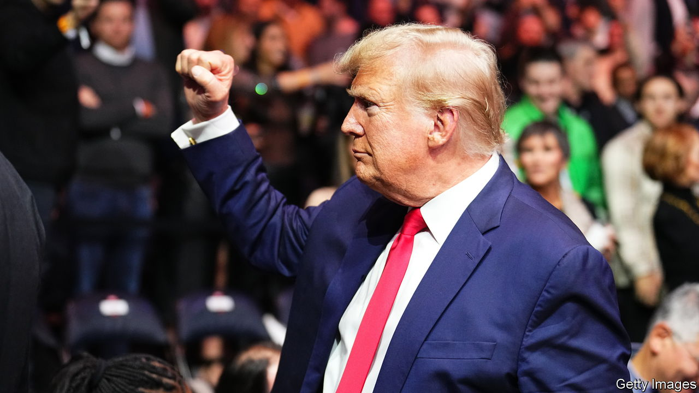
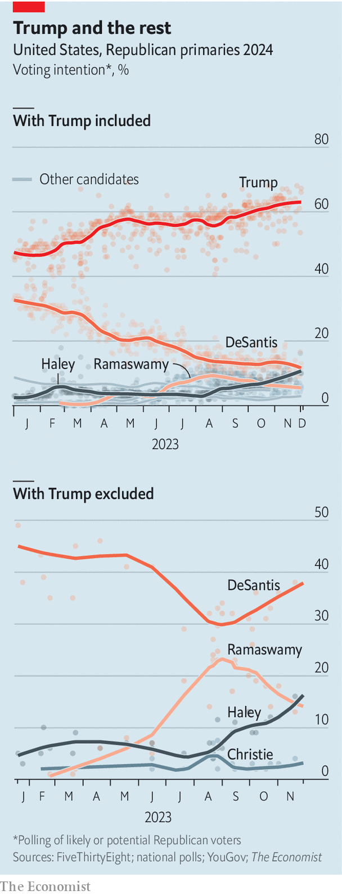

###### A Don-horse race

# Our tracker of voters’ intentions shows the contest behind Trump 

##### And what might happen if Trump dropped out 

 

> Dec 6th 2023 

To see how extraordinarily tight Donald Trump’s grip on his party is, look back . Then Mr Trump was the unexpected front-runner in the Republican presidential primaries, polling at around 30%. That was still uncertain enough for  to call his candidacy a “long shot” in . Today, according to  of Republicans’ voting intentions (see the latest odds at economist.com/republicans-tracker), he has double the support he did then. His closest rival, , the governor of Florida, is on a lowly 12% (see left-hand chart). Of all the things that could stop Mr Trump from contesting next year’s election, the most probable obstacle is himself. 

 


The primaries may yet throw up some surprises. Despite high-profile withdrawals in recent weeks, including Mike Pence, Mr Trump’s former vice-president, determined opponents remain. Mr DeSantis has flopped on the campaign trail, but Nikki Haley, who trails just behind Mr DeSantis, received a boost recently when the Koch network, one of the party’s biggest donors, backed the former governor of South Carolina. She has notably distanced herself from Mr Trump by being hawkish on Ukraine. And Vivek Ramaswamy, a 38-year-old former pharmaceutical-company boss, has learnt from Mr Trump: he is quick to throw himself in front of a microphone, heaps praise on the former president and sticks sharp barbs into everyone else. 

None is likely to overtake Mr Trump. But they are boosting their profiles—in some cases maybe positioning themselves for jobs in a new Trump administration. 

Never-Trumpers instead look to the courts to scupper the former president. Mr Trump faces four criminal trials. If he is convicted, the constitution would probably not prevent him from running. But the trials may yet sour voters on him. 

What if Mr Trump were to drop out, improbable as that may be? The few polls which take into account his supporters’ second preferences currently suggest Mr DeSantis would be the most likely victor (see right-hand chart), though Ms Haley is moving up. The Republican National Convention in Milwaukee, where the party will crown its nominee, is still seven months away. But the race is Mr Trump’s to lose. ■


