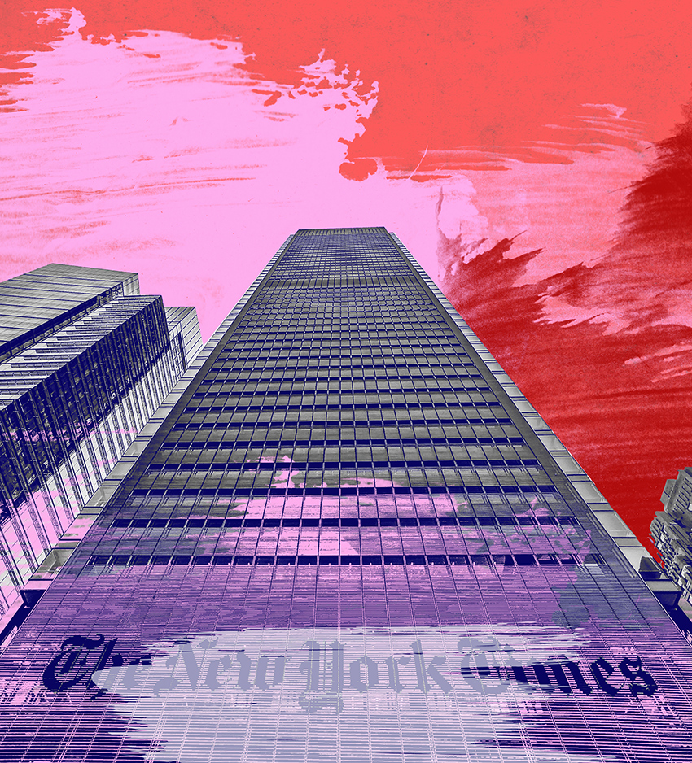
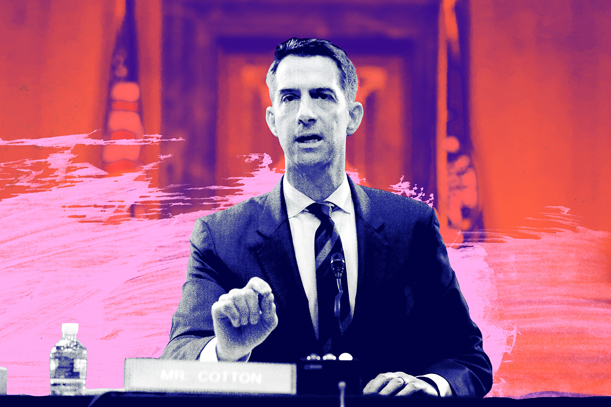
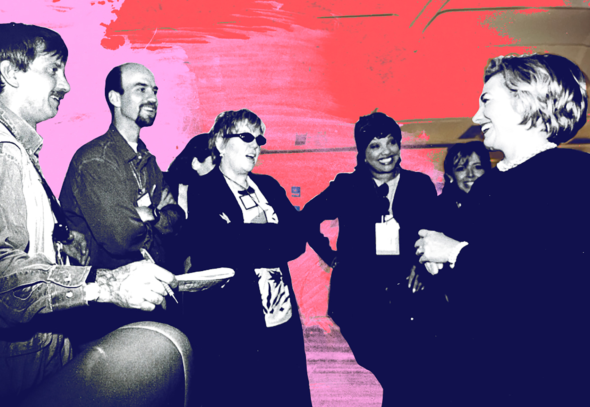

###### Journalism

# When the New York Times lost its way 

##### America’s media should do more to equip readers to think for themselves 

 

> Dec 14th 2023 

Are we truly so precious?” Dean Baquet, the executive editor of the , asked me one Wednesday evening in June 2020. I was the editorial-page editor of the , and we had just published an op-ed by , a senator from Arkansas, that was outraging many members of the staff. America’s conscience had been shocked days before by images of a white police officer kneeling on the neck of a black man, George Floyd, until he died. It was a frenzied time in America, assaulted by covid-19, scalded by police barbarism. Throughout the country . Substantive reform of the police, so long delayed, suddenly seemed like a real possibility, but so did violence and political backlash. In some cities rioting and looting had broken out. 

It was the kind of crisis in which journalism could fulfil its highest ambitions of helping readers understand the world, in order to fix it, and in the ’s Opinion section, which I oversaw, we were pursuing our role of presenting . We had published pieces arguing against the idea of relying on troops to stop the violence, and one urging abolition of the police altogether. But Cotton, an army veteran, was calling for the use of troops to protect lives and businesses from rioters. Some reporters and other staff were taking to what was then called Twitter, now called X, to attack the decision to publish his argument, for fear he would persuade readers to support his proposal and it would be enacted. The next day the ’s union—its unit of the NewsGuild-CWA—would issue a statement calling the op-ed “a clear threat to the health and safety of the journalists we represent”.

The had endured many cycles of Twitter outrage for one story or opinion piece or another. It was never fun; it felt like sticking your head in a metal bucket while people were banging it with hammers. The publisher, A.G. Sulzberger, who was about two years into the job, understood why we’d published the op-ed. He had some criticisms about packaging; he said the editors should add links to other op-eds we’d published with a different view. But he’d emailed me that afternoon, saying: “I get and support the reason for including the piece,” because, he thought, Cotton’s view had the support of the White House as well as a majority of the Senate. As the clamour grew, he asked me to call Baquet, the paper’s most senior editor.


Like me, Baquet seemed taken aback by the criticism that readers shouldn’t hear what Cotton had to say. Cotton had a lot of influence with the White House, Baquet noted, and he could well be making his argument directly to the president, Donald Trump. Readers should know about it. Cotton was also a possible future contender for the White House himself, Baquet added. And, besides, Cotton was far from alone: lots of Americans agreed with him—most of them, according to some polls. “Are we truly so precious?” Baquet asked again, with a note of wonder and frustration.

The answer, it turned out, was yes. Less than three days later, on Saturday morning, Sulzberger called me at home and, with an icy anger that still puzzles and saddens me, demanded my resignation. I got mad, too, and said he’d have to fire me. I thought better of that later. I called him back and agreed to resign, flattering myself that I was being noble.

Whether or not American democracy endures, a central question historians are sure to ask about this era is why America came to elect Donald Trump, promoting him from a symptom of the country’s institutional, political and social degradation to its agent-in-chief. There are many reasons for Trump’s ascent, but changes in the American news media played a critical role. Trump’s manipulation and every one of his political lies became more powerful because journalists had forfeited what had always been most valuable about their work: their credibility as arbiters of truth and brokers of ideas, which for more than a century, despite all of journalism’s flaws and failures, had been a bulwark of how Americans govern themselves. 

I hope those historians will also be able to tell the story of how journalism found its footing again – how editors, reporters and readers, too, came to recognise that journalism needed to change to fulfil its potential in restoring the health of American politics. As Trump’s nomination and possible re-election loom, that work could not be more urgent. 

I think Sulzberger shares this analysis. In interviews and his own writings, including an essay earlier this year for the , he has defended “independent journalism”, or, as I understand him, fair-minded, truth-seeking journalism that aspires to be open and objective. It’s good to hear the publisher speak up in defence of such values, some of which have fallen out of fashion not just with journalists at the and other mainstream publications but at some of the most prestigious schools of journalism. Until that miserable Saturday morning I thought I was standing shoulder-to-shoulder with him in a struggle to revive them. I thought, and still think, that no American institution could have a better chance than the , by virtue of its principles, its history, its people and its hold on the attention of influential Americans, to lead the resistance to the corruption of political and intellectual life, to overcome the encroaching dogmatism and intolerance. 

 


But Sulzberger seems to underestimate the struggle he is in, that all journalism and indeed America itself is in. In describing the essential qualities of independent journalism in his essay, he unspooled a list of admirable traits – empathy, humility, curiosity and so forth. These qualities have for generations been helpful in contending with the ’s familiar problem, which is liberal bias. I have no doubt Sulzberger believes in them. Years ago he demonstrated them himself as a reporter, covering the American Midwest as a real place full of three-dimensional people, and it would be nice if they were enough to deal with the challenge of this era, too. But, on their own, these qualities have no chance against the ’s new, more dangerous problem, which is in crucial respects the opposite of the old one. 

The ’s problem has metastasised from liberal bias to illiberal bias, from an inclination to favour one side of the national debate to an impulse to shut debate down altogether. All the empathy and humility in the world will not mean much against the pressures of intolerance and tribalism without an invaluable quality that Sulzberger did not emphasise: courage. 

Don’t get me wrong. Most journalism obviously doesn’t require anything like the bravery expected of a soldier, police officer or protester. But far more than when I set out to become a journalist, doing the work right today demands a particular kind of courage: not just the devil-may-care courage to choose a profession on the brink of the abyss; not just the bulldog courage to endlessly pick yourself up and embrace the ever-evolving technology; but also, in an era when polarisation and social media viciously enforce rigid orthodoxies, the moral and intellectual courage to take the other side seriously and to report truths and ideas that your own side demonises for fear they will harm its cause. 

One of the glories of embracing illiberalism is that, like Trump, you are always right about everything, and so you are justified in shouting disagreement down. In the face of this, leaders of many workplaces and boardrooms across America find that it is so much easier to compromise than to confront – to give a little ground today in the belief you can ultimately bring people around. This is how reasonable Republican leaders lost control of their party to Trump and how liberal-minded college presidents lost control of their campuses. And it is why the leadership of the  is losing control of its principles. 


Over the decades the and other mainstream news organisations failed plenty of times to live up to their commitments to integrity and open-mindedness. The relentless struggle against biases and preconceptions, rather than the achievement of a superhuman objective omniscience, is what mattered. As everyone knows, the internet knocked the industry off its foundations. Local newspapers were the proving ground between college campuses and national newsrooms. As they disintegrated, the national news media lost a source of seasoned reporters and many Americans lost a journalism whose truth they could verify with their own eyes. As the country became more polarised, the national media followed the money by serving partisan audiences the versions of reality they preferred. This relationship proved self-reinforcing. As Americans became freer to choose among alternative versions of reality, their polarisation intensified. When I was at the , the newsroom editors worked hardest to keep Washington coverage open and unbiased, no easy task in the Trump era. And there are still people, in the Washington bureau and across the , doing work as fine as can be found in American journalism. But as the top editors let bias creep into certain areas of coverage, such as culture, lifestyle and business, that made the core harder to defend and undermined the authority of even the best reporters. 

There have been signs the  is trying to recover the courage of its convictions. The paper was slow to display much curiosity about the hard question of the proper medical protocols for trans children; but once it did, the editors defended their coverage against the inevitable criticism. For any counter-revolution to succeed, the leadership will need to show courage worthy of the paper’s bravest reporters and opinion columnists, the ones who work in war zones or explore ideas that make illiberal staff members shudder. As Sulzberger told me in the past, returning to the old standards will require agonising change. He saw that as the gradual work of many years, but I think he is mistaken. To overcome the cultural and commercial pressures the faces, particularly given the severe test posed by another Trump candidacy and possible presidency, its publisher and senior editors will have to be bolder than that. 

Since Adolph Ochs bought the paper in 1896, one of the most inspiring things the has said about itself is that it does its work “without fear or favour”. That is not true of the institution today – it cannot be, not when its journalists are afraid to trust readers with a mainstream conservative argument such as Cotton’s, and its leaders are afraid to say otherwise. As preoccupied as it is with the question of why so many Americans have lost trust in it, the is failing to face up to one crucial reason: that it has lost faith in Americans, too. 

For now, to assert that the plays by the same rules it always has is to commit a hypocrisy that is transparent to conservatives, dangerous to liberals and bad for the country as a whole. It makes the too easy for conservatives to dismiss and too easy for progressives to believe. The reality is that the is becoming the publication through which America’s progressive elite talks to itself about an America that does not really exist.

 


It is hard to imagine a path back to saner American politics that does not traverse a common ground of shared fact. It is equally hard to imagine how America’s diversity can continue to be a source of strength, rather than become a fatal flaw, if Americans are afraid or unwilling to listen to each other. I suppose it is also pretty grandiose to think you might help fix all that. But that hope, to me, is what makes journalism worth doing.

The es taught me how to do daily journalism. I joined the paper, for my first stint, in the pre-internet days, in an era of American journalism so different that it was almost another profession. Back in 1991 the was anxious not about a print business that was collapsing but about an industry so robust that Long Island  was making a push into New York City. A newspaper war was under way, and the was fighting back by expanding its Metro desk, hiring reporters and opening bureaus in Brooklyn, Queens and the Bronx. 

Metro was the biggest news desk. New reporters had to do rotations of up to a year there to learn the culture and folkways of the paper. Baquet, surely among the greatest investigative journalists America has produced, was then in Metro. I was brought on as a probationary reporter, with a year to prove myself, and like other new hires was put through a series of assignments at the low end of the hierarchy. 

After about six months the Metro editor, Gerald Boyd, asked me to take a walk with him, as it turned out, to deliver a harsh lesson in ian ambition and discipline. Chain-smoking, speaking in his whispery, peculiarly high-pitched voice, he kicked my ass from one end of Times Square to the other. He had taken a chance hiring me, and he was disappointed. There was nothing special about my stories. At the rate I was going, I had no chance of making it onto the paper.

The next day was a Saturday, and I reached Boyd at home through the Metro desk to rattle off the speech I’d endlessly rehearsed while staring at the ceiling all night. The gist was that the desk had kept me chasing small-bore stories, blah blah blah. Boyd sounded less surprised than amused to hear from me, and soon gave me a new assignment, asking me to spend three months covering the elderly, one of several new “mini-beats” on subjects the desk had overlooked. 

I was worried there were good reasons this particular beat had been ignored. At 26, as one of the youngest reporters on the desk, I was also not an obvious candidate for the role of house expert on the wise and grey. But Boyd assigned me to an excellent editor, Suzanne Daley, and as I began studying the city’s elderly and interviewing experts and actual old people, I began to discover the rewards granted any serious reporter: that when you acknowledge how little you know, looking in at a world from the outside brings a special clarity.


The subject was more complicated and richer than I imagined, and every person had stories to tell. I wrote about hunger, AIDS and romance among the elderly, about old comedians telling old jokes to old people in senior centres. As I reported on Jews who had fled Germany to settle in Washington Heights or black Americans who had left the Jim Crow south to settle in Bushwick, Brooklyn, it dawned on me that, thanks to Boyd, I was covering the history of the world in the 20th century through the eyes of those who had lived it. 

After joining the permanent staff, I went, again in humbling ignorance, to Detroit, to cover the auto companies’ – and the city’s – struggle to recapture their former glory. And again I had a chance to learn, in this case, everything from how the largest companies in the world were run, to what it was like to work the line or the sales floor, to the struggle and dignity of life in one of America’s most captivating cities. “We still have a long way to go,” Rosa Parks told me, when I interviewed her after she had been robbed and beaten in her home on Detroit’s west side one August night in 1994. “And so many of our children are going astray.” 

I began to write about presidential politics two years later, in 1996, and as the most inexperienced member of the team was assigned to cover a long-shot Republican candidate, Pat Buchanan. I packed a bag for a four-day reporting trip and did not return home for six weeks. Buchanan campaigned on an eccentric fusion of social conservatism and statist economic policies, along with coded appeals to racism and antisemitism, that 30 years earlier had elevated George Wallace and 20 years later would be rebranded as Trumpism. He also campaigned with conviction, humour and even joy, a combination I have rarely witnessed. As a Democrat from a family of Democrats, a graduate of Yale and a blossom of the imagined meritocracy, I had my first real chance, at Buchanan’s rallies, to see the world through the eyes of stalwart opponents of abortion, immigration and the relentlessly rising tide of modernity.

The task of making the world intelligible was even greater in my first foreign assignment. I arrived in Jerusalem a week before the attacks of September 11th 2001, just after the second intifada had broken out. I had been to the Middle East just once, as a White House reporter covering President Bill Clinton. “Well, in at the deep end,” the foreign editor, Roger Cohen, told me before I left. To spend time with the perpetrators and victims of violence in the Middle East, to listen hard to the reciprocal and reinforcing stories of new and ancient grievances, is to confront the tragic truth that there can be justice on more than one side of a conflict. More than ever, it seemed to me that a reporter gave up something in renouncing the taking of sides: possibly the moral high ground, certainly the psychological satisfaction of righteous anger. 

 


But there was a compensating moral and psychological privilege that came with aspiring to journalistic neutrality and open-mindedness, despised as they might understandably be by partisans. Unlike the duelling politicians and advocates of all kinds, unlike the corporate chieftains and their critics, unlike even the sainted non-profit workers, you did not have to pretend things were simpler than they actually were. You did not have to go along with everything that any tribe said. You did not have to pretend that the good guys, much as you might have respected them, were right about everything, or that the bad guys, much as you might have disdained them, never had a point. You did not, in other words, ever have to lie.

This fundamental honesty was vital for readers, because it equipped them to make better, more informed judgments about the world. Sometimes it might shock or upset them by failing to conform to their picture of reality. But it also granted them the respect of acknowledging that they were able to work things out for themselves. 

What a gift it was to be taught and trusted as I was by my editors – to be a reporter with licence to ask anyone anything, to experience the whole world as a school and every source and subject as a teacher. I left after 15 years, in 2006, when I had the chance to become editor of the . Rather than starting out on yet another beat at the , I felt ready to put my experience to work and ambitious for the responsibility to shape coverage myself. It was also obvious how much the internet was changing journalism. I was eager to figure out how to use it, and anxious about being at the mercy of choices by others, in a time not just of existential peril for the industry, but maybe of opportunity. 

The  did not aspire to the same role as the . It did not promise to serve up the news of the day without any bias. But it was to opinion journalism what the ’s reporting was supposed to be to news: honest and open to the world. The question was what the magazine’s 19th-century claim of intellectual independence – to be “of no party or clique” – should mean in the digital era. 


Those were the glory days of the blog, and we hit on the idea of creating a living op-ed page, a collective of bloggers with different points of view but a shared intellectual honesty who would argue out the meaning of the news of the day. They were brilliant, gutsy writers, and their disagreements were deep enough that I used to joke that my main work as editor was to prevent fistfights. 

The lessons we learned from adapting the  to the internet washed back into print. Under its owner, David Bradley, my colleagues and I distilled our purpose as publishing big arguments about big ideas. We made some mistakes – that goes along with any serious journalism ambitious to make a change, and to embrace change itself – but we also began producing some of the most important work in American journalism: Nicholas Carr on whether Google was “making us stupid”; Hanna Rosin on “the end of men”; Taylor Branch on “the shame of college sports”; Ta-Nehisi Coates on “the case for reparations”; Greg Lukianoff and Jonathan Haidt on “the coddling of the American mind”.

I was starting to see some effects of the new campus politics within the . A promising new editor had created a digital form for aspiring freelancers to fill out, and she wanted to ask them to disclose their racial and sexual identity. Why? Because, she said, if we were to write about the trans community, for example, we would ask a trans person to write the story. There was a good argument for that, I acknowledged, and it sometimes might be the right answer. But as I thought about the old people, auto workers and abortion opponents I had learned from, I told her there was also an argument for correspondents who brought an outsider’s ignorance, along with curiosity and empathy, to the story. 

A journalism that starts out assuming it knows the answers, it seemed to me then, and seems even more so to me now, can be far less valuable to the reader than a journalism that starts out with a humbling awareness that it knows nothing. “In truly effective thinking”, Walter Lippmann wrote 100 years ago in “Public Opinion”, “the prime necessity is to liquidate judgments, regain an innocent eye, disentangle feelings, be curious and open-hearted.” Alarmed by the shoddy journalism of his day, Lippmann was calling for journalists to struggle against their ignorance and assumptions in order to help Americans resist the increasingly sophisticated tools of propagandists. As the made its digital transition, one thing I preached was that we could not cling to any tradition or convention, however hallowed, for its own sake, but only if it was relevant to the needs of readers today. In the age of the internet it is hard even for a child to sustain an “innocent eye”, but the alternative for journalists remains as dangerous as ever, to become propagandists. America has more than enough of those already. 

What we did together at the  worked. We dramatically increased the magazine’s audience and influence while making it profitable for the first time in generations. After I had spent ten years as editor, the last few as co-president, the publisher, A.G. Sulzberger’s father, also an Arthur Sulzberger, asked me to return to the as editorial-page editor. 

His offer, I thought, would give me the chance to do the kind of journalism I loved with more resources and greater effect. The freedom Opinion had to experiment with voice and point of view meant that it would be more able than the  newsroom to take advantage of the tools of digital journalism, from audio to video to graphics. Opinion writers could also break out of limiting print conventions and do more in-depth, reported columns and editorials. Though the Opinion department, which then had about 100 staff, was a fraction the size of the newsroom, with more than 1,300, Opinion’s work had outsized reach. Most important, the , probably more than any other American institution, could influence the way society approached debate and engagement with opposing views. If Opinion demonstrated the same kind of intellectual courage and curiosity that my colleagues at the  had shown, I hoped, the rest of the media would follow.

 


No doubt Sulzberger’s offer also appealed not just to my loyalty to the , but to my ambition as well. I would report directly to the publisher, and I was immediately seen, inside and outside the paper, as a candidate for the top job. I had hoped being in Opinion would exempt me from the infamous political games of the newsroom, but it did not, and no doubt my old colleagues felt I was playing such games myself. Fairly quickly, though, I realised two things: first, that if I did my job as I thought it should be done, and as the Sulzbergers said they wanted me to do it, I would be too polarising internally ever to lead the newsroom; second, that I did not want that job, though no one but my wife believed me when I said that. 

It was 2016, a presidential-election year, and I had been gone from the for a decade. Although many of my old colleagues had also left in the interim and the had moved into a new glass-and-steel tower, I otherwise had little idea how much things had changed. When I looked around the Opinion department, change was not what I perceived. Excellent writers and editors were doing excellent work. But the department’s journalism was consumed with politics and foreign affairs in an era when readers were also fascinated by changes in technology, business, science and culture. 

The Opinion department mocked the paper’s claim to value diversity. It did not have a single black editor. The large staff of op-ed editors contained only a couple of women. Although the 11 columnists were individually admirable, only two of them were women and only one was a person of colour. (The had not appointed a black columnist until the 1990s, and had only employed two in total.) Not only did they all focus on politics and foreign affairs, but during the 2016 campaign, no columnist shared, in broad terms, the worldview of the ascendant progressives of the Democratic Party, incarnated by Bernie Sanders. And only two were conservative. 

This last fact was of particular concern to the elder Sulzberger. He told me the needed more conservative voices, and that its own editorial line had become predictably left-wing. “Too many liberals,” read my notes about the Opinion line-up from a meeting I had with him and Mark Thompson, then the chief executive, as I was preparing to rejoin the paper. “Even conservatives are liberals’ idea of a conservative.” The last note I took from that meeting was: “Can’t ignore 150m conservative Americans.”


With my Opinion colleagues, I set out to deal with this long list of needs. I restructured the department, changing everybody’s role and, using buyouts, changing people as well. It was too much, too fast; it rocked the department, and my colleagues and I made mistakes amid the turmoil, including one that brought a libel suit from John McCain’s vice-presidential running-mate, Sarah Palin, dismissed twice by a judge and once by a jury but endlessly appealed on procedural grounds. Yet we also did more in four years to diversify the line-up of writers by identity, ideology and expertise than the had in the previous century; we published more ambitious projects than Opinion had ever attempted. We won two Pulitzer prizes in four years – as many as the department had in the previous 20. 

As I knew from my time at the  this kind of structural transformation can be frightening and even infuriating for those understandably proud of things as they are. It is hard on everyone. But experience at the also taught me that pursuing new ways of doing journalism in pursuit of venerable institutional principles created enthusiasm for change. I expected that same dynamic to allay concerns at the .

In that same statement in 1896, after committing the to pursue the news without fear or favour, Ochs promised to “invite intelligent discussion from all shades of opinion”. So adding new voices, some more progressive and others more conservative, and more journalists of diverse identities and backgrounds, fulfilled the paper’s historic purpose. If Opinion published a wider range of views, it would help frame a set of shared arguments that corresponded to, and drew upon, the set of shared facts coming from the newsroom. On the right and left, America’s elites now talk within their tribes, and get angry or contemptuous on those occasions when they happen to overhear the other conclave. If they could be coaxed to agree what they were arguing about, and the rules by which they would argue about it, opinion journalism could serve a foundational need of the democracy by fostering diverse and inclusive debate. Who could be against that?

Out of naivety or arrogance, I was slow to recognise that at the , unlike at the , these values were no longer universally accepted, let alone esteemed. When I first took the job, I felt some days as if I’d parachuted onto one of those Pacific islands still held by Japanese soldiers who didn’t know that the world beyond the waves had changed. Eventually, it sank in that my snotty joke was actually on me: I was the one ignorantly fighting a battle that was already lost. The old liberal embrace of inclusive debate that reflected the country’s breadth of views had given way to a new intolerance for the opinions of roughly half of American voters. New progressive voices were celebrated within the . But in contrast to the  and the  conservative voices – even eloquent anti-Trump conservative voices – were despised, regardless of how many leftists might surround them. (President Trump himself submitted one op-ed during my time, but we could not raise it to our standards – his people would not agree to the edits we asked for.) 

 


About a year after the 2016 election, the newsroom published a profile of a man from Ohio who had attended the rally in Charlottesville, Virginia, at which a white nationalist drove his car into a crowd of protesters, killing one. It was a terrifying piece. The man had four cats, listened to National Public Radio, and had registered at Target for a muffin pan before his recent wedding. In exploring his evolution from “vaguely leftist rock musician to ardent libertarian to fascist activist” the article rang an alarm about how “the election of President Donald Trump helped open a space for people like him”. 

The profile was in keeping with the ’s tradition of confronting readers with the confounding reality of the world around them. After the 9/11 attacks, as the bureau chief in Jerusalem, I spent a lot of time in the Gaza Strip interviewing Hamas leaders, recruiters and foot soldiers, trying to understand and describe their murderous ideology. Some readers complained that I was providing a platform for terrorists, but there was never any objection from within the . (Nor did it occur to me to complain that by publishing op-eds critical of Hamas the Opinion department was putting my life in danger.) Our role, we knew, was to help readers understand such threats, and this required empathetic – not sympathetic – reporting. This is not an easy distinction but good reporters make it: they learn to understand and communicate the sources and nature of a toxic ideology without justifying it, much less advocating it.

Today’s newsroom turns that moral logic on its head, at least when it comes to fellow Americans. Unlike the views of Hamas, the views of many Americans have come to seem dangerous to engage in the absence of explicit condemnation. Focusing on potential perpetrators – “platforming” them by explaining rather than judging their views – is believed to empower them to do more harm. After the profile of the Ohio man was published, media Twitter lit up with attacks on the article as “normalising” Nazism and white nationalism, and the convulsed internally. The wound up publishing a cringing editor’s note that hung the writer out to dry and approvingly quoted some of the criticism, including a tweet from a  opinion editor asking, “Instead of long, glowing profiles of Nazis/White nationalists, why don’t we profile the victims of their ideologies”? The did profile the victims of such ideologies; and the very headline of the piece – “A Voice of Hate in America’s Heartland” – undermined the claim that it was “glowing”. But the lacked the confidence to defend its own work. (As it happens, being platformed did not do much to increase the power of that Ohio man. He, his wife and his brother lost their jobs and the newly married couple lost the home intended for their muffin pan.)


The editor’s note paraded the principle of publishing such pieces, saying it was important to “shed more light, not less, on the most extreme corners of American life”. But less light is what the readers got. As a reporter in the newsroom, you’d have to have been an idiot after that explosion to attempt such a profile. Empathetic reporting about Trump supporters became even more rare. It became a cliché among influential left-wing columnists and editors that blinkered political reporters interviewed a few Trump supporters in diners and came away suckered into thinking there was something besides racism that could explain anyone’s support for the man. 

I failed to take the hint. As the first anniversary of Trump’s inauguration approached, the editors who compile letters to the , part of my department, had put out a request to readers who supported the president to say what they thought of him now. The results had some nuance. “Yes, he is embarrassing,” wrote one reader. “Yes, he picks unnecessary fights. But he also pushed tax reform through, has largely defeated ISIS in Iraq,” and so forth. After a year spent publishing editorials attacking Trump and his policies, I thought it would be a demonstration of ian open-mindedness to give his supporters their say. Also, I thought the letters were interesting, so I turned over the entire editorial page to the Trump letters.

I wasn’t surprised that we got some criticism on Twitter. But I was astonished by the fury of my colleagues. I found myself facing an angry internal town hall, trying to justify what to me was an obvious journalistic decision. During the session, one of the newsroom’s journalists demanded to know when I would publish a page of letters from Barack Obama’s supporters. I stammered out some kind of answer. The question just didn’t make sense to me. Pretty much every day we published letters from people who supported Obama and criticised Trump. Didn’t he know that Obama wasn’t president any more? Didn’t he think other  readers should understand the sources of Trump’s support? Didn’t he also see it was a wonderful thing that some Trump supporters did not just dismiss the  as fake news, but still believed in it enough to respond thoughtfully to an invitation to share their views? 

And if the  could not bear to publish the views of Americans who supported Trump, why should it be surprised that those voters would not trust it? Two years later, in 2020, Baquet acknowledged that in 2016 the had failed to take seriously the idea that Trump could become president partly because it failed to send its reporters out into America to listen to voters and understand “the turmoil in the country”. And, he continued, the  still did not understand the views of many Americans. “One of the great puzzles of 2016 remains a great puzzle,” he said. “Why did millions and millions of Americans vote for a guy who’s such an unusual candidate?” Speaking four months before we published the Cotton op-ed, he said that to argue that the views of such voters should not appear in the was “not journalistic”.

 


Conservative arguments in the Opinion pages reliably started uproars within the . Sometimes I would hear directly from colleagues who had the grace to confront me with their concerns; more often they would take to the company’s Slack channels or Twitter to advertise their distress in front of each other. By contrast, in my four years as Opinion editor, I received just two complaints from newsroom staff about pieces we published from the left. When I was visiting one of the ’s West Coast bureaus, a reporter pulled me aside to say he worried that a liberal columnist was engaged in ad hominem attacks; a reporter in the Washington bureau wrote to me to object to an op-ed piece questioning the value of protecting free speech for right-wing groups. 

This environment of enforced group-think, inside and outside the paper, was hard even on liberal opinion writers. One left-of-centre columnist told me that he was reluctant to appear in the New York office for fear of being accosted by colleagues. (An internal survey shortly after I left the paper found that barely half the staff, within an enterprise ostensibly devoted to telling the truth, agreed “there is a free exchange of views in this company” and “people are not afraid to say what they really think”.) Even columnists with impeccable leftist bona fides recoiled from tackling subjects when their point of view might depart from progressive orthodoxy. I once complimented a long-time, left-leaning Opinion writer over a column criticising Democrats in Congress for doing something stupid. Trying to encourage more such journalism and thus less such stupidity, I remarked that this kind of argument had more influence than yet another Trump-is-a-devil column. “I know,” he replied, ruefully. “But Twitter hates it.” 

The bias had become so pervasive, even in the senior editing ranks of the newsroom, as to be unconscious. Trying to be helpful, one of the top newsroom editors urged me to start attaching trigger warnings to pieces by conservatives. It had not occurred to him how this would stigmatise certain colleagues, or what it would say to the world about the ’s own bias. By their nature, information bubbles are powerfully self-reinforcing, and I think many staff have little idea how closed their world has become, or how far they are from fulfilling their compact with readers to show the world “without fear or favour”. And sometimes the bias was explicit: one newsroom editor told me that, because I was publishing more conservatives, he felt he needed to push his own department further to the left.


The ’s failure to honour its own stated principles of openness to a range of views was particularly hard on the handful of conservative writers, some of whom would complain about being flyspecked and abused by colleagues. One day when I relayed a conservative’s concern about double standards to Sulzberger, he lost his patience. He told me to inform the complaining conservative that that’s just how it was: there was a double standard and he should get used to it. A publication that promises its readers to stand apart from politics should not have different standards for different writers based on their politics. But I delivered the message. There are many things I regret about my tenure as editorial-page editor. That is the only act of which I am ashamed. 

As I realised how different the new had become from the old one that trained me, I began to think of myself not as a benighted veteran on a remote island, but as Rip Van Winkle. I had left one newspaper, had a pleasant dream for ten years, and returned to a place I barely recognised. The new was the product of two shocks – sudden collapse, and then sudden success. The paper almost went bankrupt during the financial crisis, and the ensuing panic provoked a crisis of confidence among its leaders. Digital competitors like the  were gaining readers and winning plaudits within the media industry as innovative. They were the cool kids; folk were ink-stained wrinklies. 

In its panic, the bought out experienced reporters and editors and began hiring journalists from publications like the who were considered “digital natives” because they had never worked in print. This hiring quickly became easier, since most digital publications financed by venture capital turned out to be bad businesses. The advertising that was supposed to fund them flowed instead to the giant social-media companies. The s and s began to decay, and the ’s subscriptions and staff began to grow.

I have been lucky in my own career to move between local and national and international journalism, newspapers and magazines, opinion and news, and the print and digital realms. I was even luckier in these various roles to have editors with a profound understanding of their particular form and a sense of duty about teaching it. The wipeout of local papers and the desperate transformation of survivors like the have left young reporters today with fewer such opportunities. 

Though they might have lacked deep or varied reporting backgrounds, some of the ’s new hires brought skills in video and audio; others were practised at marketing themselves – building their brands, as journalists now put it – in social media. Some were brilliant and fiercely honest, in keeping with the old aspirations of the paper. But, critically, the abandoned its practice of acculturation, including those months-long assignments on Metro covering cops and crime or housing. Many new hires who never spent time in the streets went straight into senior writing and editing roles. Meanwhile, the paper began pushing out its print-era salespeople and hiring new ones, and also hiring hundreds of engineers to build its digital infrastructure. All these recruits arrived with their own notions of the purpose of the . To me, publishing conservatives helped fulfil the paper’s mission; to them, I think, it betrayed that mission.

 


And then, to the shock and horror of the newsroom, Trump won the presidency. In his article for , Sulzberger cites the ’s failure to take Trump’s chances seriously as an example of how “prematurely shutting down inquiry and debate” can allow “conventional wisdom to ossify in a way that blinds society.” Many staff members – scared, angry – assumed the was supposed to help lead the resistance. Anxious for growth, the ’s marketing team implicitly endorsed that idea, too. 

As the number of subscribers ballooned, the marketing department tracked their expectations, and came to a nuanced conclusion. More than 95% of subscribers described themselves as Democrats or independents, and a vast majority of them believed the was also liberal. A similar majority applauded that bias; it had become “a selling point”, reported one internal marketing memo. Yet at the same time, the marketers concluded, subscribers wanted to believe that the was independent. 

When you think about it, this contradiction resolves itself easily. It is human nature to want to see your bias confirmed; however, it is also human nature to want to be reassured that your bias is not just a bias, but is endorsed by journalism that is “fair and balanced”, as a certain Murdoch-owned cable-news network used to put it. As that memo argued, even if the was seen as politically to the left, it was critical to its brand also to be seen as broadening its readers’ horizons, and that required “a perception of independence”. 

Perception is one thing, and actual independence another. Readers could cancel their subscriptions if the challenged their worldview by reporting the truth without regard to politics. As a result, the ’s long-term civic value was coming into conflict with the paper’s short-term shareholder value. As the cable networks have shown, you can build a decent business by appealing to the millions of Americans who comprise one of the partisan tribes of the electorate. The  has every right to pursue the commercial strategy that makes it the most money. But leaning into a partisan audience creates a powerful dynamic. Nobody warned the new subscribers to the that it might disappoint them by reporting truths that conflicted with their expectations. When your product is “independent journalism”, that commercial strategy is tricky, because too much independence might alienate your audience, while too little can lead to charges of hypocrisy that strike at the heart of the brand. 


It became one of Dean Baquet’s frequent mordant jokes that he missed the old advertising-based business model, because, compared with subscribers, advertisers felt so much less sense of ownership over the journalism. I recall his astonishment, fairly early in the Trump administration, after reporters conducted an interview with Trump. Subscribers were angry about the questions the had asked. It was as if they’d only be satisfied, Baquet said, if the reporters leaped across the desk and tried to wring the president’s neck. The  was slow to break it to its readers that there was less to Trump’s ties to Russia than they were hoping, and more to Hunter Biden’s laptop, that Trump might be right that covid came from a Chinese lab, that masks were not always effective against the virus, that shutting down schools for many months was a bad idea. 

In my experience, reporters overwhelmingly support Democratic policies and candidates. They are generally also motivated by a desire for a more just world. Neither of those tendencies are new. But there has been a sea change over the past ten years in how journalists think about pursuing justice. The reporters’ creed used to have its foundation in liberalism, in the classic philosophical sense. The exercise of a reporter’s curiosity and empathy, given scope by the constitutional protections of free speech, would equip readers with the best information to form their own judgments. The best ideas and arguments would win out. The journalist’s role was to be a sworn witness; the readers’ role was to be judge and jury. In its idealised form, journalism was lonely, prickly, unpopular work, because it was only through unrelenting scepticism and questioning that society could advance. If everyone the reporter knew thought X, the reporter’s role was to ask: why X? 

Illiberal journalists have a different philosophy, and they have their reasons for it. They are more concerned with group rights than individual rights, which they regard as a bulwark for the privileges of white men. They have seen the principle of free speech used to protect right-wing outfits like  and  and are uneasy with it. They had their suspicions of their fellow citizens’ judgment confirmed by Trump’s election, and do not believe readers can be trusted with potentially dangerous ideas or facts. They are not out to achieve social justice as the knock-on effect of pursuing truth; they want to pursue it head-on. The term “objectivity” to them is code for ignoring the poor and weak and cosying up to power, as journalists often have done. 

And they do not just want to be part of the cool crowd. They need to be. To be more valued by their peers and their contacts – and hold sway over their bosses – they need a lot of followers in social media. That means they must be seen to applaud the right sentiments of the right people in social media. The journalist from central casting used to be a loner, contrarian or a misfit. Now journalism is becoming another job for joiners, or, to borrow Twitter’s own parlance, “followers”, a term that mocks the essence of a journalist’s role.

This is a bit of a paradox. The new newsroom ideology seems idealistic, yet it has grown from cynical roots in academia: from the idea that there is no such thing as objective truth; that there is only narrative, and that therefore whoever controls the narrative – whoever gets to tell the version of the story that the public hears – has the whip hand. What matters, in other words, is not truth and ideas in themselves, but the power to determine both in the public mind. 

 


By contrast, the old newsroom ideology seems cynical on its surface. It used to bug me that my editors at the assumed every word out of the mouth of any person in power was a lie. And the pursuit of objectivity can seem reptilian, even nihilistic, in its abjuration of a fixed position in moral contests. But the basis of that old newsroom approach was idealistic: the notion that power ultimately lies in truth and ideas, and that the citizens of a pluralistic democracy, not leaders of any sort, must be trusted to judge both.

Our role in Opinion, I used to urge my colleagues, was not to tell people what to think, but to help them fulfil their desire to think for themselves. It seems to me that putting the pursuit of truth, rather than of justice, at the top of a publication’s hierarchy of values also better serves not just truth but justice, too: over the long term journalism that is not also sceptical of the advocates of any form of justice and the programmes they put forward, and that does not struggle honestly to understand and explain the sources of resistance, will not assure that those programmes will work, and it also has no legitimate claim to the trust of reasonable people who see the world very differently. Rather than advance understanding and durable change, it provokes backlash. 

The impatience within the newsroom with such old ways was intensified by the generational failure of the to hire and promote women and non-white people, black people in particular. In the 1990s, and into the early part of this century, when I worked in the high-profile Washington bureau of the , usually at most two of the dozens of journalists stationed there were black. Before Baquet became executive editor, the highest-ranked black journalist at the had been my old Metro editor, Gerald Boyd. He rose to become managing editor before A.G. Sulzberger’s father pushed him out, along with the executive editor, Howell Raines, when a black reporter named Jayson Blair was discovered to be a fabulist. Boyd was said to have protected Blair, an accusation he denied and attributed to racism. 

The accusation against Boyd never made sense to me. In my experience he was even harder on black and brown reporters than he was on us white people. He understood better than anyone what it would take for them to succeed at the . “The  was a place where blacks felt they had to convince their white peers that they were good enough to be there,” he wrote in his heartbreaking memoir, published posthumously. He died in 2006 of lung cancer, three years after he was discarded. 


Pay attention if you are white at the  and you will hear black editors speak of hiring consultants at their own expense to figure out how to get white staff to respect them. You might hear how a black journalist, passing through the newsroom, was asked by a white colleague whether he was the “telephone guy” sent to fix his extension. I certainly never got asked a question like that. Among the experienced journalists at the , black journalists were least likely, I thought, to exhibit fragility and herd behaviour. 

As wave after wave of pain and outrage swept through the , over a headline that was not damning enough of Trump or someone’s obnoxious tweets, I came to think of the people who were fragile, the ones who were caught up in Slack or Twitter storms, as people who had only recently discovered that they were white and were still getting over the shock. Having concluded they had got ahead by working hard, it has been a revelation to them that their skin colour was not just part of the wallpaper of American life, but a source of power, protection and advancement. They may know a lot about television, or real estate, or how to edit audio files, but their work does not take them into shelters, or police precincts, or the homes of people who see the world very differently. It has never exposed them to live fire. Their idea of violence includes vocabulary.

I share the bewilderment that so many people could back Trump, given the things he says and does, and that makes me want to understand why they do: the breadth and diversity of his support suggests not just racism is at work. Yet these elite, well-meaning staff cannot seem to stretch the empathy they are learning to extend to people with a different skin colour to include those, of whatever race, who have different politics. 

The digital natives were nevertheless valuable, not only for their skills but also because they were excited for the to embrace its future. That made them important allies of the editorial and business leaders as they sought to shift the to digital journalism and to replace staff steeped in the ways of print. Partly for that reason, and partly out of fear, the leadership indulged internal attacks on journalism, despite pleas from me and others, to them and the company as a whole, that folk should treat each other with more respect. My colleagues and I in Opinion came in for a lot of the scorn, but we were not alone. Correspondents in the Washington bureau and political reporters would take a beating, too, when they were seen as committing sins like “false balance” because of the nuance in their stories. 

My fellow editorial and commercial leaders were well aware of how the culture of the institution had changed. As delighted as they were by the ’s digital transformation they were not blind to the ideological change that came with it. They were unhappy with the bullying and group-think; we often discussed such cultural problems in the weekly meetings of the executive committee, composed of the top editorial and business leaders, including the publisher. Inevitably, these bitch sessions would end with someone saying a version of: “Well, at some point we have to tell them this is what we believe in as a newspaper, and if they don’t like it they should work somewhere else.” It took me a couple of years to realise that this moment was never going to come.

 


More than 30 years ago, a young political reporter named Todd Purdum tremulously asked an all-staff meeting what would be done about the “climate of fear” within the newsroom in which reporters felt intimidated by their bosses? The moment immediately entered lore. There is a lot not to miss about the days when editors like Boyd could strike terror in young reporters like me and Purdum. But the pendulum has swung so far in the other direction that editors now tremble before their reporters and even their interns. “I miss the old climate of fear,” Baquet used to say with a smile, in another of his barbed jokes. 

During the first meeting of the board of directors that I attended, in 2016, Baquet and I hosted a joint question-and-answer session. At one point, Baquet, musing about how the was changing, observed that one of the newsroom’s cultural critics had become the paper’s best political-opinion columnist. Taking this musing one step further, I then noted that this raised an obvious question: why did the paper still have an Opinion department separate from the newsroom, with its own editor reporting directly to the publisher? If the newsroom was publishing the best opinion journalism at the paper – if it was publishing opinion at all – why did the maintain a separate department that falsely claimed to have a monopoly on such journalism?

Everyone laughed. But I meant it, and I wish I’d pursued my point and talked myself out of the job. This contest over control of opinion journalism within the was not just a bureaucratic turf battle (though it was that, too). The newsroom’s embrace of opinion journalism has compromised the ’s independence, misled its readers and fostered a culture of intolerance and conformity.

The Opinion department is a relic of the era when the enforced a line between news and opinion journalism. Editors in the newsroom did not touch opinionated copy, lest they be contaminated by it, and opinion journalists and editors kept largely to their own, distant floor within the building. Such fastidiousness could seem excessive, but it enforced an ethos that  reporters owed their readers an unceasing struggle against bias in the news. But by the time I returned as editorial-page editor, more opinion columnists and critics were writing for the newsroom than for Opinion. As at the cable news networks, the boundaries between commentary and news were disappearing, and readers had little reason to trust that journalists were resisting rather than indulging their biases.


The newsroom had added more cultural critics, and, as Baquet noted, they were free to opine about politics. Departments across the newsroom had also begun appointing their own “columnists”, without stipulating any rules that might distinguish them from columnists in Opinion. It became a running joke. Every few months, some poor editor in the newsroom or Opinion would be tasked with writing up guidelines that would distinguish the newsroom’s opinion journalists from those of Opinion, and every time they would ultimately throw up their hands.

I remember how shaken A.G. Sulzberger was one day when he was cornered by a cultural critic who had got wind that such guardrails might be put in place. The critic insisted he was an opinion writer, just like anyone in the Opinion department, and he would not be reined in. He wasn’t. (I checked to see if, since I left the , it had developed guidelines explaining the difference, if any, between a news columnist and opinion columnist. The paper’s spokeswoman, Danielle Rhoades Ha, did not respond to the question.)

The internet rewards opinionated work and, as news editors felt increasing pressure to generate page views, they began not just hiring more opinion writers but also running their own versions of opinionated essays by outside voices – historically, the province of Opinion’s op-ed department. Yet because the paper continued to honour the letter of its old principles, none of this work could be labelled “opinion” (it still isn’t). After all, it did not come from the Opinion department. And so a newsroom technology columnist might call for, say, unionisation of the Silicon Valley workforce, as one did, or an outside writer might argue in the business section for reparations for slavery, as one did, and to the average reader their work would appear indistinguishable from news articles. 

By similarly circular logic, the newsroom’s opinion journalism breaks another of the ’s commitments to its readers. Because the newsroom officially does not do opinion – even though it openly hires and publishes opinion journalists – it feels free to ignore Opinion’s mandate to provide a diversity of views. When I was editorial-page editor, there were a couple of newsroom columnists whose politics were not obvious. But the other newsroom columnists, and the critics, read as passionate progressives.

I urged Baquet several times to add a conservative to the newsroom roster of cultural critics. That would serve the readers by diversifying the ’s analysis of culture, where the paper’s left-wing bias had become most blatant, and it would show that the newsroom also believed in restoring the ’s commitment to taking conservatives seriously. He said this was a good idea, but he never acted on it. I couldn’t help trying the idea out on one of the paper’s top cultural editors, too: he told me he did not think readers would be interested in that point of view. 

 


As the tried to compete for more readers online, homogenous opinion was spreading through the newsroom in other ways. News desks were urging reporters to write in the first person and to use more “voice”, but few newsroom editors had experience in handling that kind of journalism, and no one seemed certain where “voice” stopped and “opinion” began. The magazine, meanwhile, became a crusading progressive publication. Baquet liked to say the magazine was Switzerland, by which he meant that it sat between the newsroom and Opinion. But it reported only to the news side. Its work was not labelled as opinion and it was free to omit conservative viewpoints. 

This creep of politics into the newsroom’s journalism helped the beat back some of its new challengers, at least those on the left. Competitors like and the  were blending leftish politics with reporting and writing it up conversationally in the first person. Imitating their approach, along with hiring some of their staff, helped the repel them. But it came at a cost. The rise of opinion journalism over the past 15 years changed the newsroom’s coverage and its culture. The tiny redoubt of never-Trump conservatives in Opinion is swamped daily not only by the many progressives in that department but their reinforcements among the critics, columnists and magazine writers in the newsroom. They are generally excellent, but their homogeneity means readers are being served a very restricted range of views, some of them presented as straight news by a publication that still holds itself out as independent of any politics. And because the critics, newsroom columnists and magazine writers are the newsroom’s most celebrated journalists, they have disproportionate influence over the paper’s culture. 

And yet the insists to the public that nothing has changed. By saying that it still holds itself to the old standard of strictly separating its news and opinion journalists, the paper leads its readers further into the trap of thinking that what they are reading is independent and impartial – and this misleads them about their country’s centre of political and cultural gravity. “Even though each day’s opinion pieces are typically among our most popular journalism and our columnists are among our most trusted voices, we believe opinion is secondary to our primary mission of reporting and should represent only a portion of a healthy news diet,” Sulzberger wrote in the  “For that reason, we’ve long kept the Opinion department intentionally small – it represents well under a tenth of our journalistic staff – and ensured that its editorial decision-making is walled off from the newsroom.” 


When I was editorial-page editor, Sulzberger, who declined to be interviewed on the record for this article, worried a great deal about the breakdown in the boundaries between news and opinion. At one town hall, he was confronted by a staffer upset that we in Opinion had begun doing more original reporting, which was a priority for me. Sulzberger replied he was much less worried about reporting in the Opinion coverage than by opinion in the news report – a fine moment, I thought then and think now, in his leadership. He told me once that he would like to restructure the paper to have one editor oversee all its news reporters, another all its opinion journalists and a third all its service journalists, the ones who supply guidance on buying gizmos or travelling abroad. Each of these editors would report to him. That is the kind of action the needs to take now to confront its hypocrisy and begin restoring its independence. 

The could learn something from the , which has kept its journalistic poise. It has maintained a stricter separation between its news and opinion journalism, including its cultural criticism, and that has protected the integrity of its work. After I was chased out of the ,  reporters and other staff attempted a similar assault on their opinion department. Some 280 of them signed a letter listing pieces they found offensive and demanding changes in how their opinion colleagues approached their work. “Their anxieties aren’t our responsibility,” shrugged the ’s editorial board in a note to readers after the letter was leaked. “The signers report to the news editors or other parts of the business.” The editorial added, in case anyone missed the point, “We are not the .” That was the end of it. 

Unlike the publishers of the , however, Sulzberger is in a bind, or at least perceives himself to be. The confusion within the over its role, and the rising tide of intolerance among the reporters, the engineers, the business staff, even the subscribers – these are all problems he inherited, in more ways than one. He seems to feel constrained in confronting the paper’s illiberalism by the very source of his authority. He is sensitive about the idiosyncratic way he reached the pinnacle of American news media, via his family’s control of the paper’s voting stock. Once, when I told him we were preparing an editorial series on nepotism within the Trump White House, he was quick to note that the was in a glass house when it came to such criticism.

The paradox is that in previous generations the Sulzbergers’ control was the bulwark of the paper’s independence. For this publisher, it seems also to be a vulnerability. He noted in the  that he is “a wealthy white man who succeeded a series of other wealthy white men with the same first and last name.” His background, he wrote, may make him “uniquely, perhaps even comically, unpersuasive” in the debate over journalistic principles. That confession read like throat-clearing before his lengthy exposition of “independent journalism”, and it is right for people to be aware of the blinders and biases created by their upbringing. But if he is going to instil the principles he believes in, he needs to stop worrying so much about his powers of persuasion, and start using the power he is so lucky to have.

Tom Cotton had written two op-eds for us in Opinion, making the case for buying Greenland and defending Trump’s decision to assassinate the head of the Quds Force of the Iranian Revolutionary Guard, General Qassem Suleimani. Adam Rubenstein, a rising talent in Opinion, had helped edit the second of these pieces. Rubenstein had brought in dozens of op-eds by then that reflected a variety of voices, ideas and politics, and had received a note of praise from Sulzberger himself, for a piece by a former congressman, Joe Walsh, a Tea Party favourite who had called for a primary challenge to Trump. But Rubenstein had a background in conservative journalism, and within the his work in soliciting pieces from conservatives had put a target on his back. 

 


In early June 2020 Cotton’s office pitched a piece about Twitter’s curation of its platform. Cotton had tweeted that Trump should call out troops to stop the “anarchy, rioting and looting” if “local law enforcement is overwhelmed”, and Twitter had threatened to censor his account. Jim Dao, the op-ed editor, was more interested in the substance of the tweet and, via Rubenstein, asked Cotton to write an op-ed about that. 

That was the right thing to do. Trump was starting to call for the use of troops, and on May 31st the mayor of Washington, DC, had requested that the National Guard be deployed in her city. After police gassed protesters before Trump posed for a photo in Lafayette Square on June 1st, the editorial board, which I led, weighed in against that use of force and Trump’s “incendiary behaviour”, and the op-ed team had pieces planned for June 3rd arguing he did not have a sound basis to call out federal forces and would be wrong to do so. In keeping with the basic practice of the op-ed page, which was created to present points of view at odds with  editorials, Dao owed readers the counter-argument. They also needed to know someone so influential with the president was making this argument, and how he was making it.

I knew the piece was coming, and that Dao had asked for substantive revisions to the first draft. At the time, Rubenstein was assisting me with research for a daily newsletter I was writing, and I asked him when we met on the morning of June 3rd to make sure Cotton was distinguishing clearly between rioters and protesters. He did: “A majority who seek to protest peacefully shouldn’t be confused with bands of miscreants,” Cotton wrote. From Cotton’s perspective, it was leftist elites who were confusing the two. In the op-ed, he decried any “revolting moral equivalence of rioters and looters to peaceful, law-abiding protesters”. 

Rubenstein also told me that in one draft Cotton had linked disapprovingly to a tweet from a reporter that could be read as expressing support for the rioters. I told Rubenstein to make sure that this link was removed. I had prohibited criticising any work, including any social-media activity, from the newsroom, unless I ran the idea by a senior newsroom editor first. 

Shortly after we published the op-ed that Wednesday afternoon, some reporters tweeted their opposition to Cotton’s argument. But the real action was in the ’s Slack channels, where reporters and other staff began not just venting but organising. They turned to the union to draw up a workplace complaint about the op-ed. At least one of the reporters who covered news media took a strong position in this internal debate: “Amplifying a message that argues for MORE force only puts our own people in harm’s way, and undermines the paper’s commitment to their safety,” this reporter argued to colleagues in Slack, going on to offer suggestions for how the union should attack the op-ed: “I think it’s good that a lot of us will put our names on a strong condemnation.”


The next day, this reporter shared the byline on the  story about the op-ed. That article did not mention that Cotton had distinguished between “peaceful, law-abiding protesters” and “rioters and looters”. In fact, the first sentence reported that Cotton had called for “the military to suppress protests against police violence”.

This was – and is – wrong. You don’t have to take my word for that. You can take the ’s. Three days later in its article on my resignation it also initially reported that Cotton had called “for military force against protesters in American cities”. This time, after the article was published on the website, the editors scrambled to rewrite it, replacing “military force” with “military response” and “protesters” with “civic unrest”. That was a weaselly adjustment – Cotton wrote about criminality, not “unrest” – but the article at least no longer unambiguously misrepresented Cotton’s argument to make it seem he was in favour of crushing democratic protest. The did not publish a correction or any note acknowledging the story had been changed.

Seeking to influence the outcome of a story you cover, particularly without disclosing that to the reader, violates basic principles I was raised on at the . I asked the if the media reporter’s behaviour was ethical. The spokeswoman, Ms Rhoades Ha, did not answer the question but instead wrote in an email that the reporter was assigned to the story after posting the messages in Slack and the “editors were unaware of those Slack messages”. The reporter, apparently asked by the to write to me, immediately followed with an email that said: “In the heat of the moment, I made comments on an internal Slack channel that, as a media reporter, I should not have” but that “the factual reporting I contributed to the story is not at issue.” (I am not naming this journalist because I do not want to point the finger at a single reporter when, in my view, an editor should be taking responsibility for the coverage.) Ms Rhoades Ha disputes my characterisation of the after-the-fact editing of the story about my resignation. She said the editors changed the story after it was published on the website in order to “refine” it and “add context”, and so the story did not merit a correction disclosing to the reader that changes had been made. 

I asked if it was accurate and fair to report that Cotton called for “the military to suppress protests against police violence”, as the June 4th story still does. In response, Ms Rhoades Ha supplied an opinion from a lawyer which noted that Cotton called for a military presence to “deter lawbreakers”. The lawyer argued that because some protesters violated curfews, failed to get permits or disperse when police ordered them to, they could be considered “lawbreakers”, just like the rioters and looters Cotton explicitly referred to. I followed up, saying I was seeking an editorial rather than a legal opinion, and asking again whether the  believed its characterisation of Cotton’s argument was not just accurate, but fair. Ms Rhoades Ha again referred me to the lawyer’s opinion. 

She also defended the more broadly: “The believes unequivocally in the principle of independence, as has been demonstrated consistently by our journalism before and since that episode. There are countless examples of the standing strong against pressure and protest, whether from governments, companies, politicians, activist groups or even internally. In the case of the Tom Cotton op-ed, the handling of such a sensitive piece, specifically the decision to rush it into publication without key leaders having read it because it was “newsy”, made it unusually vulnerable to attack. Good principles, as the Cotton op-ed demonstrated, cannot be an excuse for bad execution.”

 


In retrospect what seems almost comical is that as the conflict over Cotton’s op-ed unfolded within the I acted as though it was on the level, as though the staff of the would have a good-faith debate about Cotton’s piece and the decision to publish it. Instead, people wanted to vent and achieve what they considered to be justice, whether through Twitter, Slack, the union or the news pages themselves. Engaging with them at all was a mistake. That first night after the op-ed was published, when I called Baquet, his sage advice was to say nothing. Give it time, he said. Let this play out. The publisher disagreed. He thought we needed to say something that night explaining why we chose to publish the piece, and so we kept heaping more logs on the fire.

My colleagues in Opinion, together with the PR team, put together a series of connected tweets describing the purpose behind publishing Cotton’s op-ed. Rather than publish these tweets from the generic Opinion Twitter account, Sulzberger encouraged me to do it from my personal one, on the theory that this would humanise our defence. I doubted that would make any difference, but it was certainly my job to take responsibility. So I sent out the tweets, sticking my head in a Twitter bucket that clangs, occasionally, to this day. At the publisher’s direction, I then wrote an explanation of the decision to publish the op-ed for the next day’s edition of the Opinion newsletter. Reading that piece now, I think it holds up. It was not defensive and it dealt with the strongest criticisms. It concluded with a sentiment that I’ve always thought journalists should bring to all their work, and which I intended as an invitation to debate. (“It is impossible to feel righteous about any of this. I know that my own view may be wrong.”) But no one took me up on that. 

What is worth recalling now from the bedlam of the next two days? I suppose there might be lessons for someone interested in how not to manage a corporate crisis. I began making my own mistakes that Thursday. The union condemned our publication of Cotton, for supposedly putting journalists in danger, claiming that he had called on the military “to ‘detain’ and ‘subdue’ Americans protesting racism and police brutality” – again, a misrepresentation of his argument. The publisher called to tell me the company was experiencing its largest sick day in history; people were turning down job offers because of the op-ed, and, he said, some people were quitting. He had been expecting for some time that the union would seek a voice in editorial decision-making; he said he thought this was the moment the union was making its move. He had clearly changed his own mind about the value of publishing the Cotton op-ed. 


I asked Dao to have our fact-checkers review the union’s claims. But then I went a step further: at the publisher’s request, I urged him to review the editing of the piece itself and come back to me with a list of steps we could have taken to make it better. Dao’s reflex – the correct one – was to defend the piece as published. He and three other editors of varying ages, genders and races had helped edit it; it had been fact-checked, as is all our work. But I resisted, worried that we had put Sulzberger in a hard position. In Opinion we had grown accustomed to the wrath of our colleagues, but this time the publisher was in the line of fire as well. 

I told myself there was nothing false about this. There isn’t an article out of the many thousands I have written or edited that I do not think, in retrospect, could have met a higher standard in some way – and Cotton’s op-ed is no exception. And I thought that by saying we could have somehow made the piece better, we would dispel the heat within the but affirm the principle that it was the kind of piece we should publish. This was my last failed attempt to have the debate within the that I had been seeking for four years, about why it was important to present readers with arguments like Cotton’s. The staff at the paper never wanted to have that debate. The Cotton uproar was the most extreme version of the internal reaction we faced whenever we published conservative arguments that were not simply anti-Trump. Yes, yes, of course we believe in the principle of publishing diverse views, my  colleagues would say, but why conservative? Why argument?

Most of the union’s assertions were wrong, but in going back over the piece the fact-checker did find a minor error. Cotton had accidentally left some words from a legal opinion in quotation marks that he should have put in his own voice. Dao also dutifully itemised language that we might have softened, and said the headline, “Send in the Troops” should in retrospect have been made more palatable, if duller. I doubt these changes would have mattered, and to extract this list from Dao was to engage in precisely the hypocrisy I claimed to despise – that, in fact, I do despise. If Cotton needed to be held to such standards of politesse, so did everyone else. Headlines such as “Tom Cotton’s Fascist Op-ed”, the headline of a subsequent piece, should also have been tranquillised.

As that miserable Thursday wore on, Sulzberger, Baquet and I held a series of Zoom meetings with reporters and editors from the newsroom who wanted to discuss the op-ed. Though a handful of the participants were there to posture, these were generally constructive conversations. A couple of people, including Baquet, even had the guts to speak up in favour of publishing the op-ed. Two moments stick out. At one point, in answer to a question, Sulzberger and Baquet both said they thought the op-ed – as the union and many journalists were saying – had in fact put journalists in danger. That was the first time I realised I might be coming to the end of the road. The other was when a pop-culture reporter asked if I had read the op-ed before it was published. I said I had not. He immediately put his head down and started typing, and I should have paid attention rather than moving on to the next question. He was evidently sharing the news with the company over Slack. 

 


If he had followed up, or I had, I might have explained that this was standard practice. Dao’s name was on the masthead of the  because he was in charge of the op-ed section. If I insisted on reviewing every piece, I would have been doing his job for him – and been betraying a crippling lack of trust in one of the papers’ finest editors. After I departed, and other Opinion staff quit or were reassigned, the later made him Metro editor, a sign of its own continued confidence in him. Every job review I had at the urged me to step back from the daily coverage to focus on the long term. (Hilariously, one review, urging me to move faster in upending the Opinion department, instructed me to take risks and “ask for forgiveness not permission”.) 

It was important to me to read pieces in advance that might cause an uproar, and I had asked Dao and his deputy to alert me to any they thought would be particularly sensitive, but they did not think the Cotton piece rose to that level. I had also instituted an “if-you-see-something-say-something” policy in Opinion as a whole. Nobody raised a red flag with me. To be clear – I don’t fault anyone for this; I mention it only as an index of how much easier it was to judge in hindsight, after publication, when a piece was explosive. In any event, if anyone had raised an alarm, I might have edited the piece differently, but that would not have changed the outcome. Given the pieces we had already published and planned to publish opposing the position Cotton argued, we would still have published it – it was, in my view at the time, the kind of viewpoint the Sulzbergers had said they wanted to see also represented in the . And the critics would hardly have been mollified had it been more persuasive. 

I learned when these meetings were over that there had been a new eruption in Slack. staff were saying that Rubenstein had been the sole editor of the op-ed. In response, Dao had gone into Slack to clarify to the entire company that he had also edited it himself. But when the posted the news article that evening, it reported, “The Op-Ed was edited by Adam Rubenstein” and made no mention of Dao’s statement. One of the ironies of this episode was that it was not any newsroom reporter but Rubenstein who wound up receiving death threats because of the Cotton op-ed, and it was the newsroom that put him in harm’s way. I would put Opinion’s standards for the editing of Cotton’s op-ed up against the newsroom’s standards for its coverage of the op-ed any day of the week.

By unhappy – but, really, also quite funny – coincidence, a meeting of the entire company had been scheduled over Zoom for the next morning. The plan had been for the newsroom to talk about its coverage of the protests. Now the only subject was going to be the op-ed. Early that morning, I got an email from Sam Dolnick, a Sulzberger cousin and a top editor at the paper, who said he felt “we” – he could have only meant me – owed the whole staff “an apology for appearing to place an abstract idea like open debate over the value of our colleagues’ lives, and their safety”. He was worried that I and my colleagues had unintentionally sent a message to other people at the that: “We don’t care about their full humanity and their security as much as we care about our ideas.”


Like his cousin, the publisher, Dolnick is a smart guy with a good heart, and I know he meant well. But I was staggered by his email, by how different his conception was of the role of journalism, and of my own commitment to it. Did he really think I saw this as an academic exercise, or some kind of game? My mother survived the Holocaust in Poland, and it took years for her and the remnant of our family to be admitted to the United States. Did he really think I believed ideas had no consequences for people’s lives? I guess I was also fed up. I wrote to the publisher, who had been copied in on Dolnick’s note. 

“I know you don’t like it when I talk about principles at a moment like this,” I began. But I viewed the journalism I had been doing, at the and before that at the , in very different terms from the ones Dolnick presumed. “I don’t think of our work as an abstraction without meaning for people’s lives – quite the opposite,” I continued. “The whole point – the reason I do this – is to have an impact on their lives to the good. I have always believed that putting ideas, including potentially dangerous one[s], out in the public is vital to ensuring they are debated and, if dangerous, discarded.” It was, I argued, in “edge cases like this that principles are tested”, and if my position was judged wrong then “I am out of step with the times.” But, I concluded, “I don’t think of us as some kind of debating society without implications for the real world and I’ve never been unmindful of my colleagues’ humanity.”

Sulzberger did not reply. But in the end, one thing he and I surely agree on is that I was, in fact, out of step with the . It may have raised me as a journalist – and invested so much in educating me to what were once its standards – but I did not belong there any more. 

In retrospect, it seems clear that I was done by then. The executive committee gathered that morning to prepare, and for the first time I was not invited to join them. They had solicited questions in advance, and I got a glimpse at the list only as the company-wide meeting was about to start. I did not hear from Sulzberger, but the speechwriter who drafted many of his remarks, Alex Levy, contacted me just before the meeting began to tell me to use whatever question I got first to apologise, and at some point to acknowledge my privilege. 

A Zoom call with a couple of thousand people is a disorienting experience, particularly when many of them are not particularly mindful of your “full humanity”. I do not recommend it. As my first turn to speak came up, I was still struggling with what I should apologise for. I was not going to apologise for denying my colleagues’ humanity or endangering their lives. I had not done those things. I was not going to apologise for publishing the op-ed. Finally, I came up with something that felt true. I told the meeting that I was sorry for the pain that my leadership of Opinion had caused. What a pathetic thing to say. I did not think to add, because I’d lost track of this truth myself by then, that opinion journalism that never causes pain is not journalism. It can’t hope to move society forward. 

 


Baquet spoke movingly about how, as a black man, he was vulnerable in ways a white man was not when he left his apartment wearing a hoodie and a mask, to ward off covid. Speaking into the void, via the unblinking eye above my computer screen, I said I knew, as a white man, I was in a very different position. When I stepped out into the street, I was protected by my privilege. But I added that I did know what it was like to be a reporter out in the field, alone, surrounded by armed, hostile people. I knew what it was like to be shot at, and to see a fellow journalist shot in front of me. And so I took to heart the criticism that I’d endangered my colleagues. I’d been raised – raised at the  – to believe the best way to confront ideas that some people might consider dangerous was to bring them out into the open. But I recognised that many of my colleagues thought that was wrong. And I said I would like to debate with them whether it was time to discard the old approach, and, if that was the case, what role opinion journalism should have at the . 

As I look back at my notes of that awful day, I don’t regret what I said. Even during that meeting, I was still hoping the blow-up might at last give me the chance either to win support for what I had been asked to do, or to clarify once and for all that the rules for journalism had changed at the . 

But no one wanted to talk about that. Nor did they want to hear about all the voices of vulnerable or underprivileged people we had been showcasing in Opinion, or the ambitious new journalism we were doing. Instead, my colleagues demanded to know things such as the names of every editor who had had a role in the Cotton piece. Having seen what happened to Rubenstein I refused to tell them. A Slack channel had been set up to solicit feedback in real time during the meeting, and it was filling with hate. The meeting ran long, and finally came to a close after 90 minutes.


One last dismal task lay ahead. I had agreed to take the rare step of posting an “Editor’s Note” on the Cotton op-ed describing what was supposedly wrong with it, and the publisher had asked a newsroom editor to draft it for him. Although I had urged Dao to come up with “process” criticisms, I tried to insist, as did Dao, that the note make clear the Cotton piece was within our editorial bounds. Sulzberger said he felt the  could afford to be “silent” on that question. In the end the note went far further in repudiating the piece than I anticipated, saying it should never have been published at all. The next morning I was told to resign. 

What an intense period that was, inside the and across America. In spring 2020 covid-19 chased people into their homes in fear, and then, as spring turned to summer, the murder of George Floyd brought many of them out into the streets in anger. Or maybe the emotions were the other way around. We were also angry at the virus, and at the government’s handling of it, and at our employers; and we were afraid of the police, or of the rioters, or of white people or black people, Democrats or Republicans. It was a terrible moment for the country. By the traditional – and perverse – logic of journalism, that should also have made it an inspiring time to be a reporter, writer or editor. Journalists are supposed to run towards scenes that others are fleeing, towards hard truths others need to know, towards consequential ideas they would prefer to ignore. 

But fear got all mixed up with anger inside the , too, along with a desire to act locally in solidarity with the national movement. That energy found a focus in the Cotton op-ed. Scattered as we were by covid, none of us at the could speak face to face, and nobody was thinking very clearly. That seems understandable, given the frantic pile-up of circumstances. It would be reasonable now for all of us – me, Sulzberger, the journalists who were declaring their fright on Twitter – to look back, shake our heads and say that was a crazy time, and we all made some mistakes.

But the is not good at acknowledging mistakes. Indeed, one of my own, within the culture, was to take responsibility for any mistakes my department made, and even some it didn’t. To Sulzberger, the meltdown over Cotton’s op-ed and my departure in disgrace are explained and justified by a failure of editorial “process”. As he put it in an interview with the  this summer, after publishing his piece in the , Cotton’s piece was not “perfectly fact-checked” and the editors had not “thought about the headline and presentation”. He contrasted the execution of Cotton’s opinion piece with that of a months-long investigation the newsroom did of Donald Trump’s taxes (which was not “perfectly fact-checked”, as it happens – it required a correction). He did not explain why, if the  was an independent publication, an op-ed making a mainstream conservative argument should have to meet such different standards from an op-ed making any other kind of argument, such as for the abolition of the police. “It’s not enough just to have the principle and wave it around,” he said. “You also have to execute on it.”

To me, extolling the virtue of independent journalism in the pages of the  is how you wave a principle around. Publishing a piece like Cotton’s is how you execute on it. As Sulzberger also wrote in the , “Independent journalism, especially in a pluralistic democracy, should err on the side of treating areas of serious political contest as open, unsettled, and in need of further inquiry.” It matters that conflicting views do not just appear before different audiences in politically rivalrous publications or cable news networks, but instead in the same forum, before the same readers, subject to the same standards for fact and argumentation. That is also, by the way, an important means by which politicians, like Cotton, can learn, by speaking to audiences who are not inclined to nod along with them. That was our ambition for Opinion – or mine, I guess. Americans can shout about their lack of free speech all they want, but they will never be able to overcome their differences, and deal with any of their real problems, if they do not learn to listen to each other again. 

 


If Sulzberger must insist on comparing the execution of the Cotton op-ed with that of the most ambitious of newsroom projects, let him compare it with something really important, the 1619 Project, which commemorated the 400th anniversary of the arrival of enslaved Africans in Virginia. Like Cotton’s piece, the 1619 Project was fact-checked and copy-edited (most of the newsroom does not fact-check or copy-edit articles, but the magazine does). But it nevertheless contained mistakes, as journalism often does. Some of these mistakes ignited a firestorm among historians and other readers. 

And, like Cotton’s piece, the 1619 Project was presented in a way the later judged to be too provocative. The declared that the 1619 Project “aims to reframe the country’s history, understanding 1619 as our true founding”. That bold statement – a declaration of fact, not opinion, since it came from the newsroom – outraged many Americans who venerated 1776 as the founding. The later stealthily erased it from the digital version of the project, but was caught doing so by a writer for the publication . Sulzberger told me during the initial uproar that the top editors in the newsroom – not just Baquet but his deputy – had not reviewed the audacious statement of purpose, one of the biggest editorial claims the paper has ever made. They also, of course, did not edit all the pieces themselves, trusting the magazine’s editors to do that work.

If the 1619 Project and the Cotton op-ed shared the same supposed flaws and excited similar outrage, how come that one is lauded as a landmark success and the other is a sackable offence? In asking this, I am not running down the 1619 Project. It was excellent, above all because it made arguments readers should hear and consider. And to be clear: unlike Sulzberger, I do not see any equivalence between any huge project like that and a single op-ed piece. The parallel is absurd. I am comparing them only to meet Sulzberger on his terms, in order to illuminate what he is trying to elide. What distinguished the Cotton piece was not an error, or strong language, or that I didn’t edit it personally. What distinguished that op-ed was not process. It was politics. It is one thing for the to aggravate historians, or conservatives, or even old-school liberals who believe in open debate. It has become quite another for the to challenge some members of its own staff with ideas that might contradict their view of the world. 

The lessons of the incident are not about how to write a headline but about how much the has changed – how digital technology, the paper’s new business model and the rise of new ideals among its staff have altered its understanding of the boundary between news and opinion, and of the relationship between truth and justice. Ejecting me was one way to avoid confronting the question of which values the  is committed to. Waving around the word “process” is another. 

What still seems most striking about the Cotton episode is how out of sync the leaders of the paper were with the ascendant, illiberal values within it. Cotton’s essay brought into focus conflicts over the role of journalism that had been growing within the for years, and that the leadership has largely ducked away from. Is it journalism’s role to salt wounds or to salve them, to promote debates or settle them, to ask or to answer? Is its proper posture humble or righteous? As journalists trained in what was once the conventional way, with the old set of principles, Sulzberger, Baquet and I reacted similarly to Cotton’s essay: here’s a potentially consequential idea from an influential voice. It may make readers uncomfortable, and they should know about it and evaluate it partly for that very reason. 


 colleagues who were frightened or angry about the piece had the opposite view: that readers should not hear Cotton’s argument. To expose them to it was to risk that they might be persuaded by an elected politician.

As he asserts the independence of journalism, Sulzberger is finding it necessary to reach back several years to another piece I chose to run, for proof that the remains willing to publish views that might offend its staff. “We’ve published a column by the head of the part of the Taliban that kidnapped one of our own journalists,” he told the. He is missing the real lesson of that piece, as well. 

That op-ed was a tough editorial call. It troubles my conscience as publishing Tom Cotton never has. But the reason is not that the writer, Sirajuddin Haqqani, the deputy leader of the Taliban, kidnapped a reporter (David Rohde, now of NBC, with whom I covered the Israeli siege of Jenin on the West Bank 20 years ago; he would never be afraid of an op-ed). The case against that piece is that Haqqani, who remains on the FBI’s most-wanted terrorist list, may have killed Americans. It’s puzzling: in what moral universe can it be a point of pride to publish a piece by an enemy who may have American blood on his hands, and a matter of shame to publish a piece by an American senator arguing for American troops to protect Americans? 

As Mitch McConnell, then the majority leader, said on the Senate floor about the ’s panic over the Cotton op-ed, listing some other debatable op-ed choices, “Vladimir Putin? No problem. Iranian propaganda? Sure. But nothing, nothing could have prepared them for 800 words from the junior senator from Arkansas.” The ’s staff members are not often troubled by obnoxious views when they are held by foreigners. This is an important reason the paper’s foreign coverage, at least of some regions, remains exceptional. It is relatively safe from internal censure. Less than four months after I was pushed out, my former department published a shocking op-ed praising China’s military crackdown on protesters in Hong Kong. I would not have published that essay, which, unlike Cotton’s op-ed, actually did celebrate crushing democratic protest. But there was no internal uproar. 

The opportunity the threw away in repudiating the Cotton piece goes deeper than a setback to Sulzberger’s hopes that the paper will be seen as independent by anyone disinclined to nod along with its representation of reality. What seems most important and least understood about that episode is that it demonstrated in real time the value of the ideals that I poorly defended in the moment, ideals that not just the ’s staff but many other college-educated Americans are abandoning.

After all, we ran the experiment; we published the piece. Was any journalist hurt? No. Nobody in the country was. In fact, though it is impossible to know the op-ed’s precise effect, polling showed that support for a military option dropped after the published the essay, as the ’s media critic, Erik Wemple, has written. If anything, in other words, publishing the piece stimulated debate that made it less likely Cotton’s position would prevail. The liberal, journalistic principle of open debate was vindicated in the very moment the was fleeing from it. Maybe if the would put more trust again in the intelligence and decency of Americans, more Americans would again trust the . Journalism, like democracy, works best when people refuse to surrender to fear. ■

 is ’s Lexington columnist

ILLUSTRATIONS: 

IMAGES: © New York Times / Redux / eyevine, Natan Dvir / eyevine, GETTY IMAGES, AP

