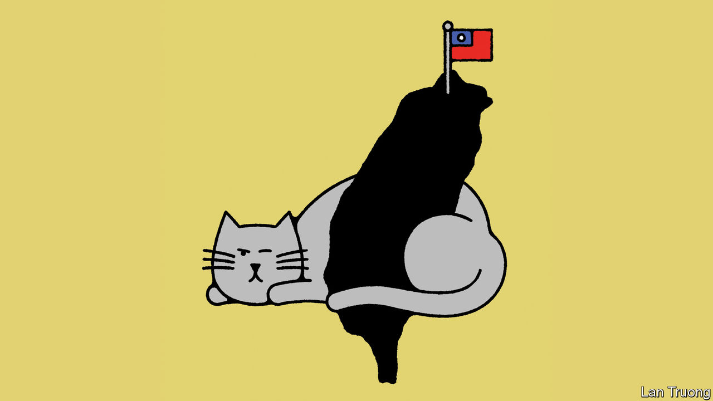

###### Banyan

# Hsiao Bi-khim is Taiwan’s cat warrior 

##### The former de facto ambassador to America is running for vice-president 

 

> Dec 13th 2023 


Before Hsiao Bi-Khim was dispatched to Washington in 2020, she was asked how she would counter China’s so-called wolf-warrior diplomacy. Taiwan’s new de facto ambassador to America said she would be a “”. Inspired by her four beloved felines, she would be lovable, nimble and flexible. Cats “can balance themselves in very delicate places”, she tells Banyan. “They tread softly, but they…are able to find the right positions of defence.” What is more, adds Ms Hsiao, who recently returned to Taiwan to contest the  due on January 13th as the  of the ruling Democratic Progressive Party (DPP), cats are independent-minded. “You can’t force them to do things they don’t want to.”

Ms Hsiao’s candidacy is a strong signal that the DPP plans to maintain its current posture towards China under William Lai, its presidential candidate and the narrow favourite in the election. Under Tsai Ing-wen, Taiwan’s current president, this has been characterised by avoiding unnecessary provocation, while asserting Taiwanese sovereignty. That is reassuring to America, where Ms Hsiao’s feline outreach won her many friends and admirers, but irritating to China. It has sanctioned Ms Hsiao twice and derides her as an “unyielding separatist”.

Ms Hsiao is unruffled. A politician before she became a diplomat, she was formerly the DPP’s director of international affairs and has advised both Chen Shui-bian, Taiwan’s first DPP president, and Ms Tsai. Ms Hsiao spent eight years as a legislator in Hualien, a rural district where the opposition Kuomintang (KMT), which wants reunification with China, has significant support. Her ability to win the trust of the local farmers earned her a reputation for deft grassroots campaigning. Today she exudes confidence in her domestic support. She and Ms Tsai, another cat-lover, have become minor social-media stars in Taiwan, appearing in videos with their furry pets.

Seated at the dpp headquarters in Taipei, Ms Hsiao points to a photo of the party’s founders, who launched it in 1986 to resist the KMT’s authoritarian rule. They were “willing to risk their lives”, for the sake of Taiwan’s democratisation, she says admiringly. They were mostly in favour of Taiwanese independence, which is why China denounces the DPP as a “separatist” outfit. In reality, it has become more moderate since Ms Tsai became president in 2016. She advocates not outright Taiwan independence but a continuation of de facto separation and peaceful relations across the Taiwan Strait. That is “the most practical approach to Taiwan’s status”, says Ms Hsiao. It chimes with the conflict-averse view of most Taiwanese, she notes, and provides a position that Taiwan’s friends and allies can support.

Such pragmatism has been much needed in recent years. Ms Hsiao went to Washington just as America was pivoting from engagement with China to competition. Taiwan promptly became a bellicose talking-point for hot-blooded American politicians. Some are outspoken supporters of Taiwanese independence. Ms Hsiao refuses to say whether such talk has been helpful to Taiwan or not. The important thing, she says, is that under both Donald Trump and Joe Biden there has been bipartisan American support for Taiwan. As vice-president, she would be charged with maintaining that backing after America’s own election, due next November, no matter who captures the White House.

Managing cross-strait relations would be tougher. Taiwan’s opposition parties criticise the DPP’s inability to engage the Chinese Communist Party, which cut off contact with Ms Tsai after she refused to say Taiwan was part of China. Ms Hsiao says the DPP is in principle open to dialogue. Taiwan should also be “clear-eyed” about its trade dependency on China, she says. It has remained constant under Ms Tsai, despite coercive Chinese import bans on Taiwanese goods.

Ms Hsiao’s promise, then, is of continuity. Under Mr Lai, the current vice-president, Taiwan would keep building alliances and strengthening its defences. “Like cats, we can be warm and cuddly, but don’t mess with us,” she says. So, tensions would stay high in the Taiwan Strait—a hard message for many Taiwanese, especially younger voters, who are tired of hearing about the Chinese threat while facing costly housing and low wages. Recent polls suggests the DPP’s lead is only around 3-6% (see the latest at economist.com/taiwan-tracker). Ms Hsiao’s cat-like assurance is compelling. But it remains to be seen whether Taiwanese voters are convinced by it.■


