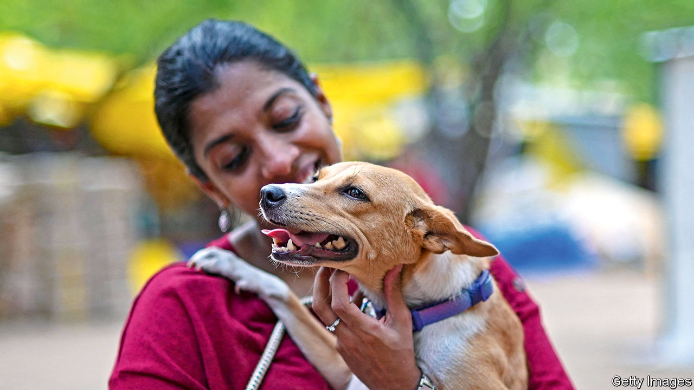

###### Pooch raj

# Indians are going gooey over dogs 

##### The nascent Indian pet-care industry is growing fast 

 

> Dec 12th 2023 

When Kyle D’Costa and his wife met Rio, a nine-month old shih apso, in 2021, “it was love at first sight.” The newly-weds soon added a shih tzu and, besotted with their pooches, also pet insurance, doggy-sized India cricket jerseys and other accoutrements. Then they rented a bigger flat to give the animals “more space”.

The D’Costas and millions of other middle-class Indians, chief beneficiaries of the country’s , are following a well-trodden development path. No longer content with new cars, branded sneakers and other Western baubles, they are rapidly acquiring pets. According to Statista, a data company, India had 19.4m pet dogs in 2018 and may now have 31m. In 2021 Market Decipher, another research outfit, estimated India’s pet economy to be worth $890m and that it would almost triple in size over the next decade.

The trend mirrors even more dramatic growth in , which is estimated to have increased fivefold in seven years, to $58.6bn in 2022. Increased pet-ownership comes with rising incomes, especially among young professionals who tend to delay marriage and parenthood and to be especially open to a poochie surrogate. It is only a matter of time before Indian matrimonial websites include a “pet-friendly” option. In India as elsewhere, the covid-19 lockdown also increased demand for animal companionship.

Established pet-industry players are gearing up and new ones emerging. Nestlé, the world’s biggest food company, last year acquired Purina Petcare, an Indian pet-food business. Emami, an Indian consumer-goods giant, offers Ayurvedic medicines for pets. Euromonitor International, a market-research company, thinks India’s pet-food industry is worth $480m and will grow to $1.2bn by 2025. 

Pet services, conventional and somewhat outlandish, are also booming. Grooming and boarding companies are becoming commonplace. Wiggles, one such firm, recently opened a vast facility in Pune, in Maharashtra. Supertails, an online pet store, offers pet-relationship managers and advises on pet-friendly policies. “We offer paw-ternity leave”, deadpans Varun Sadana, its co-founder, “for new parents [he means owners].” Take A Dog’s Story, a pet-friendly hotel chain, encourages customers “to pick a paw-perty at some of the most scenic locations across India.’‘ Visiting pets are garlanded with marigolds. “For me, the pet is a guest, not you,” says its founder, Himmat Anand.

As the prestige of pet-ownership rises, so does that of those working in the industry. “Being in this trade was looked down upon just five years ago,” says Chinmay, a 30-year-old dog trainer in Thane, a suburb of Mumbai. “How will you find a girl?” he recalls his relatives asking him. But dog trainers in Mumbai can these days charge 2,400 rupees ($30) an hour—more than twice as much as piano teachers. Chinmay, in hot demand, is now happily married to one of his clients. ■


