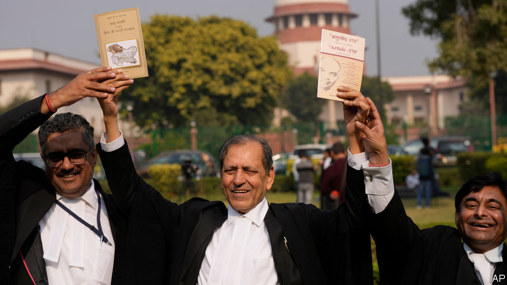

###### Kashmir

# India’s top court upholds the central government’s grab at Kashmir 

##### The judges say Narendra Modi was entitled to strip the region of its autonomy 

 

> Dec 11th 2023 

THE PHRASING was unusually gushing even by ’s fulsome social-media style. On December 11th India’s prime minister praised the country’s Supreme Court on X (formerly Twitter) for having “in its profound wisdom…fortified the very essence of unity that we, as Indians, hold dear and cherish above all else.”

Mr Modi was delighted by the court’s unanimous verdict, delivered minutes before, to uphold his government’s revocation of article 370 of India’s constitution. Thereby it endorsed Mr Modi’s decision, in August 2019, to scrap the  of Jammu &amp; Kashmir, and then break India’s only Muslim-majority state into two. A priority of Mr Modi’s Hindu-nationalist government, this was deeply opposed by many Kashmiris. Given the authoritarian way in which the power grab was carried out, the Supreme Court’s judgment on the issue had been billed as a big test of the judges’ own independence from Mr Modi’s powerful influence.

Under its constitutionally-enshrined special status, Jammu &amp; Kashmir, uniquely among Indian states, used to have its own constitution and flag, and the right to bar outsiders from buying its land. Before stripping it of statehood, Mr Modi’s central government first cut the region’s phone lines, television signals and internet cables. It also put Kashmiri political leaders and other public figures under house arrest. Then it carved the state into two “union territories”, to be ruled from Delhi.

The court had not been expected to side with the Kashmiri petitioners who had challenged Mr Modi’s right to scrap the former state’s special status. It duly argued that, like other princely states absorbed into India in 1947, Jammu &amp; Kashmir had not retained intrinsic sovereignty. Article 370, it ruled, had been a temporary provision designed to govern the state in a “wartime situation”, with the ultimate aim of integrating Jammu &amp; Kashmir into the rest of India. Though this was expected, the extent to which the court endorsed Mr Modi’s heavy-handed methods was surprising.

The judges offered no comment on the authoritarian style of the power grab. They merely directed the government to restore statehood (though not special status) to one of the two territories, which is also now called Jammu &amp; Kashmir, “at the earliest”. They said elections should be held by next September. One of the five judges proposed that a “truth and reconciliation commission” should be convened to examine abuses committed in the territory since a secessionist insurgency began there in the late 1980s. The court did not suggest how this might be done.

The court also appeared to rebuke the petitioners for having brought their challenge. In a state under president’s rule—as Jammu &amp; Kashmir was at the time of the carve-up—the central government cannot be routinely subject to judicial challenge without bringing administration “to a standstill”, tutted the chief justice, Dhananjaya Chandrachud.

The verdict sparked little if any public protest in Kashmir. Yet it is likely to deepen . It is also ominous for other states attempting to resist Mr Modi’s centralising efforts. The eight states of north-eastern India, some of which also enjoy a degree of autonomy, should worry. And the verdict is yet another signal that the Supreme Court has lost its former appetite to resist Mr Modi. Ahead of an election next year that is expected to give him a third term, the prime minister looks increasingly authoritarian and diminishingly restrained. ■


