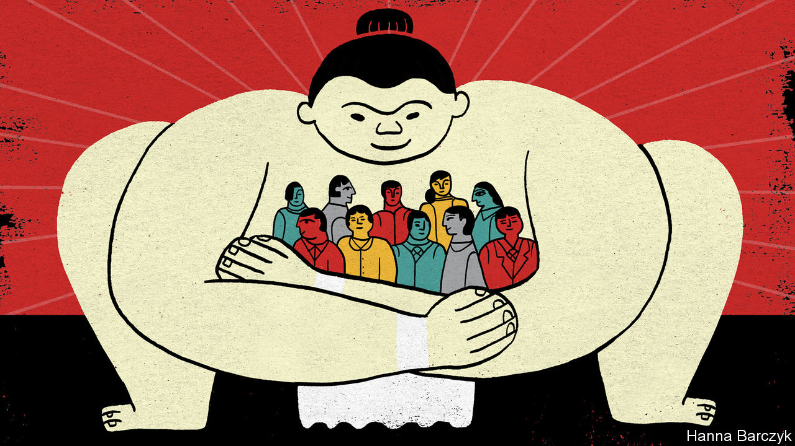
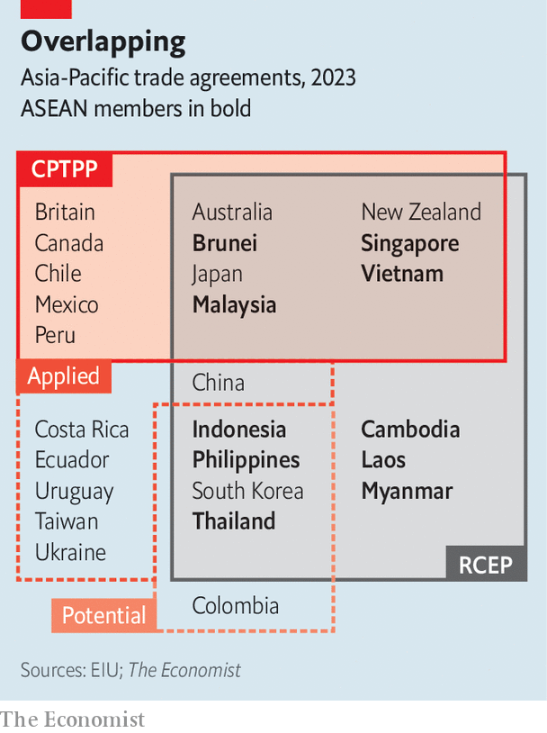
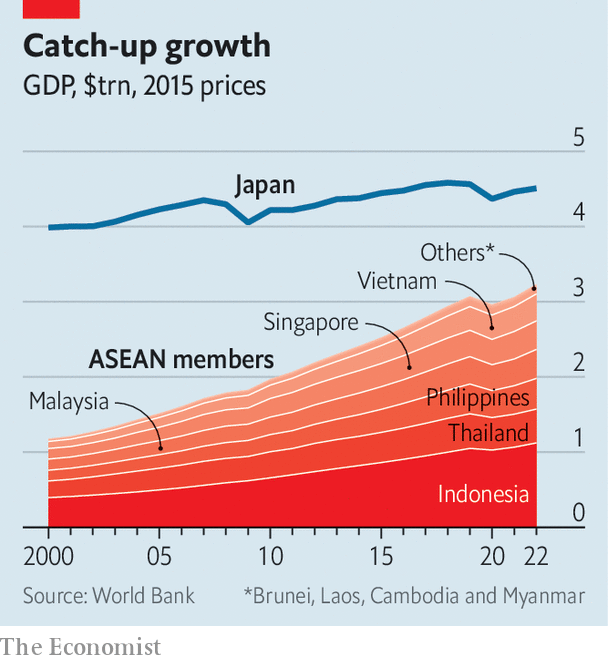

###### Japan and ASEAN

# Japan is a cuddlier friend to South-East Asia than America or China 

##### Relations between Japan and ASEAN are entering a new era 

 

> Dec 14th 2023 

Asian geopolitics is often described in terms of two giants: America, the incumbent superpower, and China, a rising one, standing astride the region and competing to pull smaller countries to their sides, including the ten members of ASEAN, the Association of South-East Asian Nations. But this misses a lot. It elides smaller countries’ agency and oversimplifies what is rarely a Manichaean divide. It also ignores the pivotal role of another rich power with strong ties: Japan.

For many South-East Asian countries, Japan offers a vital hedge against the rival powers, as a source of capital, technology and aid. Over the past decade, Japanese foreign direct investment into ASEAN countries has totalled $198bn, behind America’s $209bn, but beating China’s $106bn. Japanese firms covet South-East Asia’s growing markets, and policymakers see the region as a bulwark against Chinese expansionism. Sustained engagement, from mediating regional conflicts to building regional institutions, has helped Japan accumulate substantial influence. According to a survey of South-East Asian researchers, businesspeople and policymakers by the ISEAS-Yusof Ishak Institute in Singapore, Japan is the region’s most trusted outside partner. 

 


That trust will be on display in Tokyo on December 16th-18th, when Japan’s prime minister, Kishida Fumio, welcomes the leaders of nine ASEAN members and Timor Leste. The gathering will mark the 50th anniversary of dialogues between Japan and ASEAN, which began with contentious talks over synthetic rubber. It will also be a moment to recalibrate the relationship, as the power dynamic between Japan and ASEAN members shifts, competition for influence grows, and security fears intensify.

Warm ties between Japan and South-East Asia were hardly inevitable. Imperial Japan spread death and destruction across the region. After the second world war ended, ill-will lingered. In the early 1970s anti-Japanese riots broke out in Bangkok and Jakarta. In 1977 Japan’s prime minister, Fukuda Takeo, called for building equal partnerships with South-East Asia based on “heart to heart” ties. The soft-edged “Fukuda Doctrine” came to characterise Japan’s relations with the region. John Ciorciari of the University of Michigan and Kiyoteru Tsutsui of Stanford University dub Japan the “courteous power”. As Mr Tsutsui puts it, “It’s not that Japan is nice—Japan had to do it because of the legacy of the war.”

Japanese diplomacy tends to be deferential where America’s and China’s can be preachy or pushy. Japan keeps relatively quiet about human-rights violations and talks to autocrats, hoping they will transform. At times this has seemed to pay off, as when military rule ended in Myanmar in 2011; at others it has not, as when the junta returned there a decade later. The past three Japanese prime ministers have visited South-East Asia within four months of taking office. America is “riding Japan’s coat-tails” in South-East Asia, says Emma Chanlett-Avery of the Asia Society Policy Institute, an American think-tank.

Japanese private investment and state aid have helped to generate growth and goodwill. The Japan International Co-operation Agency (JICA), Japan’s overseas development arm, has provided training, expertise and funding for decades. The key to the trust Japan enjoys is “long-term consistency”, says Tanaka Akihiko, JICA’s president. The Manila-based Asian Development Bank, of which Japan is the largest shareholder, plays a big part in financing regional development. Japan is central to the two biggest regional trade deals of recent years, the CPTPP and RCEP. (America is absent from both, China a member only of the second.) Japanese soft power, from anime to ramen, has helped create Japanophiles across South-East Asia. 

But Japan’s presence in South-East Asia is most visible in infrastructure, from roads to sewage systems and power plants. Even in the heyday of the Belt and Road Initiative, Japanese infrastructure investments in many South-East Asian countries outpaced China’s. Earlier this year the Japanese emperor was warmly welcomed in Jakarta, where he toured a Japan-backed railway. Nearly 30 metres below the choked streets of Manila, Japanese engineers are boring the Philippine capital’s first subway, a project financed largely by JICA.

 


Yet as South-East Asia grows, the relationship is shifting. In 2000, the combined GDP of the ten ASEAN members was equivalent to 30% of Japan’s in real terms; by last year, the figure was 72% (see chart). “We’re co-operating as equals now,” says one Japanese diplomat. And Japan faces competition over aid. South Korea has become an active donor. Thailand and Indonesia have aid agencies of their own.

China has surpassed Japan on trade. In 2010 two-way goods trade between China and ASEAN and ASEAN and Japan was $236bn and $219bn respectively. By 2022 China’s had grown to $722bn, while Japan’s was $269bn. Japanese companies are too cautious, says an Indonesian businessman: “The Chinese care about returns on capital and making a profit as soon as possible, so things don’t have to be perfect.”

China’s rise has also pushed Japan to play a more proactive role in regional security. Under Abe Shinzo, prime minister from 2012 to 2020, Japan loosened the legal shackles on its armed forces and defence industry. It has since concluded defence-equipment transfer agreements with the Philippines, Malaysia, Vietnam, Thailand, Singapore and Indonesia; Japan builds boats for coastguards in the Philippines and Vietnam. Such aid helps when responding to Chinese incursions, says Jay Batongbacal of the University of the Philippines. Japanese strategists also see capacity-building in South-East Asia as a way to counter China’s assertiveness throughout the Indo-Pacific. As a Japanese security official puts it, “The theatres are connected.”

That linkage suggests where relations between Japan and South-East Asia are heading. Security ties with states worried about Chinese expansionism will thicken. In November Mr Kishida visited Manila and launched talks on a pact to facilitate closer defence collaboration; the Philippines will be part of the first group in a new Japanese aid programme focused on security kit, alongside Malaysia, Bangladesh and Fiji. In late November Vietnam’s president visited Tokyo and elevated Japan to the first tier of Vietnam’s diplomatic partners; Vietnam will probably become part of the second group to receive Japanese assistance. Japan’s outreach to South-East Asia will always include roads, ramen and courtesy. But a harder edge is emerging. ■

