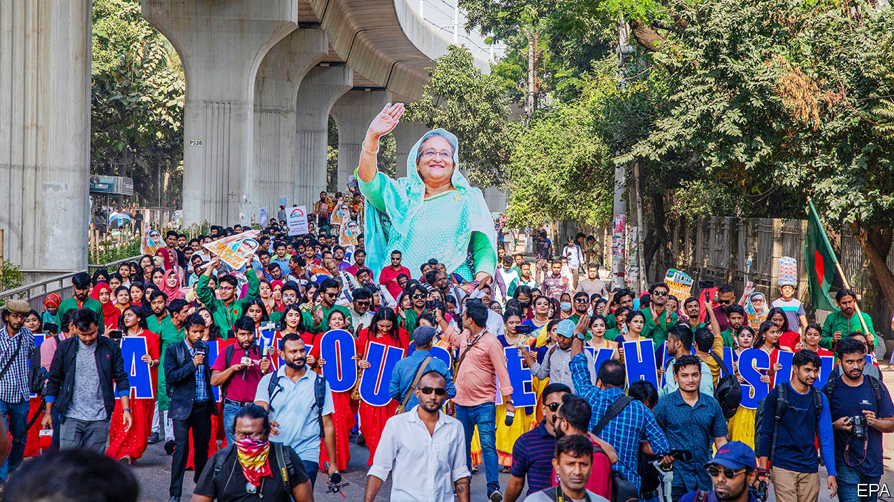

###### Bangladesh’s election

# Sheikh Hasina’s party is set to be re-elected in January 

##### The Bangladeshi leader has hounded her opponents 

 

> Dec 14th 2023 

SHEIKH HASINA has served four terms as Bangladesh’s prime minister, three of them consecutively since 2009. Nobody seriously doubts that she will begin her fifth after an election due on January 7th. The government claims the election will be competitive; 29 parties are contesting it. Yet the Bangladesh Nationalist Party (BNP), the biggest opposition party and the only one capable of mounting a challenge to the ruling Awami League (AL), is boycotting the poll. It could scarcely take part if it wanted to. Most of the bnp’s leaders and thousands of its activists have been jailed over the past six weeks. Five have died in custody since late November. Many of those who have so far evaded arrest are in hiding. 

This farce points to the conundrum that Sheikh Hasina, the world’s longest-serving female prime minister, represents. In her nearly 15 years in power, she has presided over one of the world’s fastest-growing economies and the biggest improvement in living standards in South Asia. She has also skilfully negotiated the rival interests of China and India, the feuding giants Bangladesh’s 170m people are sandwiched between, and also America, which has a long-standing interest in the country’s stability. At the same time, the 76-year-old prime minister has assailed Bangladeshi democracy with impunity. 

She has cowed the press and captured the police, courts and judiciary. She has built a personality cult around her father, who was murdered in a coup in 1975 and whose face is now plastered everywhere in Dhaka, the capital. She has neutralised the BNP’s leader, Khaleda Zia, who has been under house arrest since 2018. Bangladesh’s previous two elections, in 2014 and 2018, were also massively stacked in the ruling party’s favour. The coming one could make the BNP almost defunct. To manufacture an impression of a competitive poll, observers say the AL has encouraged its party members, their acquaintances and also defectors from the opposition to run as independent candidates.

The mass arrest of bnp members was sparked by street violence between the party’s supporters and police after a rally on October 28th. It left at least 16 people dead, including two police officers, and injured thousands, according to Human Rights Watch, an ngo. The government claims the bnp started the violence; the party says the opposite. “They have arrested 20,000 of our people,” says Mahbub Uddin Khokon, a lawyer and BNP leader. “We are fighting for democracy. If we participated in this illegal election we would legitimise it.”

The arrested activists have been charged with crimes from arson to attempted murder. Many of the arrests look arbitrary; where police could not find those they were looking for, they took their relatives. Witnesses say the arresting officers were sometimes accompanied by AL activists carrying wooden truncheons.

The crackdown has kept the BNP off the streets. Blockades of roads outside Dhaka by the party in November partially cut off the capital. But by early December delivery of most goods had resumed. An opposition protest in Dhaka, a hotbed of anti-AL sentiment, on December 10th drew hundreds, not the usual thousands.

Some al officials say in private that it would be better if the BNP was taking part in the poll. But Sheikh Hasina is unlikely to pay a price. India, Bangladesh’s main regional partner, calls the election an “internal matter”. America says it will deny visas to officials whom it deems to be “undermining the democratic election”. Yet it, like India, is fearful of pushing Sheikh Hasina towards China, so minded to ignore her abuses. The EU has merely declined to send a full team of election observers.

Sheikh Hasina remains popular in much of the country. A recent survey by the International Republican Institute, an American pollster, gave her a 70% approval rating. But in the cities especially, a tough economy has increased disaffection with the government. Rising energy and commodity prices in the wake of Russia’s invasion of Ukraine forced Bangladesh to take a $4.7bn loan from the IMF in January. Foreign reserves remain low, the banking system is stressed and the taka, the country’s currency, is under pressure. The official inflation rate, just below 10%, is probably an underestimate. Workers in the important garment industry are dissatisfied with a recent hike in the minimum monthly wage to 12,500 taka ($114), which is less than the increased cost of living.

Still, growth is fairly robust, at just under 6% in the last financial year. On December 13th the IMF lauded the government’s commitment to its bail-out programme and called it “broadly on track”. So is Sheikh Hasina’s bid to stay in power. ■

