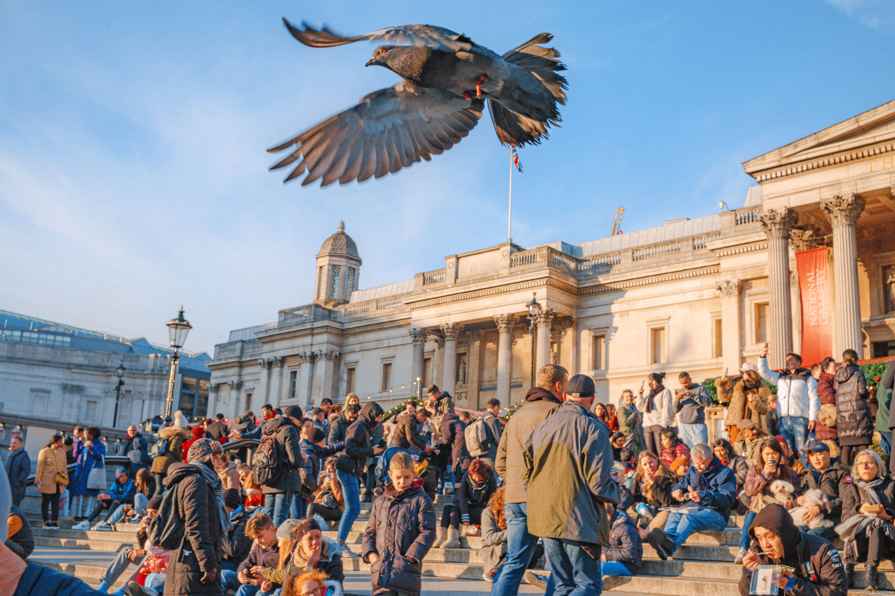
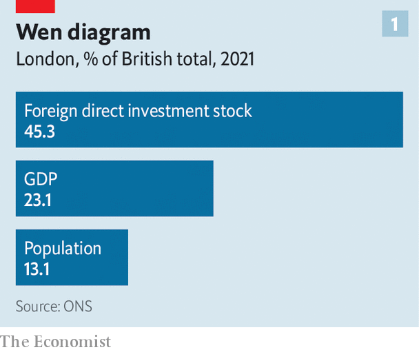
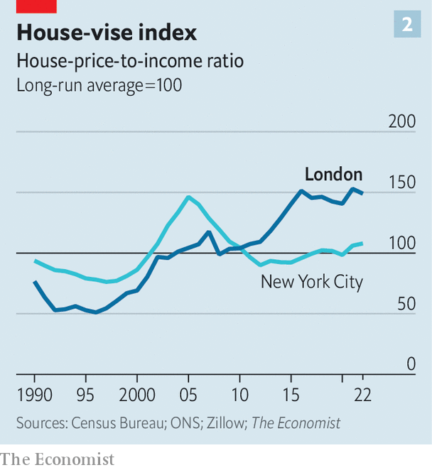

###### Invincible city

# Brexit? Hah! Lockdowns? Shrug! Can nothing stop London? 

##### It has been bouncing back for 2,000 years and counting 

 

> Dec 14th 2023 

It was not an auspicious time to open a pub in central London. When Michael Belben and his business partner took over the Eagle on Farringdon Road, Britain was in recession. Undeterred, they bought mismatched crockery from car-boot sales, removed the fruit machine and darts board and installed an open-plan kitchen and a blackboard menu. The pub was relaunched in January 1991.

In the decades since, the struggles and success of the Eagle—reputedly Britain’s first “gastropub”—have encapsulated those of London itself. At first its Mediterranean dishes were novel; but as the city’s tastes and population diversified, its formula of refined but affordable grub was widely imitated. The Eagle was unruffled by the financial crash of 2007-09; it scraped through covid-19 and its devastating social-distancing rules. For a venue that has always hired migrants from Europe, says Mr Belben, Brexit may prove “a dreadful problem”. But not yet.

“It’s amazing how resilient we are,” he concludes. The same can be said of London. In the early 1990s a city that had seemed to be on the skids was rejuvenated. After shrinking by over a fifth since the second world war, the population began to grow. Enterprising foreigners poured in. The economy boomed, fuelled by financial deregulation, European integration and communism’s collapse. By the time it hosted the Olympic games in 2012, London had a fair claim to be the capital of the world.

Cue a perfect storm of woes that threatened to capsize cities in general and London in particular. Already its mercantile heart had been shocked by the financial crisis. Then a cosmopolis that runs on immigration faced the shuttering of Brexit and the pandemic barred tourists from one of the planet’s most visited places.

 


Yet like the Eagle, London is thriving—a hardiness that holds lessons for cities everywhere. Its globalised economy has weathered Britain’s exit from the European Union far better than doomsayers had predicted. For all the political bluster on immigration, it remains a magnet for ambitious newcomers. And it is better-placed than many cities to absorb the disruptions of covid-19. Traverse London from south to north and west to east, and you find that its biggest challenges are the results of its dynamism rather than decline. Begin in the south London neighbourhood of Peckham.

A regal woman in ceremonial Yoruba attire rides a horse down Peckham’s high street. Youngsters playing basketball and shoppers at west African grocers watch in wonder (with classic London insouciance, some don’t bat an eyelid). Adeyemi Michael’s short film, recently on show at the South London Gallery in Peckham, honoured the Nigerians who began thronging to this part of the capital in the 1970s, earning it the nickname “Little Lagos”.

Southern crossroads

You can still eat knockout jollof rice at Lolak Afrique, a café just off Peckham’s main drag. But the neighbourhood, and London’s Nigerian community, are changing. As cocktail bars and sushi restaurants have moved in, the Nigerians have spread out, their numbers falling in Southwark, the borough which includes Peckham, and rising elsewhere. London has never been as ethnically segregated as some American cities; as analysis by Gemma Catney of Queen’s University Belfast shows, it has become progressively less so over the past few decades, the black African population dispersing especially fast.

As it spreads, London’s Nigerian population is growing. In the past couple of years post-Brexit immigration policies have admitted many more students and workers (largely in health care) from beyond Europe. In the year to June 2023, 141,000 Nigerians moved to Britain, more than the total from the entire EU, to which there is now net emigration.

On December 4th the government announced plans to cut immigration. But so far, at least, the fear that Brexit might stem the flow of migrants to London has not been realised. In one of Brexit’s ironies, other arrivals have more than compensated for the shortfall of Europeans. Partly as a result, London’s population, which dipped during the pandemic, is nudging 9m and is expected to hit 10m by 2040. Taking into account the inflow of skills and students, says Jonathan Portes of King’s College London, Brexit’s effect on the city “has if anything been positive”, in terms of immigration, at least. It remains “a roost for every bird”, as Benjamin Disraeli wrote in 1870.

Nor does the latest influx into what was already a spectacularly diverse city seem to have stirred much tension. According to Ipsos, a pollster, Londoners are more than twice as likely as Parisians to say immigrants have had a positive impact on their home town. Suella Braverman, twice forced out as home secretary in Conservative governments, recently claimed multiculturalism has “failed”. She is walking proof of the opposite: a Buddhist brought up in London by parents from Mauritius and Kenya, she found a Jewish husband and rose to one of the highest offices in the land. The London dream, you might call it.

In another widely predicted way, Brexit has indeed bruised London: by damaging the City, an engine of growth already beleaguered by the financial crisis and the rise of other hubs. Yet as at the Eagle, the consequences have, so far, been manageable.

Brexit’s overall costs will be felt as much in things that don’t happen—internships forgone, romances that never blossom—as in those that do. The same goes for its impact on the City, says William Wright of New Financial, a think-tank. He points to the hundreds of new jobs created in Paris by American investment banks, which in different circumstances would probably have come to London. As for things that have happened: London’s share of new listings, and of trade in European equities and derivatives, has dwindled.

Still, relatively few existing jobs have been relocated from the City because of Brexit. The latest estimate by EY, a consultancy, is around 7,000, far lower than the tens of thousands once anticipated. The City will no longer be the default financial centre Europe, predicts Mr Wright; but because of its status in global financial markets, it is set to remain the dominant hub  Europe. It is big enough to cope.


Besides sheer size, the City and the rest of London enjoy two other advantages in Brexit’s aftermath. The first is that they already did lots of business with the world beyond Europe, receiving copious foreign direct investment (FDI) from America especially. London has become even more reliant on American investment since Brexit, observes Riccardo Crescenzi of the London School of Economics (lse). Worryingly, when downsizing and divestment are included, in 2021 there was a net outflow of foreign capital from both London and Britain for the first time since 1984. Even so, says Professor Crescenzi, London is still the top city in Europe for new FDI projects.

The other plus is that the industries in which London specialises—not just finance but law, accounting, consulting, the media and higher education—have been less hampered by post-Brexit rules than other sectors. Between 2016 and 2021 London’s exports of services grew by 47%, notes Emily Fry of the Resolution Foundation, another think-tank; for the rest of Britain the rise was just 4%. Places that import parts and export goods have suffered more Brexit-related costs and bureaucracy.

The momentum of the tech scene, in particular, is too strong to be “stopped in its tracks”, insists Brent Hoberman, a tech guru and investor. Because of Brexit “we have to be more paranoid” about competition, but, he reckons, London remains the best place to start a tech firm in Europe. American venture capitalists are still keen. The record supports his confidence: London has produced more tech unicorns than its three nearest European rivals—Berlin, Paris and Stockholm—combined.

Unhobbled hub

Its perennial virtues—the time zone, English language and rule of law—are reinforced by the proximity of top universities and an abundance of skills and capital. Babs Ogundeyi, the founder of Kuda, a fintech firm based in London, says savvy local angel investors helped attract more capital. Kuda runs a digital-only bank in Nigeria and a remittance service for Africans in Britain. For all Brexit’s hassles, Mr Ogundeyi notes, it has led to closer ties to Africa.

The upshot is another irony of Brexit; you might also call it karma or poetic justice. London, the only region of England that in the referendum of 2016 voted to stay in the EU, has fared better than regions that wanted to leave. For overlapping reasons, it has bounced back faster from the pandemic. Head to north London to see why.

Sally north

On a chilly evening at Arsenal’s football stadium, the club’s new anthem rings around the ground: “North London for ever/Whatever the weather/These streets are our own.” It is a sentimental but affecting tune, especially after the lockdown months in which spectators were barred. Now the stadium is packed; Gunnersaurus, the team’s mascot, is high-fiving young fans. The faithful are loudly outraged by lunging tackles on their hero, the winger Bukayo Saka (he duly scores).

Like the carousing at the Eagle, London’s entertainment economy is buoyant again after the deathly doldrums of covid-19. Its seven Premier League football clubs project soft power around the globe. Tourism has almost returned to pre-pandemic levels, boosted by a rise in American visitors. The Society of London Theatre says audiences are up. On some weekends the Tube is busier than in 2019.

All told, London’s nimble economy has recovered much more strongly than has the rest of the country’s. Like other cities, it faces obstacles in the post-covid world. But it is better equipped for them than many.

Already under pressure from online shopping, some retail districts are struggling—notably Oxford Street, which this year looks somewhat bedraggled beneath its Christmas lights. Along with a rise in rough sleeping, vacant shops have contributed to a dilapidated air in parts of central London. By some accounts, however, the main threat to its pizzazz is Londoners’ reluctance to return to the office full-time.

One Triton Square, an office tower a mile from the Eagle, near Regent’s Park, is an emblem of this trend. It stands in a snazzy development with all the modish appurtenances of a modern office complex, including a climbing wall and an art gallery. But the building is empty. Lights blink eerily in the dark atrium; the escalators are frozen. Earlier this year Meta, the parent company of Facebook, paid a whopping fee to cancel its lease on the tower before it even moved in.

The ghostly building is not unique. Vacancy rates in commercial property in central London are high, in part because—as elsewhere, only more so—people are loth to kick the working-from-home (WFH) habit acquired during the pandemic. A recent survey for the Centre for Cities, also a think-tank, found that, on average, workers in central London were in the office 2.3 days per week, less than other Britons. Of 32 countries surveyed for research by Nick Bloom of Stanford University, British workers stayed home more than any bar Canadians. Taken together, these findings imply Londoners are among the most absent workers anywhere.

Face-to-face interactions are good for productivity, already stalling in London before the pandemic. Low office attendance could in time deter foreign investors. Then again, in a WFH future, London has enticements that other places lack.

A three-days-a-week office will have to look different from the antediluvian sort: more flexible and alluring. Yet networking, transport and entertainment possibilities mean the case for keeping a central-London HQ is stronger than for having a satellite office. Notably, the WFH culture has not led armies of Londoners to retreat beyond striking distance of the workplace. Most inner Londoners who moved home between the summers of 2021 and 2022 circulated around the city, rather than fleeing it.

It has brushed off another crisis that some thought would nobble it: the war in Ukraine and ensuing sanctions on Russia’s elite, who had brought joy to London’s libel lawyers, estate agents, PR firms and football fans. For all their notoriety and flamboyance, their largesse was always less important than that from China and the Middle East, says Oliver Bullough, author of “Butler to the World”, an exposé of Britain’s services to kleptocracy. In any case, plenty of other high-rollers still call London home, or one of them. (For an Ozymandian monument to London’s indulgence of oligarchs, stroll west from Harrods and look out for a disused Tube station. In 2014 the government sold it for £53m—$87m at the time—to Dmitry Firtash, a Ukrainian tycoon wanted in America on charges of alleged corruption, which he denies.)

London, after all, has absorbed all manner of shocks in its 2,000-year history. Its most precarious period, considers Tony Travers of the lse, came after the Romans left in the fifth century AD. The Black Death killed much of its population in the 1340s; the Great Fire of 1666 razed swathes of it. A port city that adapted to the decline of its port, it was also an imperial capital that acclimatised to the loss of empire. It defied the Blitz of 1940-41—when, rather than sheltering in the Tube as urban myth has it, most Londoners simply slept at home.

That phlegmatism is one of London’s abiding traits. Its biggest worries now may not be external threats but the repercussions of success. Moscow, Paris, Seoul, Tokyo: other cities dominate both the politics and economies of their country. Even so, London stands out for its grip on government, finance, media and the arts (worlds that collide at the Eagle, a watering hole for moneymen and media types and home to an art gallery). Equally glaring are the differences in the demography and outlook of Londoners and their compatriots.

At the last count, disposable household income per person was 43% higher in London than in the country as a whole. Londoners are younger, more left-wing and far more diverse: ethnic minorities account for 46% of residents, over double the proportion in England and Wales. Two-fifths of Londoners were born abroad. Contrary to its reputation in the shires as a latter-day Gomorrah, on average London is slightly more socially conservative and less boozy than other regions.

For that, thank its immigrants, many of whom are devout. They have also helped raise standards in London’s schools, which this century have been transformed from the worst-performing of any English region to the best. For a close-up look at that phenomenon, go west.

Known as “Little India”, the western suburb of Southall is studded with Punjabi and Afghan restaurants, mosques and Sikh temples. Nathan Walters, head of the local Featherstone High School, says 85% of its pupils use another language at home. Almost a third receive free school meals (a standard measure of poverty). Whether or not they speak English themselves, parents are “unfailingly positive” about education; results far outstrip the national average. Proximity to opportunity is a motivation, says Mr Walters. Pupils “can almost see it from their bedroom windows”.

London’s dominance, and voracity for people and capital, have been concerns for centuries. Over 400 years ago King James I griped, “Soon, London will be all England.” In the 19th century it was dubbed “the great wen” (cyst). These days polling finds other Britons view it as crowded and expensive and its denizens as arrogant and insular. Many think it is favoured by policymakers and the exchequer, though it contributes far more than it gets back. London’s net fiscal contribution per head is over £4,000.

 


That sort of resentment has fed populism across the West. In Britain it coloured the Brexit referendum. Yet since then, the divide—in wealth, diversity and opportunity—has grown (see chart 1).

In its bid to narrow the gaps, the current government, like its predecessors, has recycled failed ideas. As a recent parliamentary report noted, for instance, schemes to shift civil-service jobs to the regions are reliably launched every ten to 15 years. Often such efforts involve constraining London’s growth in hope of diverting it elsewhere. A good example was a misguided rule of 1964 (since discarded) that in effect banned new office developments in central London.

Too often, policies have corseted the capital without boosting other places—and have wound up punishing everyone. The other big cost of London’s appeal has proved just as hard to tackle. This distress cry comes from inside the house.

“Affordable housing isn’t always as nice as this,” a resident of McGrath Road says with droll London understatement. Home, for her, is one of 26 houses in a beguiling development in Stratford, in the east London borough of Newham. Set amid unlovely 20th-century estates, the units, some of them public housing, form what looks like a Moorish citadel, with turrets and crenellations but also welcoming arches, balconies and a tree-lined central courtyard. Walk up to the railway tracks and you spy the glinting towers that were part of the regeneration spurred by the Olympics.

 


Peter Barber, the architect of McGrath Road, says a lot can be learned from the compact cities of north Africa and the Middle East. Newham’s council, he recalls, initially expected a design for a block of flats. Instead he emulated the Georgian terraces that are the acme of efficient London housing, with a distinctive twist. 

Clogged roads, air pollution, long and pricey commutes, a discredited police force—inevitably London suffers from many big-city ailments. Compared with their compatriots, Londoners report a low sense of neighbourhood belonging; as is common amid such hurly-burly, life can feel lonely and atomised. (“It is strange with how little notice”, wrote Charles Dickens, “a man may live and die in London.”) But the most acute problem, and most enduring, is the scarcity and cost of housing—and it is sharpest, and most intransigent, in the East End.

Orient compress

In late Victorian times the East End was known as “the empire of hunger” and “the city of dreadful night”. Today overcrowding in Newham runs at double the rate for the city, itself more than double the national average. The basic causes of the shortage are a failure over decades to provide sufficient new homes and to use space as imaginatively as does Mr Barber.

The result has been at once inevitable and stunning. James Carville, an American political strategist, once joked that he’d like to be reincarnated as the bond market, because then he could intimidate everybody. Another good choice would be to come back as the London house price: perhaps only the city’s brazen foxes can match its indestructibility. True, a finance-driven boom that lasted two decades has recently flattened, but at a dizzying plateau.

 


In 2020 the average house in the capital sold for over 13 times average earnings, almost double the ratio two decades earlier (see chart 2). A two-bedroom flat near the Eagle will set you back around £1m. Since 1981, meanwhile, the share of Londoners living in public housing has fallen from over a third to a fifth. Rents in the private sector have soared: in 2022 the median rent was 35% of median income. As Jack Brown of King’s College London says, the city “has never been quite this big or quite this expensive”.

All this means the perception of Londoners as wealthy is incomplete. It is a rich city with many poor people. Factor in housing costs and the poverty rate is higher than in the rest of England. Eight times as many London households live in temporary accommodation as in the country overall. The most affluent decile has nearly ten times the income of the poorest. Because of London’s unusually integrated economic geography, deprived and well-heeled families rub shoulders more than in Paris or New York, pound shops abutting artisan bakeries on the high street.

Complaints about how packed London is, notes Professor Travers, recall the old joke of the restaurant that is so crowded, no one wants to go there any more. Still, the pandemic may open up solutions to this age-old problem. In a place with an oversupply of offices and a deficit of homes, it would make sense, where possible, to repurpose commercial buildings as residential ones. More than ever, in an age of hybrid work it is time to build on some of the protected land of the “green belt”, starting with existing commuter corridors.

Something like this happened after crises of yore. Christopher Wren reimagined the city in the ashes of the Great Fire. Idealistic urban planners did so again in the rubble of the Blitz. The evidence of the past few years, and of the past two millennia, is that London—one of the world’s greatest cities, and perhaps its most resilient—will find a way to cope, and to thrive. ■

