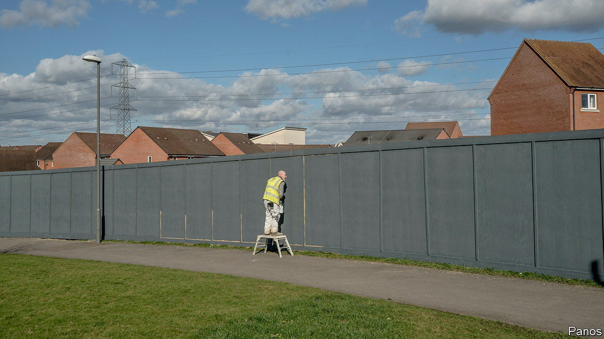
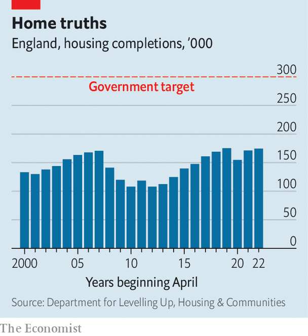

###### Grand designs

# Britain needs more houses. Does the industry want to build them? 

##### Developers are wary of adding supply to a falling market 

 

> Dec 11th 2023 

Britain’s politicians are finally beginning to compete to . Sir Keir Starmer, Labour’s leader, promises to oversee the building of 1.5m homes over five years if it wins the next election. The Tories have consistently fallen short of the target of 300,000 new homes per year (see chart), but last month Jeremy Hunt, the chancellor, announced reforms to the planning system and additional subsidies for affordable homes. That followed a relaxation in environmental rules which had crimped some projects. 

 


The need for more houses is real. Sadly for Britons struggling to buy a house, policymakers are not the only people who matter. The folk who will have to meet these goals—the developers—are planning to cut back, not expand.

The timeliest official data, covering only England, reported completions falling by 3% in the year to June. In a trading update in October, Barratt Developments, Britain’s largest housebuilder, said that it expected to finish between 13,250 and 14,250 homes in 2024, a fall of around 20% on its expectations for 2023. The Royal Institute of Chartered Surveyors (RICS), a trade body, reckons that building activity is the weakest it has been since the start of the pandemic. “Housing supply is likely to fall at least for the next year,” according to Simon Rubinsohn, RICS’s chief economist.

Two years of rising interest rates have been tough for . The average rate on a new two-year fixed mortgage, the benchmark product, has risen from 1.57% in December 2021 to 5.28% in November 2023. Housing-market activity has declined sharply, with the monthly volume of transactions down by 21% over the year to October. The Office for National Statistics says house prices fell by 0.1% in the 12 months to September, the first annual fall since 2012.

Builders are reluctant to increase supply into a weak market. The talk now is of “carefully managing building activity”. Building rates, says one boss, have long been depressed by supply-side issues around the planning system and, in recent years, by rising prices for materials and a shortage of skilled labour. But now “the problem is on the demand side. People just can’t afford the mortgages.” 

Rather than dropping headline prices, developers offer what they euphemistically term “incentives for buyers”. It is more common for free carpets and kitchen appliances to be bundled in with new builds. Some developers have even offered to pay £1,000 ($1,260) per month for the first 12 or 18 months of new buyers’ mortgages, or to hand buyers cash to increase their deposit.

Although few analysts foresee a crash, most expect the market to remain tepid until interest rates fall appreciably. With the Bank of England signalling that rates will not be cut much for at least a year, that may be some time away. The Office for Budget Responsibility, a fiscal watchdog, expects house prices to fall by 7.6% from a peak in the final quarter of 2022 to a trough in the final quarter of 2024.

As a result, private-sector homebuilding is likely to remain weak for the coming 18 to 24 months. If Labour is serious about building 1.5m homes, in other words, it may have to step up government-supported social housing (though that would be hard to square with the party’s current fiscal rules). The politicians certainly cannot assume that developers will be there, diggers at the ready, to build. “We need to see a more stable and robust market before we accelerate again,” says one insider. ■


