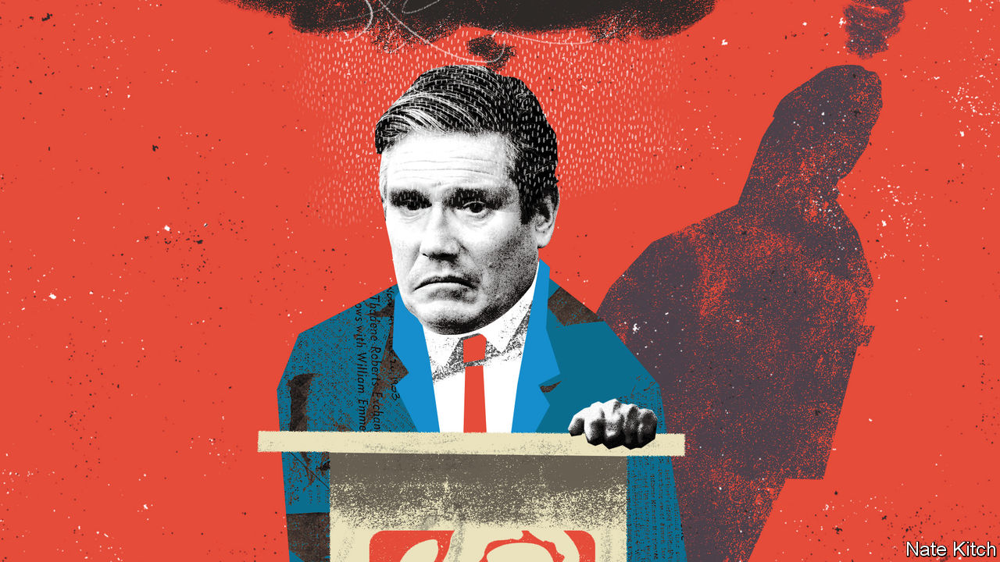

###### Bagehot

# Cheer up, Sir Keir! It might never happen 

##### Labour is too pessimistic about the backdrop it is set to inherit 

 

> Dec 14th 2023 

Usually, politicians try to offer optimism. Sir Keir Starmer’s Labour Party specialises in despair. “This is worse than the 1970s,” said Sir Keir in one speech. “We are in a hole.” Every Labour figure emits the same dirge about Britain’s high debt, low growth and exhausted public services. Even moments of hope are tempered with warnings of misery. In a rare bout of cheer, Sir Keir promised: “A realistic hope, a frank hope, a hope that levels with you about the hard road ahead.” Hooray! 

If Labour wins the next election, as is highly likely, the consensus is that it would inherit a total mess. In 1997 New Labour were handed a booming economy and low debt. In 2010 the Conservatives took over thriving public services. In 2024 Labour will receive neither. But the party harbours a dirty secret. Some problems will fix themselves; some things are better than they look; and a few conundrums can be solved with only a little effort. Pessimism is judicious. Sir Keir would enter office with the lowest expectations of any prime minister since the 1970s. The good thing about low expectations? They are easily met. 

Sir Keir has promised to boost , for instance, which is forecast to crawl along at 0.6% this year and 0.7% next year. But the Office for Budget Responsibility, a fiscal watchdog, is already predicting growth of almost 2% by 2028 through no effort of Labour’s own. Labour will undoubtedly claim credit; in truth, growth can hardly get worse. 

Labour engages in pantomime booing of Conservative tax increases. In fact, the Tories have done Labour a favour by pushing through the steepest tax rises in the best part of a century. That means the public finances are now highly geared: a small jump in growth can lead to a big jump in tax revenues. The Conservatives took the political pain; Labour can spend the proceeds. 

A steep rise in interest rates, which started last year, has hurt both public and private finances. Rising debt costs blew a hole in the Treasury’s accounts: Britain now spends about £83bn ($104bn; 3.6% of GDP) a year on interest. Each quarter hundreds of thousands of voters move from a cheap mortgage to an expensive one. But inflation is falling steeply. The markets expect a slew of rate cuts in 2025, just in time to benefit a newish government. Public and private finances will then improve—and quickly. In the course of the next parliament, mortgage renewal will flip from being a moment of despair to one of relief. 

Seemingly bold political promises by Labour are easily met. Sir Keir says that his party will whittle down National Health Service (NHS) waiting lists, for instance, but these are due to peak next summer anyway. The queue is likely to shorten from the end of 2024, regardless of who lives in Downing Street.

 is the more Augean task. After a bout of restrained spending from 2010, the service has been doused in cash in recent years yet barely treats more patients. Extra money always takes time to have an effect. A lag occurred in the 2000s; greater funding initially failed to improve productivity but it did so eventually. Perhaps the nhs really is irredeemable. It is more likely that the fading effects of the pandemic, decent funding and improvements to management will make a difference. If so, the effects will show up slap-bang in the middle of a Labour term. 

Other political problems will melt like snow in spring. Sir Keir talks tough on , which hit an all-time high of 745,000 in 2022. Labour’s pledges to cut this number will happen anyway. One-off influxes, such as arrivals from Ukraine, will end. The backlog of moves delayed by lockdowns, when people could not travel, will clear. Labour’s promise to return net migration to its recent (and still historically high) norms is not much of a challenge, yet it will still be seen as an achievement. 

When it comes to the eu, too, things are set to stop getting worse without Labour needing to do much. The pain of Brexit was front-loaded, argues John Springford from the Centre for European Reform, a think-tank. Exporters have already adjusted to the new relationship. It is politically easy for Sir Keir to forge closer ties with Brussels. Since eight in ten Labour voters say they would rejoin the eu, a tighter and more prosperous relationship with the eu is perfectly viable. 

Stability in government will bring its own rewards. Britain has been politically chaotic for the best part of a decade. The Conservatives have swung from a vision of a small-state government sat snugly inside the eu to a free-spending one far outside it. In the process it went through five prime ministers, with often radically different agendas, in seven years. Labour would take power with a vague, uninspiring plan to improve Britain’s public services without spending money and a pledge to generate growth through modest reforms. But pulling in one direction for five years would still do Britain a lot of good. Call it the “being normal” dividend. 

Can’t have a triumph of low expectations without a triumph

Some pessimism is justified. Unrealistic spending plans by the Conservatives, subsequently adopted by Labour, will not be adhered to. Tax rises will, almost inevitably, have to plug the gap. Things can always go wrong. Inflation may flare up again, meaning interest rates stay higher for longer. The nhs may indeed prove unreformable. Bored Labour backbenchers will make trouble eventually. Assuming that things will inevitably improve is naive. Yet so is assuming that things must remain terrible. 

Given the choice, the Labour leadership would grab the benign backdrop Sir Tony Blair enjoyed in his early years in office. But a golden inheritance brings high expectations. During the 2005 general-election campaign, Sir Tony was harangued by voters complaining that gps were quick to see patients. A rotten inheritance, in contrast, means any improvement will do. Sir Keir is set to take office at the bottom of a trough. Luckily for Labour, when you have hit the bottom, the only way is up. ■


