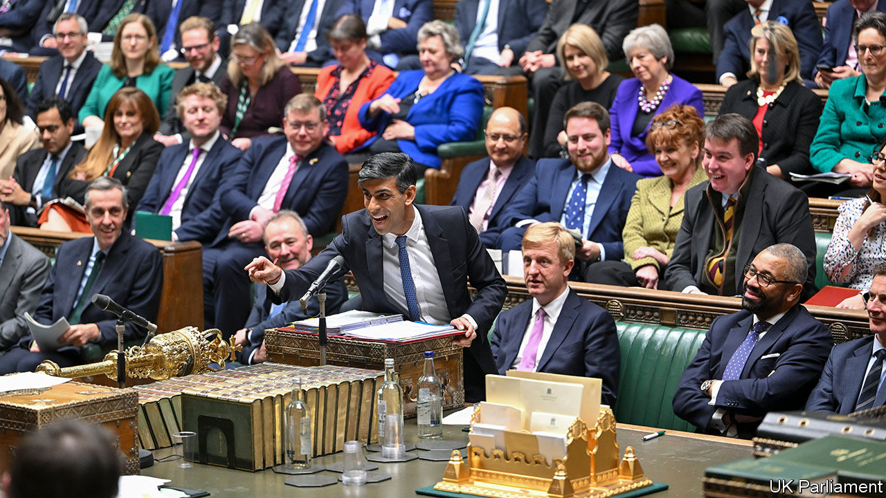

###### A flight from reality

# How a Rwandan gambit consumed the Conservative Party 

##### The story of how a party can transmogrify from liberalism to authoritarianism 

 

> Dec 13th 2023 

THE STORY of the modern Conservative Party can be found in Rwanda. In 2007, then in opposition under David Cameron, the party launched “Project Umubano”. Tory MPs and activists volunteered in impoverished Rwandan villages, where they built schools, taught English or played cricket. Mr Cameron visited Kigali, embraced President Paul Kagame, and talked about aid and climate change. It all showed that the Tories had been “detoxified”. 

Lord Cameron is still around, as Rishi Sunak’s foreign secretary. So is , now in his 23rd year of repressive rule. And Rwanda transfixes the party more than ever. In 2022 the British government struck a deal to deport asylum-seekers to Kigali. The failure to see a single migrant take off has become a humiliation for Mr Sunak. And the scheme now symbolises a different set of Tory values: an authoritarian approach to border control, a disdain for checks and balances, and the triumph of performativeness over pragmatism. 

The idea of sending asylum-seekers to a faraway land has tickled the Conservative fringe for decades. Whimsy became policy under Boris Johnson, whose tenure saw an increase in migrants attempting to cross the Channel in small boats. Priti Patel, his home secretary, spitballed numerous schemes to deter them—wave machines in the sea, jet-ski patrols or sending folk to British territories in the South Atlantic. 

She struck lucky with Mr Kagame, who in April 2022 agreed a “Migration and Economic Development Partnership” with the British government. People who would otherwise seek asylum in Britain would be flown to Kigali, which would process claims and settle successful applicants there. Britain would pay Rwanda handsomely: £240m ($300m, or 2.3% of Rwandan GDP) so far, plus another £50m next year, plus expenses for every migrant sent. 

Mr Johnson was “gung-ho about getting the deal over the line, money no object,” according to Sir Anthony Seldon, his biographer. Concerns from officials were brushed aside. Sir Matthew Rycroft, the permanent secretary at the Home Office, refused to sign it off as “value for money”, declaring that “evidence of a deterrent effect is highly uncertain”. The UN‘s refugee agency accused Britain of shirking its responsibilities. In June 2022 the first flight of asylum-seekers was grounded after the European Court of Human Rights issued an emergency ruling.

A cannier party might have used Mr Johnson’s fall to quietly ditch the scheme. But in the Tory leadership contest that summer, endorsing the Rwanda scheme was a virility test for any contender. Thus Mr Sunak, determined not to be outflanked, promised that migrants would end up “in Kigali, not King’s Cross”. 

Mr Sunak has actually made a decent go of his pledge to “stop the boats”: the number of illegal arrivals was 33% lower between July and September 2023 than a year earlier, due largely to a returns deal with the Albanian government. But the Rwanda gambit became the defining test of his government on November 15th, when the Supreme Court struck the scheme down. Since Rwanda’s asylum system was defective, the judges found, there was a “real risk” that people in danger would be sent on to unsafe destinations. That would breach international and domestic laws. 

Here was another chance for Mr Sunak to back down. Yet he was under internal pressure to push ahead. New data showed that net migration of all forms had hit a record of 745,000 in 2022. Suella Braverman, the home secretary until Mr Sunak fired her last month (and a former Project Umubano volunteer), accused him of thwarting measures necessary to make the Rwanda deal viable. Above all, she wanted “notwithstanding clauses” to “block off” Britain’s obligations under the European Convention on Human Rights (ECHR).

So Mr Sunak sought to rescue the scheme. On December 5th James Cleverly, his new home secretary, signed a treaty with Rwanda, setting out how Kigali must treat the deportees. It is to be ratified in a new British law——which requires courts to accept that Rwanda is safe and seeks to disapply bits of human-rights legislation that might prevent the scheme from going ahead. 

The bill cleared its first legislative hurdle on December 12th but no one is happy. A constellation of the Conservative right wants it to go further; when Parliament reconvenes in January, they will try to wall off any remaining avenues for individuals to appeal against deportations. The One Nation Group of Tory moderates, which claims to number more than 100 MPs, has said the bill is already at the limit of what is tolerable. The party is poised for weeks of haggling and division.

The combination of factionalism, self-absorbed backbenchers and enormous payments to foreign governments has direct  that engulfed the Tories under Theresa May during the 2016-19 fight to implement Brexit. Backbench organisers from that time are enjoying being back in the limelight. As then, careerists sense an opportunity in rallying to the right as the election approaches and power ebbs from Mr Sunak. On December 6th Robert Jenrick, a one-time ally of the prime minister known as “Robert Generic” for his colourless views, resigned as immigration minister to demand a harder line.

The hope of getting flights airborne before the general election may be forlorn. The bill is likely to face heavy amendment in the House of Lords, which is increasingly concerned at the expansion of executive power. Britain is still a signatory in international law to the ECHR; an appeal to the court in Strasbourg is therefore highly likely. Withdrawal from the court’s jurisdiction entirely may emerge as the Tory selectorate’s new litmus test for a future leader: 71% of party members back that idea.

Project Umubano was wound up in 2017. A gala dinner was held in Kigali, attended by scores of Tory MPs and activists. Mr Kagame was the guest of honour. A message from Mrs May congratulated him on his election victory that year, in which he won 98.8% of the vote. Their nations’ friendship would endure for a long time, he said. So too the strange entanglement between Rwanda and the Conservatives. ■


