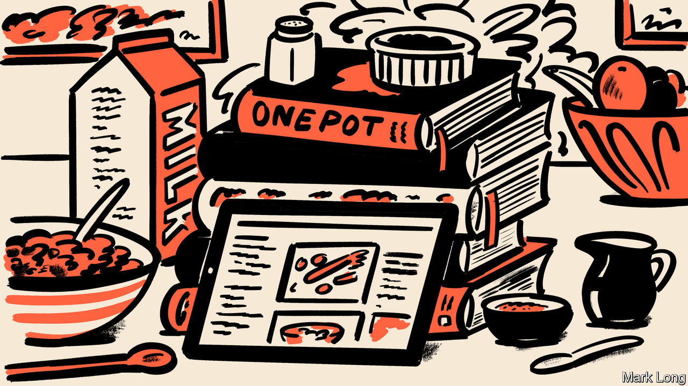

###### First, take one live goose…

# How to kill a goose quickly 

##### Britons love to buy cookery books for Christmas. But they barely use them 

 

> Dec 14th 2023 

“Countryman’s Cooking” was published in Britain in 1965. It has many strengths. If you wish to know how to brain a goose, it is peerless (in brief, bludgeon it briskly). If you want to find out how to behead a pheasant or disembowel a rabbit, it is invaluable. If, however, you wish to encase these animals in a pie, it is less helpful. For its author, W.M.W. Fowler, a former bomber pilot, has this to say on pastry recipes: “I cannot help you.” 

In fact, Fowler did have a suggested method for pastry-making. Take one telephone, he advised. Ring one nice female neighbour with it. Liberally baste her with drink (“A couple of stiff gins”); add seasoning (a liberal sprinkling of “blandishments and flattery”); and watch your timings (“DON’T kiss her till she has carried out her duties”). Soon enough, you would have an “excellent dish”. 

Cookery books are odd things. Reviewers might lavish their attention on literary novels but some of the real potboilers of the publishing industry are those with recipes. Joe Wicks, a strapping fitness-guru-cum-chef, has sold 3.7m books in Britain since his first book came out in 2015. In that same period, William Shakespeare has sold only 2.2m, George Orwell 1.8m and Charles Dickens a mere 1.4m.

Britons may buy cookery books, especially as presents during December, but they often don’t use them. It is said that if someone cooks a single recipe from an entire book, then that is considered a success. To many the puzzle is less that such books sell well, more that they sell at all, especially in an age of free online recipes. “I wonder [why] people buy cookery books,” says Claudia Roden, an Egyptian-born British cookery writer. 

For a long time, people didn’t. The genre arose relatively recently. For centuries those who could cook, couldn’t write; and those who could write, couldn’t cook. Many early recipes appeared in “books of secrets”, odd compilations that blended one-part cookery with two-parts pure sorcery. One 16th-century volume advised its readers on everything from how to conserve quinces (add sugar) to how “to comfort the heart, and take away melancholy” (yet more sugar). It also has a less appetising entry on recognising “All the Vrines that betoken death”. If your urine is red, black, green or blue, be worried—and perhaps don’t do any cooking.

Recipe books really took off with the rise of the middle classes. As a result they are infused with the flavour of social anxiety. Chapters from a book published in 1922 advise inexperienced hostesses how to correctly prepare “A Little Supper After the Play”, “Luncheon For A Motor Excursion In Winter” and a “Shooting-Party Luncheon”. (It also offered a brusquely titled chapter called “For The Too Fat”.) If such books were aimed mainly at people on the way up, they also catered to those on the way down. One book published in 1938 advised those who once had cooks but now lived in straitened circumstances (perhaps even in a “bed-sitting room”) on how long to hang a partridge before roasting it (“five to eight days”). Where you should hang a partridge for a week in a bedsit it did not say. 

Cookbooks shine a light on societies well beyond Britain. In 2017 al-Qaeda, a terrorist group, started to produce a magazine called “Your Home” that was aimed at the good jihadi wife. It offered problem pages, tips on washing up and, of course, recipes. The recipe for jihadi mashed potatoes explained to its eager readers that, for a truly successful mash, you should boil the potatoes first and only then mash them. You suspect, says Dr Elisabeth Kendall, an Arabist and Mistress of Girton College, Cambridge, that “it was written by guys”. 

Ostensibly, recipe books are about food. In truth, says Bee Wilson, author of “The Secret of Cooking”, they are about everything else, too. Cookery books are as evocative as any spell, able to conjure up worlds with a handful of words. Open something by Yotam Ottolenghi, a chef and restaurateur, and run your eye down its lists of esoteric ingredients, with their pomegranate molasses and za’atar and rose harissa. You are instantly transported to the Middle East—or at least to somewhere smug in north London. In “Culinary Jottings for Madras”, a “treatise…for Anglo-Indian Exiles” published in 1878, readers find themselves at the elbow of an English housewife as she learns how to make Victoria pudding in southern India at the height of the Raj. (It turns out to be easy enough: hand the recipe to your butler, who can hand it to your cook.)

For all that recipes pretend to be instruction, they are often epitaphs for dying worlds. According to Dr Kendall, the jihadi recipes were produced when the beginnings of the MeToo movement meant that jihadis were worried women might start to “get ideas”. “Countryman’s Cooking” may have opened with the line “This book is written for men” but it came out just as Britain was becoming less willing to cater to them. Ms Roden began her first book on the cuisine of Egyptian Jews when they left Egypt after the six-day war in 1967. Cookery was “the only thing we could take along with us. Our memories, and our food.”

It’s the home economy, stupid

“Our lives are full of death and grief and unexpected things,” says Ms Wilson. Recipes give people order, joy and—if we do them right—“a happy ending”. Yes, there are regrets and pains and exile; and there is the ever-present risk of “vrine” that turns unexpectedly blue. But there is rosemary to be chopped, too, and potatoes to peel and roast chickens to be taken from the oven. So take one helping of sorrows and a soupçon of social anxiety. Add a powerful desire for comfort. And begin. ■


