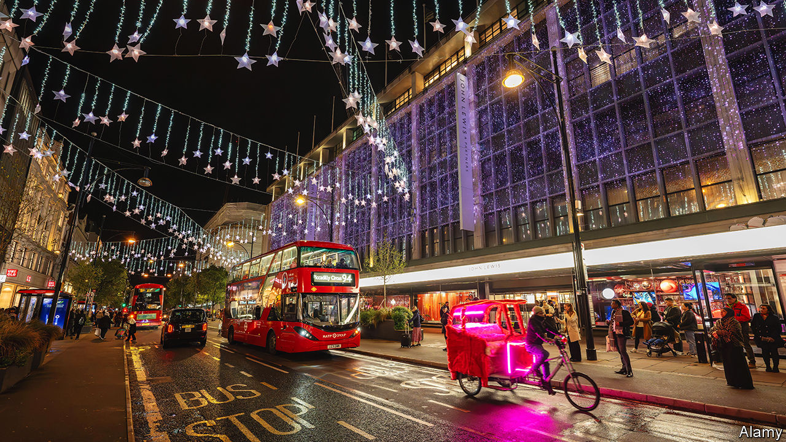

###### Pedicabonomics

# London’s riotous pedicabs are about to be regulated 

##### The streets of Soho may become less raucous 

 

> Dec 14th 2023 

STEP OUT of the Lyceum Theatre after seeing “The Lion King” on a Friday night, and the noise is cacophonous. Some 30 pedicabs, many fur-lined and dotted with bright lights, lie in wait. Drivers woo theatregoers by blaring out music: schmaltzy Christmas songs, trancy electro-pop and bhangra.

Long popular in South Asia, cycle rickshaws arrived in London only in 1998. In peak season as many as 900 pedicabs now ferry tourists and clubbers around the West End and other nightspots. Nobody is sure of the exact number because they are unregulated. Outside London pedicabs are treated like taxis, and are scarce. But in the capital the three-wheelers benefit from a bizarre loophole in the Metropolitan Public Carriage Act, a law passed in 1869 to regulate horse-drawn carriages. Loose drafting allows pedicab operators to slip through its provisions. As long as drivers negotiate a separate fare with each rider, they escape regulation.

The first pedicabs in London were merely a fun way for tourists to get around; they did not cost much more than a ride in a taxi. These days they are bigger and swisher—and pricier. Shadahan Khan, who takes your correspondent for a spin, charges £5 ($6) a minute, plus a service fee. Most customers want a round trip, he says: it is less about getting from A to B than “the experience”. His cab is adorned with fur lining, neon lights and plush seats. The sound system is “open to requests”. In parts of Soho, the pavements and streets now resemble a rickshaw edition of “Pimp My Ride”, a TV show about souped-up cars. 

Most pedicabs are not owned by their drivers. A standard electric-powered version costs some £5,000; a pimped-out one more. Instead, drivers rent them for about £200 a week. The competition means lots of waiting around for fares: a typical shift might involve as few as six rides between late afternoon and the early hours. But the pay is good. Able to charge whatever they can get away with, drivers may make up to £1,300 a week after rental costs. They are quick to spot niches. Some cater to wealthy tourists from the Middle East (cabs are emblazoned with pictures of Arab leaders and play traditional music), others to drunk Britons (Union Jacks and Oasis). 

Lack of regulation has caused problems. The gullible and the plastered alike can be whacked by unscrupulous drivers. Residents complain about the noise. Safety is another concern: some pedicabs have “great sound systems but no lights or brakes”, says Andrzej Łoziński of Maxpro, a manufacturer. Which is why this riotous free-market experiment is coming to an end. Legislation expected in the new year will fix fares and impose noise restrictions. Drivers will have to pass safety checks and prove they have the right to work. Other cities struggling with pedicabs, like Barcelona and Amsterdam, may take note. The aim is to “regulate not eradicate”, says Nickie Aiken, MP for Westminster, who backs the change. The streets of Soho may become a bit less raucous as a result. ■


