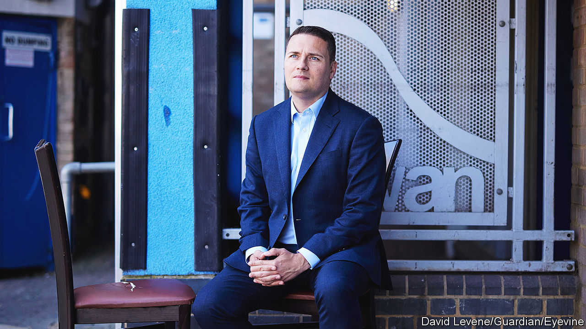

###### Health tourism

# Wes Streeting, a Labour frontbencher, visits Singapore 

##### The shadow health secretary seeks inspiration abroad 

 

> Dec 14th 2023 

I s wes streeting, the shadow health secretary, a potential future prime minister? On a recent trip to Singapore, the Labour MP for Ilford North looked like one. Glad-handing dignitaries, Mr Streeting combined the politics of Sir Tony Blair, the boyish charm of Lord Cameron and the enthusiasm for a Singapore sling of Boris Johnson. He was there after receiving a Lee Kuan Yew fellowship, in honour of Singapore’s founding father and a fellow Cambridge alumnus, for his “excellent track record and extraordinary potential”. 

Mr Streeting is still more potential than record. He has not yet served in government. In his memoir he lists as one of his greatest achievements a campaign in student politics to persuade a bank to extend interest-free overdrafts. But he is likely to get a chance soon to show what he can do. Labour is 20 points ahead of the Conservatives . Barring a shock in the next general election, which is due to be held before the end of January 2025, Mr Streeting will be given the mammoth job of fixing Britain’s beloved but creaking  (NHS). 

Mr Streeting is at least willing to be blunt about the scale of the task ahead, and about the need for change. The NHS should be “a service, not a shrine”, he says. During a briefing at Singapore’s largest hospital, he smiles at an acronym used by its bosses: “GROSS”, for “Get rid of stupid stuff”. He saw a lot of stupid stuff when he had kidney cancer in 2021 at the age of just 38; among other things, it took him three appointments to get a follow-up scan. “We’ve got to turn the NHS on its head and focus on prevention, early intervention, faster diagnosis and faster access to treatment,” says Mr Streeting. “That’s better for patients and also better value for taxpayers.” 

Less clear is whether he can actually shake things up. His call to move more care out of NHS hospitals has been repeated by predecessors from both political parties for decades. His mantra about streamlining the NHS‘s bureaucracy could have been lifted straight from Sir Tony’s “New Britain: My Vision of a Young Country”, a book Mr Streeting was ridiculed for reading at school. Like the former Labour leader, Mr Streeting’s focus is on “reform, not upheaval”. But unlike Sir Tony, he does not have lots of money to spend. 

Singapore offered Mr Streeting food for thought as well as accolades. Among rich countries, it has perhaps done the most to tackle the tricky mix of more chronic disease, an ageing population and a shortage of health-care workers. In 1961 Singaporeans could expect their lives to be five years shorter than those of Britons. Now they live two years longer (life expectancy is 83, compared with 81 in Britain). Some 6.5m people, more than Singapore’s entire population, are currently waiting for at least one NHS treatment in England. 

Yet the lessons of a small city-state are also not that easy to replicate in Britain. The Singaporean government can easily build apartment blocks to care for the elderly because it owns all the land. A more authoritarian state is able to incentivise workers to stay healthy with sticks as well as slick technology. 

Ironically, it is Britain that has provided some of the blueprint for the city-state’s health-care system. Mr Streeting is impressed by Singapore’s polyclinics, which offer a range of primary-care appointments and procedures. But most Singaporeans still use British-style general practitioners, a group Mr Streeting likes to criticise. Singaporean clinicians stress the importance of CT and MRI scanners, machines that Britain helped pioneer but which it now has too few of. Even initiatives that seem decidedly Singaporean, such as apps nudging people to walk more and eat healthily, have a British influence. “Singapore’s inspiration for behavioural science came from the UK, but we make bugger-all use of it,” Mr Streeting notes.

Mr Streeting is no stranger to beating the odds. Behind the veneer of Cambridge lies a tough upbringing in east London council houses. His family history is colourful: not many MPs can say that their grandmother gave birth to their mother handcuffed and under prison guard. His grandfather held up shops with a shotgun in a rubber mask he nicknamed Claude. Mr Streeting’s chances of ever leading his party may be hampered by his gender. Labour has never had a female leader, which makes many of its members uncomfortable. But if he were to succeed in putting the NHS right, he would have realised his potential—and then some. ■


