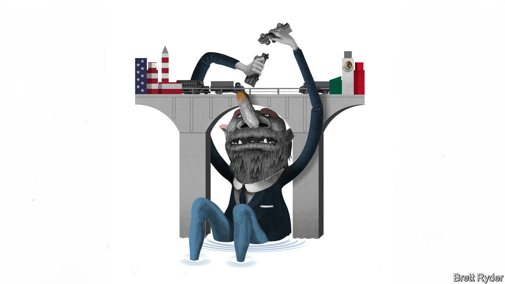

###### Schumpeter

# America’s border crisis is a hurdle to nearshoring 

##### Populist politicians are keener on walls than bridges 

 

> Dec 14th 2023 

Laredo, on America’s southern border, does not look like a crown jewel. The Texan city of 250,000 people appears more like a dusty trading outpost in the middle of nowhere. Sure, it has a quaint centre. Laredo dates back to 1755, making it older than the United States—though for part of its history it was almost as poor (and not nearly as much fun) as Nuevo Laredo, the Mexican town just across the Rio Grande. Yet since the covid-19 pandemic, it has become a shining symbol of American commerce. This is expected to be the first year when the value of goods passing through Laredo eclipses that of any other port in America—even that of mighty Los Angeles, where stuff is shipped in from China. 

Laredo’s trade is lubricated by axle grease. Every day about 20,000 lorries trundle back and forth across its two trade bridges, transporting everything from cars to chewing gum. Commerce is booming. The value of imports and exports passing through the inland port rose by 8% between January and October, year on year. That bucks the trend in other ports, such as LA, where trade has declined. Because of bilateral trucking restrictions, all that cargo has to be transferred between American and Mexican drivers, requiring 43m square feet (4m square metres) of warehousing—an area bigger than Manhattan’s Central Park. Investment is pouring in. Over the next two years, the city is expected to add another 10m square feet of warehouse space. It is daunting to think about. The number of lorries is already so large that tailbacks can stretch almost ten miles (16km) into Mexico.

The explanation for the buzz is nearshoring, which posits that, given the risks from overstretched supply chains and the trade war with China, manufacturers should move to North America. Although the potential is huge, so far it is more visible in truck traffic than investment flows. This year Mexico once again became America’s biggest trading partner, overtaking Canada and China. Yet foreign investment into Mexico as a whole, though rising, does not signal a flood of new money. The problem is politics. There is something about border crossings that breeds insanity in elected officials. Instead of keeping the vital arteries unblocked, they favour putting up barriers. Laredo is a case in point. 

It is an unusual city. With a 95% Hispanic population, most people, even those who have lived there for generations, speak Spanish. Many residents feel as much cultural affinity with Nuevo Laredo, even though it is plagued by violence, as they do with other parts of America. This came across clearly during a meeting of the Border Trade Alliance (BTA), a coalition of business executives and local officials, in Laredo this month. After greeting each other with Mexican-style , those present quickly turned to concerns about decisions taken in Austin, Texas’s state capital, and Washington, DC, that were thwarting the free flow of goods. Héctor Cerna, the BTA’s treasurer, says knee-jerk policies related to illegal migration have hit the supply of vegetables to American supermarkets, Corona beer to distributors, car parts to companies like General Motors and Nissan, and refrigerators to firms like Whirlpool. “It’s self-inflicted pain,” he says. 

Travel to the Colombia Solidarity bridge, on the outskirts of Laredo, and you see what he means. Built in preparation for the start of the North American Free Trade Agreement (NAFTA) in 1994, it was once called the “bridge to nowhere”, because there was no highway on the Mexican side. Now it is a flourishing transit point for avocados, cherry tomatoes and other goods from Mexico. Yet the governor of Texas, Greg Abbott, wants to strong-arm Mexico to do more to halt the wave of migrants trying to enter America. Under his orders, a state law-enforcement agency is imposing random safety checks on vehicles that have already passed US customs, creating long queues. The result is spoilage and ruined just-in-time delivery schedules. The costs are passed on to consumers.

The border crisis has led to other counterproductive policies. BTA delegates complained that Customs and Border Protection, an American federal agency, has responded to the surge of asylum seekers by temporarily closing international bridges to free up manpower to process asylum claims. This forces shippers to wait—or divert cargoes elsewhere. Logistics executives worry that hot-button issues such as illegal migration and fentanyl will take centre stage during next year’s presidential election in America, causing further trade-disrupting demagoguery. No one yet knows whether Donald Trump, the most likely Republican contender (and wall-builder-in-chief), will proceed with his ruinous plan to slap a 10% levy on all imports to America. But, by 2026, whoever leads the government will oversee a sexennial review of the USMCA, an update to NAFTA signed by America, Canada and Mexico in 2020. Given its importance to the trio’s economies, it will probably survive. But opponents to free trade with Mexico, such as Florida’s fruit growers, are already lobbying for a trade war. 

The threats to cross-border trade are, of course, not just American-made. Andrés Manuel López Obrador, the Mexican president, has committed his own act of sabotage by imposing state control over the energy industry, which discourages firms from relocating to Mexico. He has militarised the border, putting oversight of trade into the hands of soldiers with little customs experience. Lawlessness is another hindrance. 

Light up the border 

Yet in America the border is a perennially touchy subject. Those far away see it as a place of chaos and crisis. Those who live near it think that if only it were managed with more sensitivity, the result would be more trade and a regulated flow of guest workers to ease labour shortages. Testament to their optimism is Laredo’s love of bridges. It hopes shortly to increase the number from four to five, with a new trade bridge built by a public-private partnership. Mexico has given the green light. But officials in Washington are stalling on permit approval. There the focus is squarely on walls. ■


