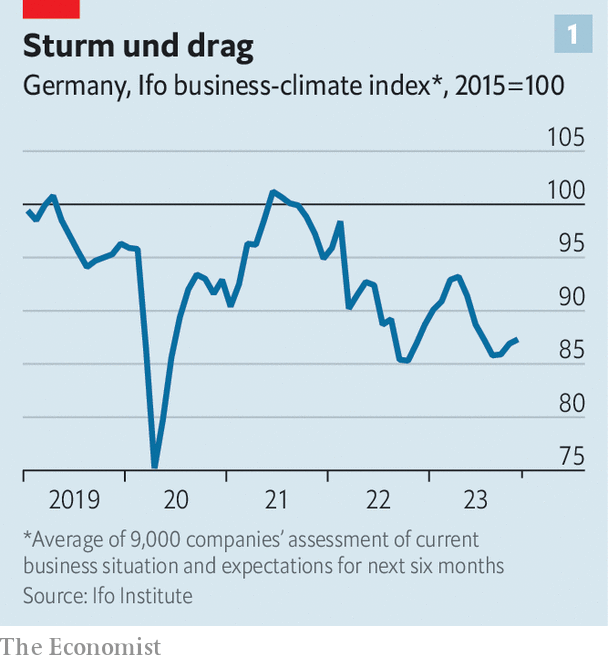

###### Season’s grumblings

# German business is fed up with a government in disarray 

##### And now it braces for budgetary austerity 

 

> Dec 14th 2023 

Many GERMAN bosses wanted just one thing for Christmas—. The country’s business circles have talked about little else than these “formal funding notices” since November 15th. On that day the federal constitutional court declared that the government’s plan to repurpose €60bn ($66bn) in “emergency” covid-19 credit lines towards infrastructure and the energy transition was unconstitutional. This blew a hole in the coalition government’s spending plans. It also raised concerns among those companies which depend on public support for their investments. Though not that numerous, they are central to the government’s economic vision—and that vision, in turn, matters to German enterprise as a whole. 

In early December Northvolt, an innovative Swedish battery-maker, received a for a €564m subsidy to construct a €4.5bn factory in the northern German state of Schleswig-Holstein. Other companies, including those behind 11 of Germany’s 27 “important projects of common European interest” that have yet to receive a formal funding offer, anxiously awaited their economic sweeteners.

 


What they got instead was a bitter dose of austerity. “We have to get by with significantly less money,” said Olaf Scholz, the Social Democrat chancellor on December 13th. After tense discussions with his Green and Free Democrat partners, Mr Scholz unveiled €29bn in savings, including €12bn less for an off-budget climate and transition fund. Details have yet to be hammered out, but some of this will come from an early end to subsidies for electric vehicles and solar power, a higher-than-expected rise in the carbon tax and a new fee on companies that use plastics. Not another in sight

Mr Scholz’s belt-tightening is fuelling doubts about the federal and state governments’ other promises. “Bosses are lobbying like crazy at the economy ministry while the finance ministry is trying its best to block new spending promises,” says Christoph Bertram of fGS, a consultancy. A €10bn subsidy for Intel, an American chipmaker, to erect a €30bn semiconductor factory, which would be post-war Germany’s largest single foreign investment, seems to be in doubt. So is €5bn for a chip plant in Dresden to be built by tSMC, a Taiwanese manufacturer. These handouts are a costly, and possibly futile, attempt to compete in the global chip-subsidy race. Still, scrapping them now “would send a catastrophic signal” about the government’s trustworthiness, warns Marcel Fratzscher, head of the German Institute for Economic Research, a think-tank. 

Coalition of the wilting

The budget shambles adds to a litany of German business , on top of shrinking GDP, high energy prices, a shortage of skilled workers, persistently cumbersome red tape and the rise of the populist far right. Small wonder bosses are becoming ever more deeply disillusioned with Mr Scholz and his coalition partners. Almost 83% say that the government is not doing a good job, according to a survey in early December by a business publication; 75% would like Germany to hold new elections in 2024. An index of the business climate by the Ifo Institute, a think-tank, which exceeded its pre-pandemic level for much of 2021, is once again well below it (see chart 1 ).

 


The glum sentiment is affecting investment decisions. Capital spending by companies fell in the third quarter, year on year, having barely grown in the few previous ones (see chart 2). Businesses have “significantly” reduced their investment plans, according to a new survey of 5,000 businesses by the Ifo Institute. According to the latest quarterly poll of the , only 24% of Germany’s admired family-owned pocket multinationals are planning to invest in expansion, the lowest share since the survey began in 2010. Fully 42% said they would not invest in Germany any more. 

All this reflects worries about high interest rates, weak demand and general uncertainty over economic policy, explains Lara Zarges of Ifo. It may also paint a flattering picture, since the survey was conducted before the budget fiasco. Although most economists predict a mild recovery for the German economy next year, Sebastian Dullien of the IMK research institute expects the recession to persist into 2024 because of the spending cuts following the constitutional court’s verdict. 

Mr Dullien thinks that it is “economically absurd” to stick to strict spending limits, as Mr Scholz is intending to do next year, at a time when the country is facing an energy crisis, giving shelter to more than 1m refugees from war-torn Ukraine, and suffering from economic weakness. Siegfried Russwurm, head of the BDI, Germany’s main industry association, sees the draft spending bill as a “tough austerity budget that will be a big burden for the economy and consumers”. He agrees with Mr Dullien that it will make Germany’s recovery in 2024 more difficult. 

The government is trying to prove the doomsayers wrong. On December 11th the Green economy minister, Robert Habeck, took a break from the budget negotiations to pay a visit to Völklingen, a city in south-western Germany. There the federal government is teaming up with the state of Saarland to finance the transformation of Stahl-Holding-Saar, a big local steelmaker, into a climate-neutral company. SHS is the third of Germany’s four big steel companies to be promised state aid for a green makeover. It could eventually receive €2.6bn in subsidies. But first it awaits its , which has yet to land under its Christmas tree. ■


