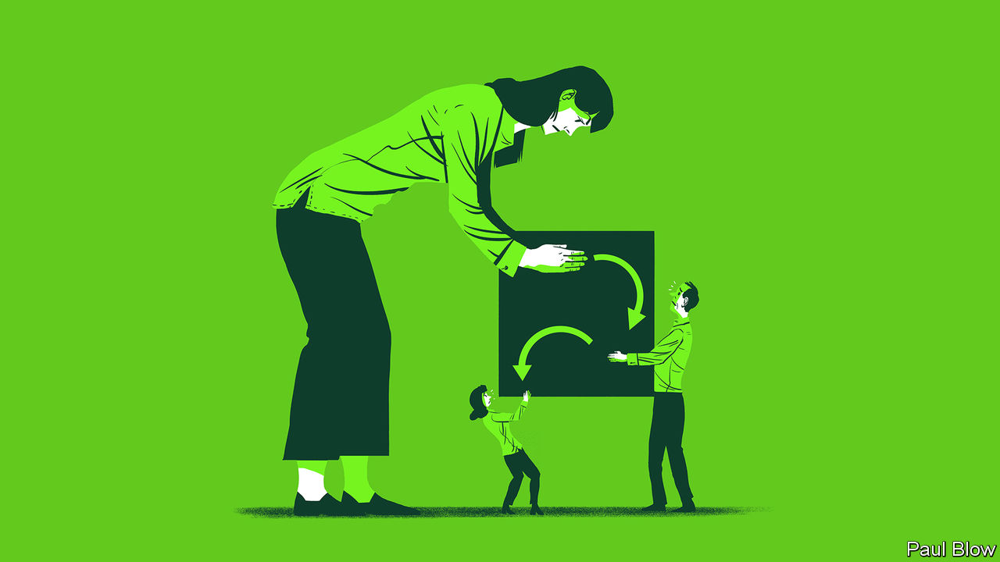

###### Bartleby

# How to master the art of delegation 

##### You can entrust decisions to subordinates without regretting it 

 

> Dec 14th 2023 

Delegating well is the six-pack of management: widely desired and harder to achieve the older you get. In theory, handing appropriate decisions off to people lower down the corporate ladder means greater satisfaction all round. Bosses get more time to concentrate on the issues that really deserve their attention. Middle managers and workers enjoy a greater sense of autonomy. And the organisation benefits from faster decision-making on the part of people who are better informed about the matter at hand. In practice, however, delegation is a minefield. 

Some bosses do not even try to delegate. They may mistrust people below them or crave control. Their career success may simply have persuaded them of their own genius. But there are kinder explanations, too. Startup founders are conditioned to do everything, at least until firms get to a certain size. Plenty of managers shoulder more work than they should in order to protect their teams from overload. 

Other managers do delegate but they do so for the wrong reasons. Studies suggest that people are likely to hand off decisions when choices are hard, when the consequences affect others and when they want to avoid being blamed for a bad outcome. In a paper from 2016 by Mary Steffel of Northeastern University and her co-authors, volunteers were told that they had to book hotel rooms at a conference, either for their own use or for their boss, and asked them if they would like to reserve the rooms themselves or delegate the task to an office manager. When they were choosing for the boss and the hotels were ropey, people were more likely to pass the job to the hapless office manager. 

A new study, by Victor Maas and Bei Shi of Amsterdam Business School, reaffirms this bleak picture of human motivation. It found that people were more likely to hand work off to subordinates when the performance targets for that particular task were demanding; they were much happier to keep hold of tasks with targets that were easier to attain. If a habitual micromanager unexpectedly asks you to take the lead on something, in other words, run for the hills. 

The great mass of managers fall into a greyer area. They may be full of good intentions to leave decisions to others but still find it hard to do so. What if you put trust in your team members but then discover you violently dislike the choices they make? What if you want to hand over some decisions but you know that your own bosses will hold you personally responsible for them? These problems can easily result in “faux-tonomy”—a lip-service version of delegation in which managers do not actually leave their teams to get on with things or underlings use their freedom solely to guess what the boss would like. 

One way to navigate such problems is to use an explicit decision-making framework that tries to make it clear who is on the hook for what. These frameworks are not perfect. Project managers often use something called the RACI model. Its first two letters sort those who are “responsible” from those who are “accountable”, a distinction which normal people may find “confusing” and “incomprehensible”. Other, clearer frameworks are available. They have punchy names like DACI, DARE and DICE: you might be choosing a cloud-computing vendor but you get to feel a little like you are in the special forces. 

As well as working out who does what, it helps to have a way to parse what kinds of decision can be delegated and what not. Before Jeff Bezos started hanging out in spacesuits and doing laughable photoshoots in , he liked to articulate his management philosophy in annual letters to Amazon’s shareholders. In 2015 he made a useful distinction between type-1 decisions (“one-way doors”) that are important and irreversible, and type-2 decisions (“two-way doors”) that can be reversed if they do not pan out. Type-1 decisions warrant slow, deliberative processes; type-2 decisions should be taken quickly by smaller groups. Having a theory of decisions improves choices on what to delegate and reduces the chance of regrets.

Delegating well requires a lot of judgment, too. Delegation is not all-or-nothing. A detached boss can be as demotivating as a micromanager; you have to stay informed on decisions and, on occasion, override them. But checking in at the right cadence, and letting people proceed with decisions that you would not have made yourself, demands self-restraint and discipline. Just like those abs.■


