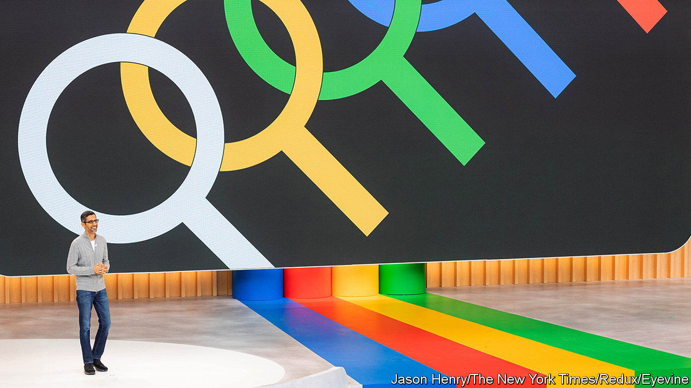
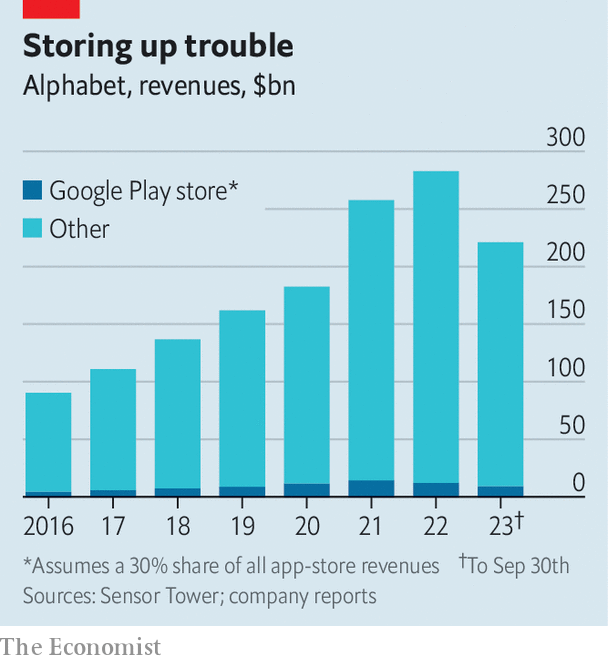

###### Un-appy returns

# What Google’s antitrust defeat means for the app economy 

##### Tech giants will try to defend their profit pools in the face of courts and regulators 

 

> Dec 14th 2023 

IT TOOK less than four hours for nine jurors to reach a verdict. On December 11th in a San Francisco courthouse they unanimously agreed that Google’s app store was a monopoly and that the company had engaged in anticompetitive behaviour. The decision strikes a blow against the search giant, which is concurrently embroiled in other legal battles. It may also redefine the app-store economy.

Most smartphones run on one of two operating systems. Apple’s iOS is a walled garden with just one app store—its own. Other device-makers tend to use Google’s Android, which on paper lets in app stores other than the Google Play store. The case was about whether it does in practice. In 2020 Epic Games, a game studio, urged players to use its payments system to make purchases in “Fortnite”, its blockbuster shoot ’em up. The idea was to bypass the 30% cut taken by Apple and Google on most in-app purchases in their app stores. “Fortnite” was briefly banned from both. 

Epic sued. Its lawyers argued Google was stifling competition by striking deals with, among others, smartphone-makers such as Samsung and LG, to give the Play store prime placement on their devices in exchange for a cut of revenues. The jurors did not buy Google’s defence that it competes fiercely with Apple, as well as other app stores on Android devices.

So far, so straightforward. What makes the situation strange is that the verdict is at odds with the one in Epic’s near-identical case against Apple. That concluded in 2021 with Apple winning on nine out of ten counts (on the tenth, related to the use of alternative billing systems, it lost). 

One reason for the difference may be that Google’s fate was decided by a jury, not a judge. Public opinion is sceptical of big tech, which two-thirds of Americans regard as having too much power. Jurors may also struggle to grasp the nuances of antitrust laws. Another explanation is, ironically, that Google has tried to make its mobile software too open. Anyone can use Android’s open-source code free of charge to create their own OS. By contrast, Apple’s customers and developers know that it controls all aspects of the iPhone. Being locked in Apple’s walled garden may be more palatable if consumers know what they are getting into. Less so if limits are imposed by the maker of just the operating system, which it claims is open.

The verdict may influence two other lawsuits against Google by America’s Department of Justice. The first went to court in September. It focuses on Google’s deals to ensure it is the default search engine on various devices, including Apple’s, and web browsers. Such arrangements cost it $26bn in 2021. The second is likely to begin next summer, and looks at Google’s advertising business.

 


The judge in the Epic case will decide on a remedy early next year. One possibility is for app developers to be freed from Google’s billing system. Last year South Korea forced Apple and Google to enable alternative payments. The EU’s new digital law has similar provisions. This may be making the app-store economy more competitive—especially for games. Microsoft, which has just concluded its $69bn acquisition of Activision-Blizzard, a big game developer, is planning its own app store for games. Epic already has one, for PCs. Riot Games, a rival, may launch its own. 

The tech giants do not like this one bit. According to Sensor Tower, a research firm, people around the world will spend about $160bn on apps this year. Google’s and Apple’s commissions account for perhaps 5% of each firm’s overall revenue. Operating margins for both app stores are thought to be over 70%, according to testimony in the two court cases. (Google argued in court that this figure does not account for some app-store costs, such as research and development.) That is much higher than the overall margins of 26% for Google and 30% for Apple last year.

Google is already seeing its Play store revenues dip, reckons Sensor Tower (see chart). So neither firm will give up without a fight. Google is challenging the jurors’ decision at an appeals court, where a panel of judges will hear the case. Apple is appealing against the payments ruling in its Epic case. Both are finding ways around rules like those in South Korea, where they let in alternative billing methods—and promptly slapped a commission of up to 26% on any sum paid using them. ■


