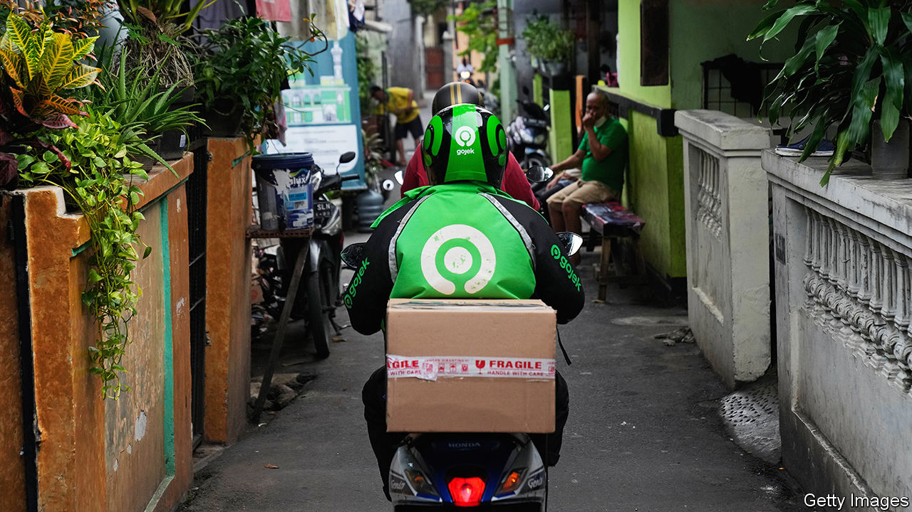

###### Toko-Tok

# Will TikTok’s GoTo gambit save its Indonesian business? 

##### How the video app is navigating around a digital shakedown 

 

> Dec 14th 2023 

The more the world’s youngsters love TikTok’s viral videos, the more their elected elders hate the app. They decry it for supposedly corroding young minds and, worse, for its links to China, home to its parent company, ByteDance. Many in America want to ban it. India already has. In October Indonesia, another big and promising market, shut down TikTok’s fledgling but lucrative sideline of selling goods via its videos, by requiring social-media firms to obtain an e-commerce licence—with no guarantee of success. 

Such obstacles have forced TikTok to act strategically, for instance by moving its global headquarters to Singapore and hiring a Singaporean chief executive, which has put distance between it and its Chinese parent. In another canny move, on December 11th it announced that it was paying $840m for a 75% stake in Tokopedia, the e-commerce arm of GoTo, an Indonesian tech conglomerate. It has also pledged to invest $1.5bn in the tie-up. 

The deal is something of a shotgun marriage, but it benefits both sides. GoTo, which has struggled to turn a profit in recent years, will no longer need to subsidise its loss-making retail arm. TikTok, for its part, will be allowed to restart its e-commerce operations. Sales on TikTok’s app will be fulfilled by Tokopedia’s logistics network (though, like all e-merchants in Indonesia, it must now charge minimum prices for products made abroad).

TikTok and Tokopedia separately account for 10% and 28%, respectively, of Indonesia’s fast-growing e-commerce market, according to Momentum Works, a data firm. Together, they are a powerhouse, matching the market share of Shopee, hitherto the country’s biggest online emporium (owned by Sea Group, a Singaporean technology conglomerate). 

Most important, an intimate link with a domestic champion makes TikTok look less like a foreign interloper. If the firm can make its new partnership work in the world’s fourth-most-populous country, it could use this as a model for expansion and consolidation in other countries where it is greeted with wariness, such as Malaysia and the Philippines. 

It will be an uphill struggle, and not just because of challenges particular to TikTok. All over the world, the advocates of international openness in digital commerce are losing the battle for hearts and minds. Last year Sea halted its expansion to India in the face of regulatory pressure, after its popular mobile game, “Free Fire”, was banned. Stringent new European rules on cloud computing, including requirements to store local users’ data locally, are aimed squarely at the American tech giants. 

Last month America, itself in an increasingly isolationist mood, dropped earlier demands to liberalise trade in digital goods and services as part of the Indo-Pacific Economic Framework, the already flimsy pact which President Joe Biden’s administration has been negotiating with 13 Asian allies. To thrive amid rising protectionism—digital and otherwise—TikTok and its rivals will need to show plenty of delicate diplomatic footwork. ■


