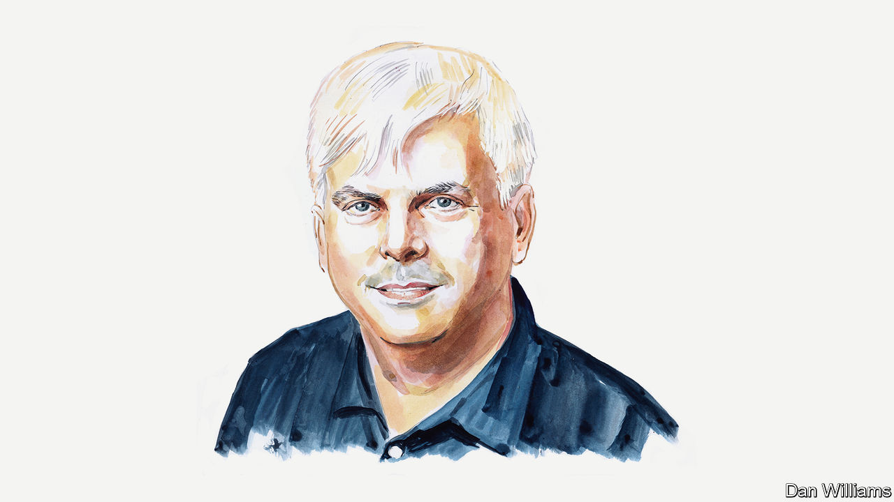

###### Artificial intelligence

# AI’s big rift is like a religious schism, says Henry Farrell 

##### In this doctrinal dust-up, very smart people are saying very strange things 

 

> Dec 12th 2023 

TWO CENTURIES ago Henri de Saint-Simon, a French utopian, proposed a new religion, worshipping the godlike force of progress, with Isaac Newton as its chief saint. He believed that humanity’s sole uniting interest, “the progress of the sciences”, should be directed by the “elect of humanity”, a 21-member “Council of Newton”. Friedrich Hayek, a 20th-century economist, later gleefully described how this ludicrous “religion of the engineers” collapsed into a welter of feuding sects. 

Today, the engineers of artificial intelligence (AI) are experiencing their own religious schism. One sect worships progress, canonising Hayek himself. The other is gripped by terror of godlike forces. Their battle has driven practical questions to the margins of debate.

Both cults are accidental by-products of science fiction. In 1993 Vernor Vinge drew on computer science and his fellow science-fiction writers to argue that ordinary human history was drawing to a close. We would surely create superhuman intelligence sometime within the next three decades, leading to a “Singularity”, in which AI would start feeding on itself. The future might be delightful or awful, depending on whether machines enhanced human intelligence or displaced it. 

Some were optimistic. The futurist Ray Kurzweil wrote an enormous tome, “The Singularity is Near”, predicting a cusp in 2045. We humans would become immortal, spreading intelligence throughout the universe, and eventually merging into God. For all its statistics and exponentials, the book prophesied “the Rapture of the Nerds”, as one unkind critic called it. Its title really should have been “The Singularity is Nigh”.

Others feared the day of judgment. Eliezer Yudkowsky, a self-taught AI researcher, was deeply influenced by Mr Vinge’s ideas. He fathered Silicon Valley’s “rationalist” movement, which sought to improve human reasoning and stop AI destroying humankind.

Rationalists believed that Bayesian statistics and decision theory could de-bias human thinking and model the behaviour of godlike intelligences. They revelled in endless theoretical debates, like medieval Christian philosophers disputing the nature of angels, applying amateur game theory instead of Aristotelian logic. Sometimes their discussions were less erudite. Mr Yudkowsky popularised his ideas in a 660,000-word fan-fiction epic, “Harry Potter and the Methods of Rationality”.

Rationalists feared that superhuman AIs wouldn’t have our best interests at heart. One notorious thought experiment—a modern version of Pascal’s wager, dubbed “Roko’s basilisk”—claimed that logic dictated that future divine intelligences would torture anyone who had known that AI was possible and hadn’t devoted themselves to bringing it into existence. AIs might also use their awesome reasoning powers to escape any limits that humans imposed on them, creating an “x risk” (existential risk) to human survival.

Rationalism explains why AI pioneers became obsessed with x risk. Sam Altman, Elon Musk and others founded OpenAI, the creator of ChatGPT, as a non-profit so that it wouldn’t duck the dangers of machine intelligence. But the incentives shifted as the funding flooded in. Some OpenAI staffers feared that their employer cared more about the opportunities than the dangers and defected to found Anthropic, a rival AI firm. More recently, clashes over AI risk, money and power reportedly led to the fracture between Mr Altman and his board.

If rationalists are frustrated by Silicon Valley’s profit model, Silicon Valley is increasingly frustrated by rationalism. Marc Andreessen, the co-founder of Andreessen Horowitz, a venture-capital firm, fulminated in June that the extremist AI-risk “cult” was holding back an awesome AI-augmented future, in which humanity could reach for the stars.

This backlash is turning into its own religion of the engineers. Grimes, a musician and Silicon Valley icon, marvels that AI engineers are “designing the initial culture of the universe”. She calls for a “Council of Elrond” (this conclave a nod to “The Lord of the Rings”) comprising the “heads of key AI companies and others who understand it” to set AI policy. Grimes met Mr Musk, the father of her children, through a shared joke about Roko’s basilisk.

In October Mr Andreessen published his own “Techno-Optimist Manifesto” to wide acclaim from Silicon Valley entrepreneurs. In it, he takes aim at a decades-long “demoralisation campaign…against technology and life”, under various names including “sustainable development goals”, “social responsibility”, “trust and safety” and “tech ethics”. Efforts to decelerate AI “will cost human lives” and are thus tantamount to “murder”. 

Mr Andreessen’s manifesto is a Nicene creed for the cult of progress: the words “we believe” appear no less than 113 times in the text. His list of the “patron saints” of techno-optimism begins with Based Beff Jezos, the social-media persona of a former Google engineer who claims to have founded “effective accelerationism”, a self-described “meta-religion” which puts its faith in the “technocapital Singularity”. 

Our future is currently being built around Mr Vinge’s three-decades-old essay, a work that only Silicon Valley thinkers and science-fiction fans have read. Warring cults dispute whether engineers are as gods, or just unwitting Dr Frankensteins. 

This schism is an attention-sucking black hole that makes its protagonists more likely to say and perhaps believe stupid things. Of course, many AI-risk people recognise that there are problems other than the Singularity, but it’s hard to resist its relentless gravitational pull. Before Mr Andreessen was fully dragged past the event horizon, he made more nuanced arguments about engineers’ humility and addressing the problems of AI as they arose.

But we need even more to listen to other people. Last month, at Rishi Sunak’s global AI-policy summit, Mr Musk pontificated about the need for an “off switch” for hostile AI. The main event was all about x risk and AI’s transformative promise, consigning other questions to a sideshow dubbed the “AI Fringe”. 

At the same time, Rachel Coldicutt, a British tech thinker, was putting together a “Fringe of the Fringe”, where a much more diverse group of thinkers debated the topics that hadn’t made the main agenda: communities, transparency, power. They didn’t suggest a Council of the Elect. Instead, they proposed that we should “make AI work for eight billion people, not eight billionaires”. It might be nice to hear from some of those 8bn voices.■

.

