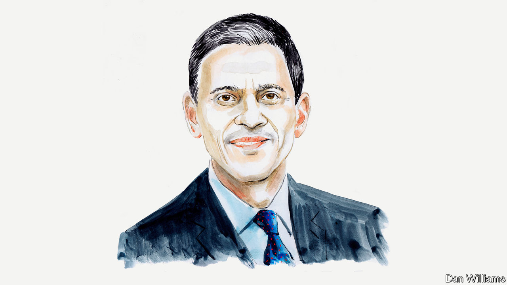

###### Humanitarian needs

# David Miliband sees a new global geography of crisis 

##### Governments and NGOs need to rethink their priorities, says the head of the IRC 

 

> Dec 14th 2023 

TODAY’S HEADLINES are understandably dominated by the crisis in Gaza. It is currently the most dangerous place in the world to be a civilian, a humanitarian nightmare that makes the case for a sustained ceasefire clear. 

Yet Gaza ranks second in the International Rescue Committee’s (IRC’s) Emergency Watchlist, an annual prediction of where crisis is most likely to be concentrated in the year ahead. Based on 65 quantitative and qualitative indicators of humanitarian need, the analysis suggests that Ukraine, Syria, Yemen and Afghanistan, all of which ranked high last year, do not make the top ten. It is not that the situation has improved in these countries. Rather, things have got much worse elsewhere. Some 300m people worldwide today are in humanitarian need.

In Sudan, which tops the Watchlist, fighting broke out between government and rebel troops in April. Some 25m people in the north African country are now in humanitarian need. This is a regional crisis, not just a national one: 1.5m people have sought refuge in poor neighbouring states like Chad and South Sudan; the latter, at number three on our list, already had problems. In total, eight African countries rank in the top ten, as coups, conflict and the climate crisis take their toll.

The report reveals the trends behind a new geography of crisis. Home to 10% of the world’s population, the 20 states on the Watchlist account for nearly 90% of people in need, 75% of forcibly displaced people and a growing share of extreme poverty and climate risk.

What were once separate circles of crisis are now a Venn diagram with an expanding intersection. Three decades ago, 44% of conflicts happened in climate-vulnerable states. Now it is more than two-thirds. While the rest of the world has cut extreme poverty by over half in that same period, it has grown by half in fragile states. Fourteen of the 20 Watchlist countries are in urgent need of debt relief. Meanwhile, the number of armed groups involved in conflicts in Watchlist countries is higher than ever before. Against this dire backdrop, these places are neglected by global leaders: the amount of humanitarian funding for Watchlist countries requested by the UN but not provided has increased four-fold since 2018.

It is vital to fight inertia in tackling these problems. It is also important to bust myths. Europe and North America do not face the greatest refugee flows; most refugees are in much poorer countries. Truck deliveries on their own don’t guarantee humanitarian aid gets to where it’s needed; aid workers and civilians need safe access to the aid. Climate change is not tomorrow’s problem; the climate crisis is happening today in Watchlist countries, where people are nearly three times more likely to be affected by a natural disaster than people in non-Watchlist countries.

To reverse these trends, governments, civil society, multilateral organisations and the private sector need to rethink their priorities. First, they should focus on reaching those most in need. For example, 80% of people displaced by climate change are women. Yet only 1.2% of humanitarian funding reaches women-led organisations.

Second, in fragile and conflict states where governments struggle to hold sway, there is a delivery gap for aid as well as a finance gap. IRC research shows that World Bank projects in Watchlist countries regularly face geographical restrictions, temporary suspensions or outright termination, especially in areas under the control or influence of non-state armed groups. World Bank studies on Somalia show that contracting projects out to civil society can help improve their sensitivity to conflict dynamics and responsiveness to the needs of affected communities. This needs to become the norm.

Third, the commitment at COP28 to recognise the link between climate and conflict needs to be turned into action. We suggest new rules for deciding where climate finance goes: 50% of public climate finance for developing countries should be allocated to adaptation by 2025 and linked to need—which would require increasing the amount going to conflict-affected states; to encourage new partnerships, 20% of all climate finance from multilateral development banks should be channelled to non-governmental actors in countries affected by war or climate change; and at least 5% of government humanitarian budgets should be spent on anticipatory action, in order to save lives and livelihoods before flooding and predictable disasters hit.

Fourth, none of this can be possible without protecting civilians and the infrastructure they depend on. We are witnessing an age of impunity in conflict. Violations of international humanitarian law have become normalised, with widespread targeting of civilians and the weaponisation and denial of humanitarian access. Some 90% of urban casualties in conflicts are non-combatants. The IRC proposes an Independent Access Organisation to ensure humanitarian access in conflict zones, and supports the proposal by France and Mexico that use of the UN Security Council veto be suspended in the case of mass atrocities. 

Finally, the West needs to step up its support of refugees at home and abroad. Watchlist countries and their neighbours are home to nearly 80% of non-Ukrainian refugees and displaced people; America and Europe host less than 10%. The West must play its part in receiving refugees humanely at home and providing assistance for initiatives that offer opportunities for self-reliance to those countries hosting the most.

Humanitarian crises are not just problems for the people who suffer them and the NGOs that try to help them. Understanding where and why human misery is growing is the foundation of effective humanitarian aid, which is the first step on the road to development. This is the way to save more lives and prevent crises from tightening their grip. The biggest lesson of the IRC Watchlist is clear: if these problems are not tackled, they will get much worse. ■


