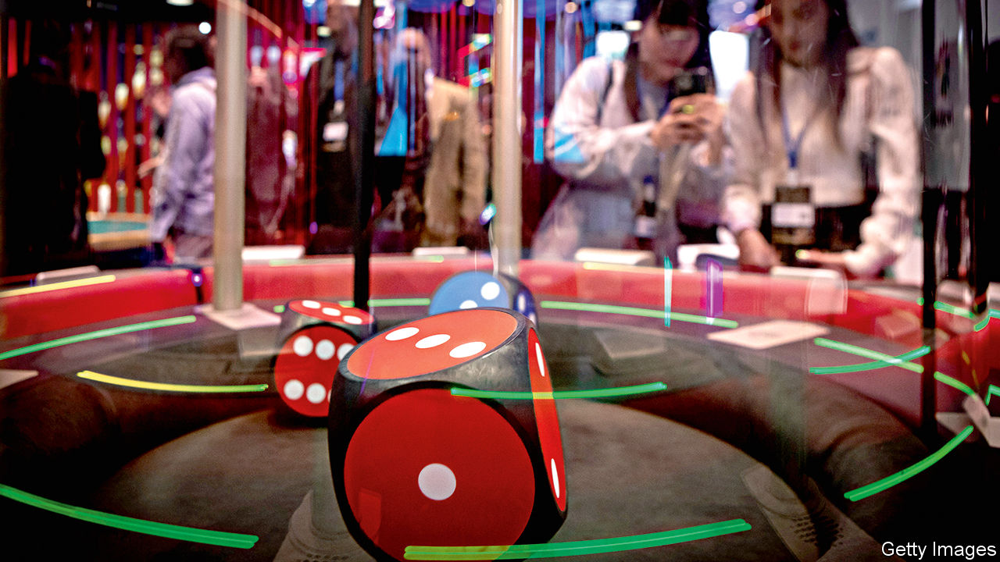
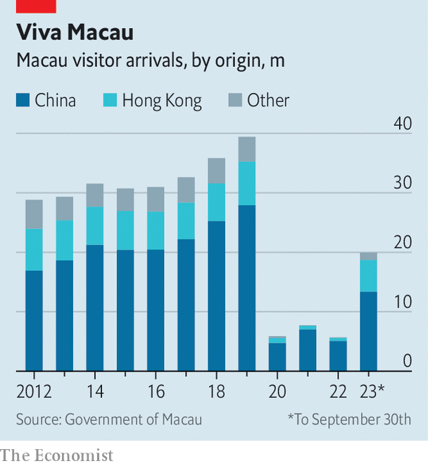
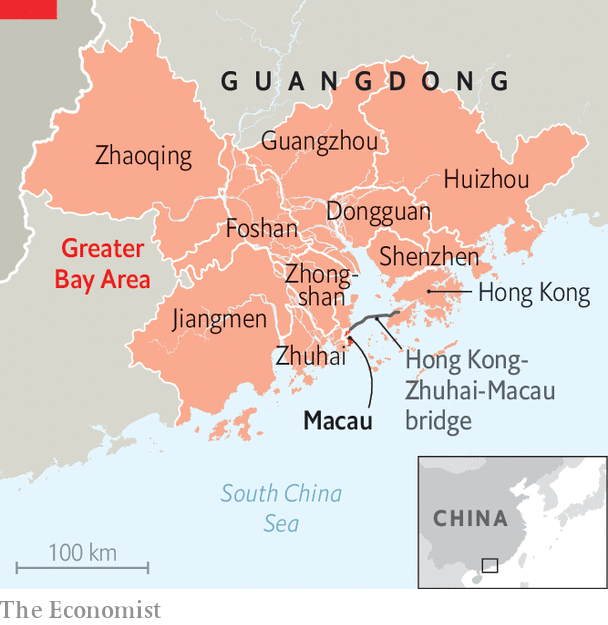

###### A big wager on the future

# Macau, China’s sin city, wants to be more like Las Vegas 

##### A fortune is on the line 

 

> Dec 14th 2023 

ON A BALMY morning in southern China tourists are back walking the canals of Venice and admiring the architecture of St Mark’s Square. The crowds have returned to the Venetian Macao, a resort with gondoliers and gaming tables. It and other casinos in Macau, the world’s largest gambling centre by revenue, were hit hard by the pandemic as China closed its borders. Tax receipts from the city’s gaming sector fell by 85% from 2019 to 2022. But now they are surging again. More people visited Macau in the first nine months of 2023 than in the preceding three years combined (see chart).

 


Yet Macau’s future still feels uncertain. So long as gambling remains illegal in mainland China, the city and its casinos should do well. But under Xi Jinping the national government has taken a dim view of vice. The state’s actions have already changed the way Macau operates. Over the coming decade, they are likely to reshape the place. Macau is under pressure to follow the model of Las Vegas, which has diversified its leisure offerings and become more family-friendly. China’s sin city, though, is struggling to adjust.

Things began to change for Macau with the ascendance of Mr Xi, who launched the largest anti-corruption campaign in Chinese history soon after taking power in 2012. Part of that effort was aimed at the city, a former Portuguese colony that has been an autonomous region of China since 1999. Like neighbouring Hong Kong, it has its own currency that is, in effect, pegged to the dollar. Mainland officials and entrepreneurs often used the city’s casinos as conduits for money-laundering or exit routes for ill-gotten gains. High-rollers would circumvent China’s strict capital controls by taking winnings in foreign currencies or staging losses and paying the “debt” into a foreign bank account.

Mr Xi’s campaign has put an end to much of that activity. In 2021 the government went after “junket” operators, who bring high-rollers from the mainland to Macau’s casinos (and often arrange credit to finance their betting). Alvin Chau, the boss of the biggest junket group, Suncity, was arrested that year and is now serving an 18-year prison sentence for illegal gambling, fraud and involvement in a criminal organisation. Macau’s gaming regulator has slashed the number of junket licences it issues. In 2011 nearly three-quarters of the city’s gaming revenue came from high-rollers; last year less than a quarter did.

Macau’s future depends on it attracting a broader audience. In 2019 mass-market gaming accounted for more than half of casinos’ earnings for the first time. But it is harder to make money from vast numbers of regular punters than it is from smaller groups of high-rollers. In the 2010s, as the number of tourists in Macau rose, their average expenditure fluctuated. This year it is down compared with last year. At the Venetian Macao, tables with high minimum bets attract few customers. Poker tables, introduced to bring in new clientele, are largely empty. (Most people play baccarat.)

The casinos are suffering a “long hangover” from the pandemic, says a staff member. But the problem goes beyond that. Macau’s tax take peaked in 2013. In 2019, before covid-19 hit and despite a record number of visitors to the city, government revenue was down 25% from its high six years earlier.

Before the pandemic Macau made most of its money (around 80%) from gambling—unlike Las Vegas, which makes more from non-gaming sources such as shows. Over the past decade Macau’s resorts have invested billions of dollars to expand their offerings, increasing entertainment and shopping options. Much more is planned. Last year the city’s government agreed to renew the licences for the six largest gambling operators for ten years starting in 2023. But they had to pledge to spend $13bn on non-gaming projects and efforts to draw foreign tourists.

Raising the stakes

One operator, Galaxy Entertainment Group, has vowed to build the city’s “first and only high-tech amusement park”. Another, Sands China, will add a glass conservatory to the 50,000-square-metre garden next to its Londoner Macao resort (with its own Big Ben and King’s Guard). Other developments aim to attract business travellers with upgraded spaces for meetings and conventions. Some wonder if there is a big enough market for these offerings.

 


Mr Xi has urged local governments to invest in the “Greater Bay Area”, which encompasses Macau, Hong Kong and much of Guangdong province (see map). Some of Macau’s casino groups are planning to build non-gaming resorts in the region. The 55km Hong Kong-Zhuhai-Macau bridge has linked up those cities, but it also makes it easier for visitors to spend just a day—not a night—in Macau. The gaming hub’s neighbours are also getting in the way of its other ambitions. In recent years Macau has tried to develop its financial industry and to depict itself as a centre for technology and innovation, but it has struggled to compete with Hong Kong and Shenzhen in those areas.

Pessimists point to other challenges. Slowing economic growth on the mainland could mean fewer domestic tourists. The flight of rich expats from Hong Kong will not help. It is unclear where new international custom will come from, particularly given the rise of gambling hubs in South-East Asia.

Betting on Beijing

Then there are Sino-American relations. Three of Macau’s biggest casino groups are largely American-owned: MGM, Sands and Wynn. Their operations in the city form a big part of their overall businesses. They were reassured when their licences were renewed, though the ten-year commitment was shorter than the previous two-decade deals. If tensions between America and China were to rise even higher, some fear the government in Beijing would order mainland firms to take a greater stake in the businesses.

Though nominally administered under the “one country, two systems” principle, Macau tends to follow the Communist Party’s lead. The media and schools instil loyalty to the mainland. A security law, known as Article 23, is there to punish treason and secessionism (or anything that resembles it). In 2021 pro-democracy candidates were disqualified from running in Macau’s legislative elections. The city’s chief executive, Ho Iat Seng, is pro-Beijing. The party hand-picked the officials in charge of justice and public security.

One reason why Macau is less demanding of democracy than Hong Kong is because its GDP per person is usually among the highest in the world (the pandemic knocked it back). But Macau’s loyalty and riches will not necessarily shield it from Mr Xi’s wrath. He appears to have a deep-seated suspicion of the gaming industry. And his push for “common prosperity” aims to reduce the type of inequality that is often on display in Macau. If the city can become a little more wholesome, Mr Xi might be more inclined to tolerate it. ■


