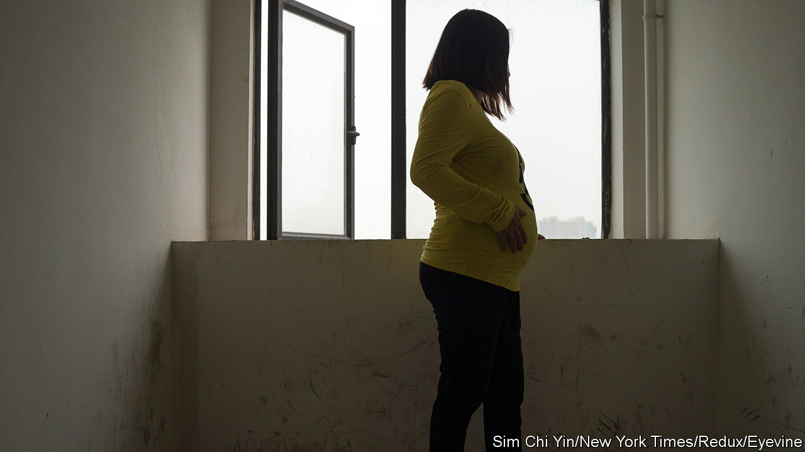

###### High-risk pregnancies

# The dangers of carrying a child for someone else in China 

##### For a shrinking country, China’s approach to surrogacy is self-defeating 

 

> Dec 11th 2023 

FAKE BIRTH certificates have long been a hot (if niche) commodity in China. In past decades couples would seek them out in order to get around the one-child policy. They could legally have two children if they were twins—or if their counterfeit papers stated as much. The one-child policy was loosened in 2016. But fake birth certificates remain in demand. Several hospitals are suspected of selling them. Some believe human-traffickers are the buyers. But investigators are eyeing another group: people who have babies via surrogates.

Surrogacy falls into a legal grey area in China. The state often says that the practice is banned; but there is no law against being a surrogate or hiring one. Yet doctors and hospitals that facilitate it are punished. Selling eggs, sperm or embryos are also crimes. And surrogacy contracts are not recognised by the state. That is where the bogus documents come in. A birth certificate is needed to obtain such things as health insurance, social security and household registration (see Chaguan). The fake ones allow non-biological children to officially be part of their new families.

For a country with a , China’s approach to surrogacy is rather counterproductive—to say nothing of its effect on families. With couples waiting longer to have children, demand for surrogacy in China seems to be growing. By one estimate, over 10,000 babies are born via the process every year in the country. But the path clients and their surrogates must navigate is full of risks.

The first step, at least, is easy. Agencies that connect people with surrogates and, if needed, egg or sperm donors operate in the open. Your correspondent found an employee of one such agency on social media. His account contained pictures of dozens of prospective egg donors from various countries. It included their height, blood type, education and whether they had had plastic surgery. “There are many Chinese ‘egg-sisters’. You are welcome to inquire about them,” said a message on his page.

Chinese clients usually want their surrogates to be Chinese too, says the agency employee. The surrogates often come from poor, rural areas and have already had their own children. They can earn tens of thousands of dollars per pregnancy. In some villages in Hubei province, where two hospitals are under investigation for selling fake birth certificates, surrogacy has become a common way for local women to make money, according to an investigation by Chinese media in 2017.

But it is a dangerous job. Agencies are known to confiscate surrogates’ identity cards during pregnancies for leverage. Bad medical care can leave them with health problems. Sometimes agencies promise clients a boy, the gender favoured by traditional families. If the fetus is a girl, surrogates can be forced to have an abortion.

The law is not much help if a dispute arises between a surrogate and a client or an agency. In 2018 a woman named Yan Xiaoli agreed to be a surrogate for 350,000 yuan ($50,000). She was paid a portion of the total. But, she claims, the client refused to hand over the rest once he learned that she was pregnant with twin girls. So Ms Yan sued him. A court not only denied her claim, but told her to return the money she had already received. It said the contract she had signed was invalid because it violated “public order and morality”.

Some Chinese people seek out surrogates in the wider region, but this is . Thailand, once a relatively affordable option, banned commercial surrogacy in 2015. A year later Cambodia did the same, using existing laws against human-trafficking. In 2020 a Chinese businessman called Xu Wenjun was given a 15-year jail sentence in Cambodia after he paid a local woman to bear his child.

Back in China most of the public seems to oppose surrogacy. In April footage of a woman covering up an advertisement for such services went viral. Many commenters expressed disgust at the practice of surrogacy. Women interviewed by local media said they often encountered similar adverts and covered them with lipstick or stickers making a counter-argument. “Surrogacy exploits women…you will be punished for it,” says one such sticker.

Every so often the government channels this mood, launching campaigns against the industry or commenting on high-profile cases. In 2021 a famous actress named Zheng Shuang was accused by her former partner of abandoning two babies they had had via surrogacy in America. She was blasted by China’s state broadcaster, CCTV, which said surrogacy showed a “disregard of life”. Even the Communist Party’s main law-enforcement body weighed in, accusing Ms Zheng of taking advantage of legal loopholes and having a “twisted worldview”. The actress was blacklisted and later charged with tax evasion. 

Surrogacy agencies are sometimes targeted, too. But their owners are rarely punished. And the firms, even if forced to shut down for a time, often reopen later. In between such campaigns, officials tend to turn a blind eye to the industry. The investigation into fake birth certificates in Hubei was launched only after an activist exposed the practice. Local governments have, after all, been tasked with reversing China’s demographic decline. Officials may see surrogacy as a means to that end. It would benefit everyone involved if the practice were regulated sensibly. ■


