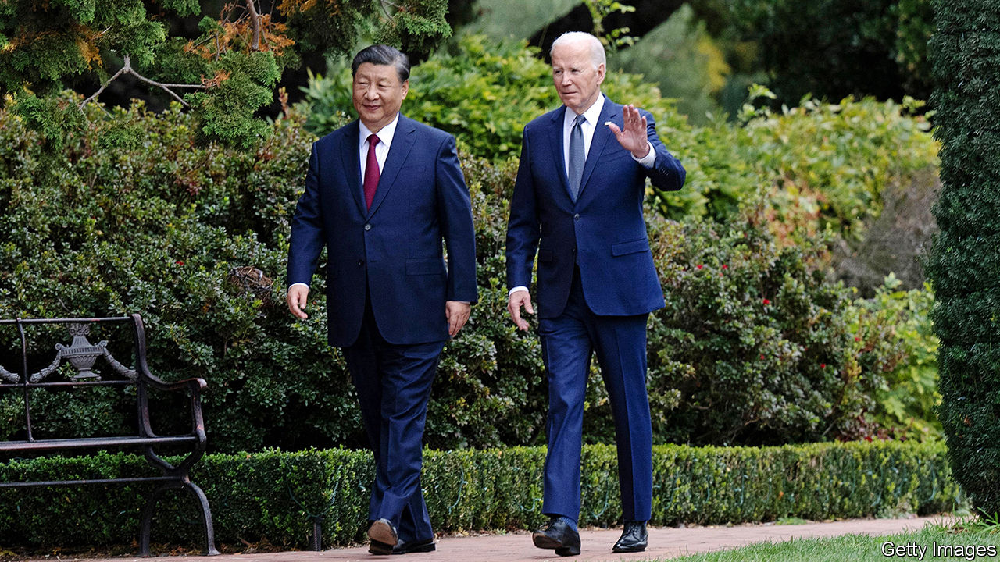

###### Lost in translation

# The world continues to garble the name and title of Xi Jinping 

##### President Zee he is not 

 

> Dec 14th 2023 

IT HAS BEEN 11 years since Xi Jinping took charge in China, becoming one of the most powerful people in the world. But for many outsiders, this has not been enough time to learn how to pronounce his name. Foreign politicians and pundits often stumble over it. The letters “x” and “j” cause the most problems. In the English-speaking world, many insert a misguided series of “z” sounds into their pronunciation. 

This was on display last month when Mr Xi met President Joe Biden in America. Airwaves around the world buzzed with mangled sibilants. It seems the internet’s many pronunciation guides (and videos of failed attempts to say Mr Xi’s name) have yet to solve the problem. 

There is, however, a more substantial source of confusion when it comes to Mr Xi. This has to do with his job title. Like past Chinese leaders, Mr Xi holds three distinct positions. The most important is general secretary of the ruling Communist Party; it is that role which makes him the paramount leader of China. He is also chairman of the party’s Central Military Commission, or commander-in-chief of the armed forces. 

By far the least important of his titles is that of state president. This is a largely ceremonial role, akin to that played by figureheads elsewhere. Think of Germany or Israel, where presidents have little authority. Mao Zedong was communist China’s first president, but the position has also been assigned to powerless figures. For a stretch in the 1960s and 70s it sat vacant. In 1975 it was abolished completely, returning in the early 80s. The tradition of China’s leader having all three titles took hold under Jiang Zemin, who was president from 1993 to 2003. 

Yet when referring to Mr Xi, foreign media and politicians usually choose the title of president. When communicating in English, so does the Chinese government. This is misleading not only because it is the least important of the three hats Mr Xi wears. It is also a poor translation: , China’s presidential title, means “chairman of the country”. China uses a different term, , to refer to Mr Biden and other presidents.

Of course, “chairman” and “general secretary” have a whiff of Leninism about them. And “Chairman of the Central Military Commission” sounds like the title of a junta leader. China probably believes that “president” is more relatable (and less ominous-sounding). But foreign commentators don’t have to abide by China’s preferences. If in doubt, they could take a cue from Mr Biden and consider calling Mr Xi the dictator.■


