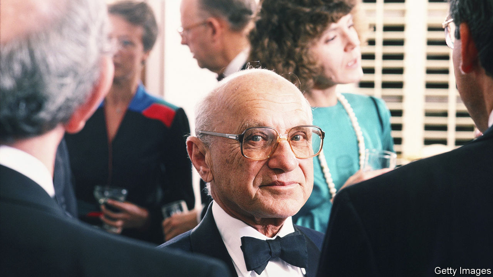

###### Economic history

# Is the age of Milton Friedman over? 

##### Some may say so. But we are still living in it 

 

> Dec 14th 2023 

 By Jennifer Burns. 

IT IS VOGUISH to declare the ideas of Milton Friedman dead, whether you think they deserve damnation or eulogy. In America, prominent Democrats spit out his name contemptuously. The most influential American economist of the 20th century is routinely disparaged as a heartless fetishist of Ayn Randian capitalism, who evangelised corporate greed at home and authoritarianism abroad. Friedman is a special bugbear of President . While running for office in 2020, he declared that “Milton Friedman isn’t running the show anymore.” 

Meanwhile, the current, populist standard-bearers of American conservatism—the political movement with which Friedman was identified throughout his life—agree, having turned their backs on fiscal discipline and open markets. 

It might be tempting to buy into the thesis that Friedman’s ideas are passé and even to wish them good riddance. But that would be a mistake. Few thinkers are as important (and as grotesquely caricatured) as Friedman. His critiques of , his advocacy of the importance of central banks, his emphasis on the primacy of the monetary supply in explaining inflation and his prioritisation of real interest rates over nominal ones were once unorthodox. They are now mainstream.

A recent biography by Jennifer Burns, a professor at Stanford University, dispels fallacies. Because of Friedman’s long life (he was born in 1912 and died in 2006) and prolific career involving the modern era’s most important economic debates, Ms Burns’s book functions as an intellectual guide to the entire 20th century, benefiting from nearly a decade of archival research. 

The Friedman who emerges here is one of astonishing economic brilliance, establishing monetary policy as a field worthy of serious study. It is a portrait of a surprisingly heterodox economist, who was perhaps the last great political economist and thought deeply about the connection between political and economic freedom. 

Friedman is best known for revolutionary ideas on the importance of money to the macroeconomy, which is now seen as blindingly obvious but once was not. With Anna Schwartz—his greatest intellectual partner other than his wife, Rose Director Friedman—he wrote “A Monetary History of the United States” (1963), which computed aggregate monetary supply to argue that the Federal Reserve had contributed to the Great Depression. 

, the man who would lead the Fed through the global financial crisis of 2007-09, gave cheeky tribute to this argument in a speech at a gathering celebrating Friedman’s 90th birthday: “Regarding the Great Depression, you’re right, we did it. We’re very sorry. But thanks to you, we won’t do it again.” 

By the 1980s Friedman was catapulted to global renown, claiming a Nobel prize, a column in  and even a popular TV series. He was a perpetual gadfly at the Fed. Were he alive today, he would probably jab at  for thinking that dramatic growth in the monetary supply would not manifest in higher inflation. (During his life, he sported a vanity licence plate with the formula of his quantity theory of money, MV=PY; the equals sign was drawn with the help of black tape, which resulted in several traffic tickets.) 

He became a bogeyman of the left for a six-day trip to Chile to advise , its dictator, though Ms Burns argues that while he “failed to the appreciate the optics”, that “in truth, he played almost no role in policy design”. Other trips, to China and to countries east of the Iron Curtain, did not provoke so much conspiracism, outrage or damage to his reputation. 

Although Ms Burns admires Friedman, her book is not a hagiography. She argues that his concept of freedom, the nominal core of his political philosophy, could be “woefully thin”. Friedman was vocally opposed to the  of 1964, which outlawed racial discrimination, and “never revisited his position on civil rights”, she writes with disappointment.

Much as the three Abrahamic religions lay claim to one saviour, conservatives, libertarians and classical liberals all claim Friedman. But he defies easy categorisation. Unlike some libertarians, Friedman accepted the legitimacy of the state (though he fought against it and advocated eliminating some government departments). Unlike many conservatives, he deemed redistribution acceptable to alleviate poverty. Indeed, Friedman envisioned the school-voucher and health-care programmes still in effect in America, as well as the tax policies that top up working class wages—perhaps the country’s most important anti-poverty programme.

Despite consulting for Barry Goldwater, Ronald Reagan and Margaret Thatcher, Friedman considered himself a classical liberal. “Those of us who believe in liberalism…have a new faith to offer; it behoves us to make it clear to one and all what the faith is”, he wrote in 1951. He was critical of overly doctrinaire, laissez-faire philosophy that “assigned almost no role to the state other than the maintenance of order and the enforcement of contracts”. 

Ms Burns insists on dubbing Friedman “the last conservative” because “the synthesis Friedman represented—based in , individual liberty and global co-operation—has cracked apart” in politics. Friedman may no longer be running the show, but he is still one of economics’ most influential acts. ■


