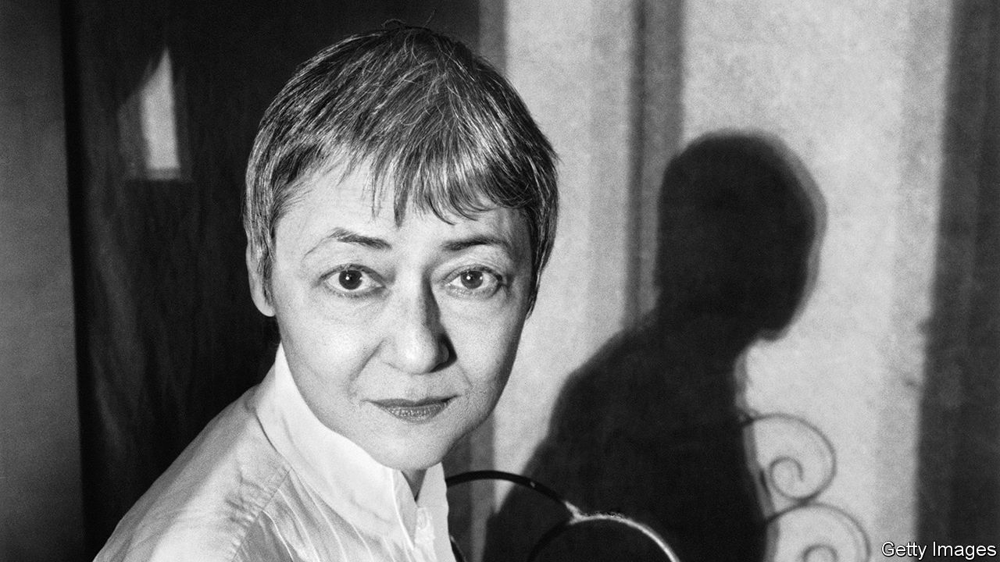

###### Pandemic fiction

# Some thought covid would change literature. It has not 

##### Two new novels by Michael Cunningham and Sigrid Nunez offer proof 

 

> Dec 14th 2023 

By Michael Cunningham. 

By Sigrid Nunez. 

When the world entered lockdowns for covid in 2020, writers and critics, finding themselves with even more time on their hands than usual, wondered how the pandemic would affect fiction. Since  literature has documented—and been shaped by—disease, including Daniel Defoe’s semi-fictional testimony of London during the pestilence of 1655, “A Journal of the Plague Year” (1722), and Albert Camus’s imagining of a cholera outbreak in a French-controlled Algerian city, . Who would write the first great pandemic novel of the covid era?

Two of America’s most distinguished novelists, Michael Cunningham and , have published novels that try to carry this mantle. Despite their new subject matter, however, these books do not . Covid did not, as some had predicted, permanently change the way people lived. As fear of the virus ebbed, they snapped back to old habits. The same is proving true for fiction.

The narrator of “The Vulnerables”, like Ms Nunez (pictured on next page), is an older writer who lives in New York. She ends up isolating in a luxury apartment with a friend’s parrot, pointedly named Eureka, and a bratty 20-something, whom she slowly grows to appreciate. 

This writer has all the stereotypical concerns of a middle-aged, middle-class American, but her real covid crisis is literary. Suffering from writer’s block, she concludes that “the traditional novel” has lost its “urgency”. Now readers want “a literature of personal history and reflection: direct, authentic, scrupulous about fact”.

Like “The Friend”, which drew on Ms Nunez’s own life and won the National Book Award in 2018, “The Vulnerables” reads as autobiographical fiction. In recent years juggernauts of “autofiction”, including  and , have turned away from this style. (Genre and historical fiction, rather than literature focused on the first person, is ascendant.) Ms Nunez’s narrator, whose reflections on life, art and children read like a boomer’s pandemic diary, is familiar—and not in a good way.

Mr Cunningham’s “Day” is the kind of traditional novel about imaginary people Ms Nunez suggests is now obsolete. But it is much more alive precisely because it looks from the outside in, rather than staying locked in a single head. 

Set on April 5th across three years (2019, 2020 and 2021), “Day” tells the story of a young family in Brooklyn. Dan, an ageing rock’n’roller, and Isabel, a photo editor, have two young children and their fair share of burnout. Covid accelerates the unravelling of their marriage and the relationships of several other people they know. “Day” is alive with all of the small thoughts, looks and feelings that covid amplified, like “the isolated inhabitedness” of Dan’s days.

Coincidentally, both “The Vulnerables” and “Day” offer tribute to , a celebrated British writer. Ms Nunez begins and ends considering a line from Woolf’s “The Years” (“It was an uncertain spring”). Mr Cunningham shares the day-long focus of Woolf’s “Mrs Dalloway”, which he also employed in his Pulitzer-prizewinning novel, “The Hours” (1998). But, unlike Woolf, neither of these novelists pushes the boundaries of fiction for their era. 

Unlike other historical traumas—the first and second world wars, or September 11th—the pandemic’s impact on fiction, as on art more generally, has so far been muted. With lockdown an increasingly distant memory, Ms Nunez’s and Mr Cunningham’s books may be most significant as historical novels set in a time that now seems stranger than fiction. They are documents of a new normal that soon slipped right back into the old. Both novels remind readers how much their lives changed during the pandemic, but also, at least for writers and readers of literary fiction, how much stayed the same. ■


