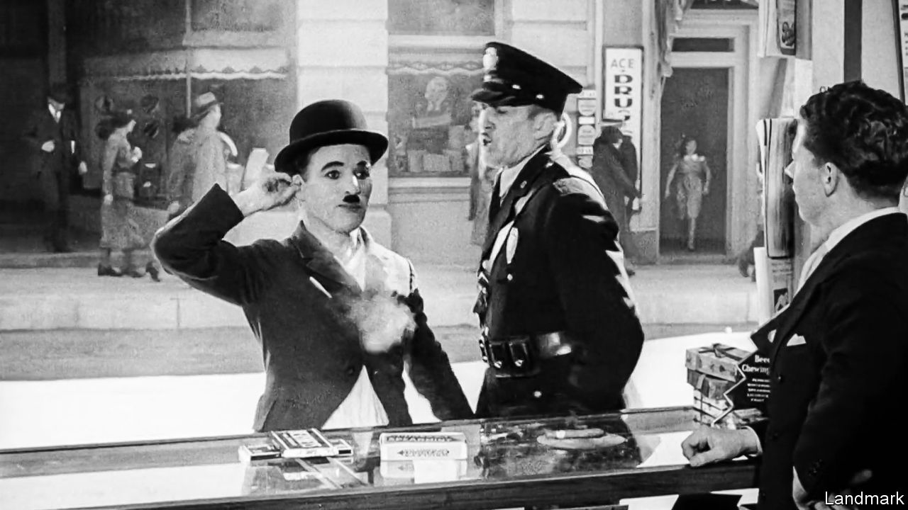

###### Hollywood and politics

# When Charlie Chaplin was cancelled 

##### A new book reconstructs the film-maker’s exclusion from America in 1952 

 

> Dec 12th 2023 

By Scott Eyman. 

IN TODAY’S CULTURE wars, Hollywood has a starring role. Films tend to trigger debates about America’s history and values. That has long been the case, as a new book, “Charlie Chaplin vs America”, shows. Chaplin, a British citizen, was harassed by the American government, culminating in the revocation of a re-entry permit in 1952. It is a sobering account of  in action. Indeed, it makes some of the current spats seem toothless by comparison.

“I don’t want to create revolution,” Chaplin said. “I just want to create a few more pictures.” But the FBI, suspecting Chaplin of communist sympathies, started surveilling the film-maker in 1922. In a paranoid climate, many looked for evidence of Marxism. Those convinced Chaplin was “red” pointed to his screen persona, the Tramp, an embodiment of the . They perceived it, too, in “Modern Times” (1936), a dramatisation of workers’ plight due to unemployment and automation, and in  (1940), which called out America’s isolationism.

Officials did not take kindly to Chaplin speaking out about politics, especially when he called for a second front in the war to alleviate pressure on Russia. Some took umbrage that Chaplin made his fortune in America and deigned to comment on its policies but refused to become a citizen.

None of this was illegal. But the FBI bedevilled him, using political groups and the press to whip up anti-Chaplin sentiment. The bureau fed journalists salacious titbits (which were not in short supply: the man was no stranger to a sex scandal). In the eyes of the public, he became “a louche degenerate with a propensity for young girls and communism”, writes the author, Scott Eyman. 

When Chaplin set off to promote a movie in Europe, the attorney-general took his chance. The film-maker was blocked from returning under a provision that allowed people of questionable “morals, health or insanity” or those “advocating communism or associating with communist or pro-communist organisations” to be kept out. Chaplin was forced to give up his home and studio and move to Switzerland, where the quality of his work suffered.

By the time he was exiled from America, the intelligence file had swelled to nearly 2,000 pages. It contained no proof of party ties. Instead, it was filled with “hearsay, rumour [and] bountiful examples of guilt by association”. Readers will be shocked by how Chaplin was hounded with so little cause. The author convincingly argues that the auteur was “the most prominent victim of the Red Scare” and paints a portrait of a time when freedom of speech was even more embattled than it is today. ■


